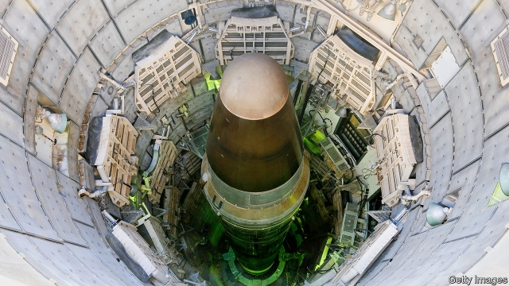

###### Finger on the button

# America should not rule out using nuclear weapons first 

 

> print-edition iconPrint edition | Leaders | Aug 17th 2019 

IN 1973 Major Harold Hering, a veteran pilot and trainee missile-squadron commander, asked his superiors a question: if told to fire his nuclear-tipped rockets, how would he know that the orders were lawful, legitimate and from a sane president? Soon after, Major Hering was pulled from duty and later kicked out of the air force for his “mental and moral reservations”. 

His question hit a nerve because there was, and remains, no check on a president’s authority to launch nuclear weapons. That includes launching them first, before America has been nuked itself. The United States has refused to rule out dropping a nuclear bomb on an enemy that has used only conventional weapons, since it first did so in 1945. 

Many people think this calculated ambiguity is a bad idea. It is unnecessary, because America is strong enough to repel conventional attacks with conventional arms. And it increases the risk of accidents and misunderstandings. If, when the tide of a conventional war turns, Russia or China fears that America may unexpectedly use nukes, they will put their own arsenals on high alert, to preserve them. If America calculates that its rivals could thus be tempted to strike early, it may feel under pressure to go first—and so on, nudging the world towards the brink. 

Elizabeth Warren, a Democratic contender for the presidency, is one of many who want to remedy this by committing America, by law, to a policy of No First Use (NFU) (see article). India and China have already declared NFU, or something close, despite having smaller, more vulnerable arsenals. 

Ms Warren’s impulse to constrain nuclear policy is right. However, her proposal could well have perverse effects that make the world less stable. Many of America’s allies, such as South Korea and the Baltic states, face large and intimidating rivals at a time when they worry about the global balance of power. They think uncertainty about America’s first use helps deter conventional attacks that might threaten their very existence, such as a Russian assault on Estonia or a Chinese invasion of Taiwan. Were America to rule out first use, some of its Asian allies might pursue nuclear weapons of their own. Any such proliferation risks being destabilising and dangerous, multiplying the risks of nuclear war. 

The aim should be to maximise the deterrence from nuclear weapons while minimising the risk that they themselves become the cause of an escalation. The place to start is the question posed by Major Hering 46 years ago. No individual ought to be entrusted with the unchecked power to initiate annihilation, even if he or she has been elected to the White House. One way to check the president’s launch authority would be to allow first use, but only with collective agreement, from congressional leaders, say, or the cabinet. 

There are other ways for a first-use policy to be safer. America should make clear that the survival of nations must be at stake. Alas, the Trump administration has moved in the opposite direction, warning that “significant non-nuclear strategic attack”, including cyber-strikes, might meet with a nuclear response. America can also make its systems safer. About a third of American and Russian nuclear forces are designed to be launched within a few minutes, without the possibility of recall, merely on warning of enemy attack. Yet in recent decades, missile launches have been ambiguous enough to trigger the most serious alarms. If both sides agreed to take their weapons off this hair-trigger, their leaders could make decisions with cooler heads. 

Most of all, America can put more effort into arms control. The collapse of the Intermediate-range Nuclear Forces Treaty on August 2nd and a deadly radioactive accident in Russia involving a nuclear-powered missile on August 8th (see article) were the latest reminders that nuclear risks are growing just as the world’s ability to manage them seems to be diminishing. ■ 
<<<<<<< HEAD

-- 

 单词注释:

1.Aug[]:abbr. 八月（August） 

2.harold['hærәld]:n. 哈罗德（男子名） 

3.trainee[trei'ni:]:n. 实习生, 新兵, 受培训者 [经] 学徒工, 培训人员 

4.lawful['lɒ:ful]:a. 法律许可的, 守法的, 合法的 [经] 合法的, 法定的 

5.legitimate[li'dʒitimәt]:a. 合法的, 正当的, 婚生的 vt. 认为正当, 立为嫡嗣, 使合法 

6.sane[sein]:a. 神智健全的, 稳健的, 没病的, 合理的 [医] 精神健全的 

7.nuke[nju:k]:n. 核武器, 核电厂, 原子核 vt. 以核武器攻击, 把...打垮 a. 核武器的 

8.ambiguity[.æmbi'gju:iti]:n. 不明确, 含糊 [计] 二义性; 多义性 

9.repel[ri'pel]:vt. 逐退, 抵制, 使厌恶, 抗御 vi. 使厌恶, 相互排斥 

10.misunderstanding[.misʌndә'stændiŋ]:n. 误会, 误解 [法] 误解, 误会, 不和 

11.unexpectedly[]:adv. 想不到的, 突然的, 意外的, 出乎意料的 

12.arsenal['ɑ:snәl]:n. 兵工厂, 军械库 [机] 兵工厂 

13.nudge[nʌdʒ]:n. 用肘轻推, 推动, 讨厌家伙 

14.brink[briŋk]:n. 边缘, 陡岸 

15.elizabeth[i'lizәbәθ]:n. 伊丽莎白（女子名） 

16.warren['wɒrәn]:n. 养兔场, 拥挤的地区 

17.contender[kәn'tendә(r)]:n. 参赛者, 争论者, 斗争者, 竞争者 

18.presidency['prezidәnsi]:n. 总统职权, 总裁职位 

19.NFU[]:abbr. （英）全国农场主联合会（National Farmers’ Union） 

20.vulnerable['vʌlnәrәbl]:a. 易受伤害的, 有弱点的, 易受影响的, 脆弱的, 成局的 [医] 易损的 

21.impulse['impʌls]:n. 冲动, 驱使, 刺激, 推动, 冲力, 建议, 脉冲 vt. 推动 

22.constrain[kәn'strein]:vt. 强迫, 限制, 关押 

23.perverse[pә'vә:s]:a. 乖张的, 故意作对的, 有悖常情的, 执迷不悟的, 歪曲的, 错误的, 不正当的 [法] 邪恶的, 罪恶的:堕落的, 不合法的 

24.les[lei]:abbr. 发射脱离系统（Launch Escape System） 

25.ally['ælai. ә'lai]:n. 同盟者, 同盟国, 助手 vt. 使联盟, 使联合, 使有关系 vi. 结盟 

26.Korea[kә'riә]:n. 朝鲜, 韩国 

27.Baltic['bɒ:ltik]:a. 波罗的海的 

28.uncertainty[.ʌn'sә:tnti]:n. 不确定, 不可靠, 不确定的事物 [化] 不确定度 

29.deter[di'tә:]:vt. 制止, 吓住, 威慑 

30.assault[ә'sɒ:t]:n. 攻击, 袭击 vt. 袭击, 攻击 vi. 发动攻击 

31.Estonia[es'tәuniә]:n. 爱沙尼亚 

32.taiwan['tai'wɑ:n]:n. 台湾 

33.proliferation[.prәulifә'reiʃәn]:n. 增殖, 激增 [医] 增生, 增殖 

34.destabilise[di:'steɪbɪlaɪz]:vt. 破坏政府的稳定 

35.maximise['mæksimaiz]:vt. 把...增加到最大限度, 把...扩大到最大限度, 充分重视, 找出...的最高值 

36.deterrence[di'tә:rәns]:n. 威慑, 威慑力量 [法] 威慑力量, 制止物 

37.minimise[]:vt. 使减到最少/最小, 使降到最低限度, 使缩到最小, 极度轻视 

38.escalation[.eskә'leiʃәn]:n. 扩大, 增加 [经] 调查, 价格调整 

39.entrust[in'trʌst]:vt. 信托, 交托, 委托 [经] 委托 

40.unchecked[.ʌn'tʃekt]:a. 未加抑制的, 未经检查的 [计] 未选中的 

41.initiate[i'niʃieit]:n. 入会, 开始 a. 新加入的 vt. 开始, 传授基本知识给 

42.annihilation[ә.naiә'leiʃәn]:n. 歼灭, 湮灭 [化] 消灭; 湮灭; 湮灭 

43.congressional[kәn'greʃәnl]:a. 会议的, 议会的, 国会的 [法] 代表大会的, 大会的, 议会的 

44.ala['eilә]:n. 翼, 翅 [化] 丙氨酸 

45.trigger['trigә]:n. 触发器, 扳机 vt. 触发, 发射, 引起 vi. 松开扳柄 [计] 切换开关 

46.reminder[ri'maindә]:n. 提醒的人, 暗示 [经] 催单 

47.diminish[di'miniʃ]:v. (使)减少, (使)变小 
=======
>>>>>>> 50f1fbac684ef65c788c2c3b1cb359dd2a904378

