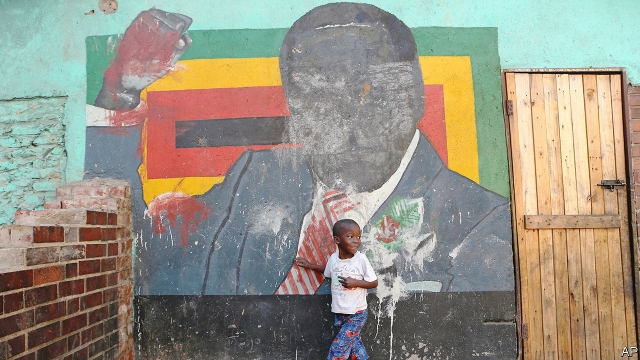

###### Land of hope and worry

# Zimbabwe’s economy is crashing and its people are hungry 

 

> print-edition iconPrint edition | Leaders | Aug 17th 2019 

AFTER DECADES of mismanagement and corruption, Zimbabwe is a wreck. Its people are poor and hungry (see article). By early next year about half of them will need help to get enough food, says the UN’s World Food Programme. In a country that was once among Africa’s most industrialised, electricity flickers for only a few hours a day, often at night. Factories and bakeries stand idle while the sun shines. Workers arrive after dark, hoping that if they are patient they will be able to switch on their machines or ovens. In homes people wake up in the middle of the night to cook or iron their shirts. Freshwater taps work for a few hours once a week. Tendai Biti, an opposition MP and former finance minister, complains that life has gone back to colonial times: “I’m washing in a bucket, my friend, as if it is Southern Rhodesia in 1923.” 

The crisis is Zimbabwe’s worst since the bad days of 2008-09, when President Robert Mugabe’s money-printing sparked hyperinflation so intense that prices doubled several times a week. That crisis was tamed only when Zimbabwe ditched its own currency and started using American dollars. This time, the government blames drought for the nation’s woes. Rains have, indeed, been poor. But the real problem is bad government. The same ruling party, ZANU-PF, has been in charge since 1980. Mr Mugabe’s successor, Emmerson Mnangagwa, who seized power from his mentor in 2017, is equally thuggish. His regime has kept grabbing dollars from people’s bank accounts and replacing them with electronic funny money, which has now lost most of its value. In June, without enough hard cash to pay the soldiers who defend it, the government decreed that shops must accept only funny money. Annual inflation has reached 500%. 

Zimbabweans have learned to expect only trouble from the people in charge. They hustle creatively to get by. Salaried workers have side gigs. Families subsist on remittances from relatives working abroad. However, they do not see why they should endure oppression and dysfunction indefinitely. 

Zimbabwe is poor because its rulers are predatory. But some blame must be shared by neighbouring governments, donors and lenders who, time and again, have looked the other way as the ruling party has rigged elections, tortured dissidents and looted the nation’s wealth. In 1987, when Mr Mugabe tried to create a de facto one-party state, Western diplomats crooned that a firm hand was probably what the country needed. In 2000, when Mr Mugabe sent thugs to seize white-owned commercial farms, some African leaders cheered the righting of a colonial wrong, ignoring the fact that much of the land was redistributed to cabinet ministers who barely bothered to farm it. After Mr Mugabe’s kleptocracy crashed the economy, the IMF handed over $510m in 2009, saying it welcomed his promises of reform. They proved empty. 

Now Mr Mnangagwa wants another bail-out from the IMF and loans from the World Bank. To secure it, he is making grand pledges to repeal oppressive laws and compensate farmers whose land was stolen. Yet after 21 months in power, he has shown few signs of doing either. Until he proves through actions that he is sincere, his regime should not get a cent. Provide food and medical aid to the hungry; but do not prop up the government that made them so.■ 

-- 

 单词注释:

1.Aug[]:abbr. 八月（August） 

2.mismanagement[]:n. 管理不善；处置失当 

3.corruption[kә'rʌpʃәn]:n. 腐败, 堕落, 贪污 [计] 论误 

4.Zimbabwe[zim'bɑ:bwei]:n. 津巴布韦 

5.industrialise[in'dʌstriәlaiz]:vi.vt. (使)工业化 

6.flicker['flikә]:n. 闪烁, 闪光, 颤动 vi. 闪动, 闪烁, 摇动, 扑动翅膀 vt. 使摇曳, 使闪烁 

7.freshwater['freʃwɔ:tә(r)]:a. 江河湖泊的, 淡水的 

8.Tendai[]:[网络] 天台；天台宗 

9.biti[]:[网络] 北京信息工程学院(Beijing Information Technology Institute)；比蒂；北京信息科技大学 

10.opposition[.ɒpә'ziʃәn]:n. 反对, 敌对, 相反, 在野党 [医] 对生, 对向, 反抗, 反对症 

11.MP[]:国会议员, 下院议员 [计] 宏处理程序, 维护程序, 线性规划, 微程序, 多处理器 

12.colonial[kә'lәunjәl]:a. 殖民的, 殖民地的 [法] 殖民地居民 

13.Rhodesia[rәu'di:zjә]:罗得西亚(津巴布韦的旧称)[非洲] 

14.Robert['rɔbәt]:[法] 警察 

15.hyperinflation[,haipәrin'fleiʃәn]:n. 恶性通货膨胀 

16.woe[wәu]:n. 悲哀, 悲痛, 苦痛 

17.successor[sәk'sesә]:n. 继承者, 接任者 [计] 后继 

18.Emmerson[]:n. (Emmerson)人名；(英)埃默森 

19.Mnangagwa[]:[网络] 南加格瓦 

20.mentor['mentɔ:]:n. 指导者, 良师益友 

21.equally['i:kwәli]:adv. 相等地, 同样地, 平等地 

22.thuggish['θʌ^iʃ]:[法] 暗杀的, 杀人的, 暴行的 

23.regime[rei'ʒi:m]:n. 政权, 当权期间, 政体, 社会制度, 体制, 情态 [医] 制度, 生活制度 

24.grab[græb]:n. 抓握, 掠夺, 强占, 东方沿岸帆船 vi. 抓取, 抢去 vt. 攫取, 捕获, 霸占 

25.decree[di'kri:]:n. 法令, 判决, 天意 vt. 颁布, 判决 vi. 发布命令 

26.inflation[in'fleiʃәn]:n. 胀大, 夸张, 通货膨胀 [化] 充气吹胀; 膨胀 

27.Zimbabwean[zim'bɑ:bwiәn]:n. 津巴布韦人 

28.hustle['hʌsl]:n. 心碌, 挤, 推, 拥挤喧嚷 vt. 催促, 乱挤活动, 硬逼, 强夺 vi. 赶紧, 硬挤过去 

29.creatively[]:adv. 创造性地；有创造力地 

30.salaried['sælәrid]:a. 拿薪水的, 拿薪金的, 有薪金的, 有薪水的 [经] 有薪金的, 拿薪金的 

31.gig[gig]:n. 旋转物, 轻便双轮马车, 赛艇, 鱼叉, 记过, 爵士乐演奏会 vi. 乘轻便双轮马车, 乘快艇, (用鱼叉)叉鱼 vt. (用鱼叉)叉, 刺激, 记过 

32.subsist[sәb'sist]:vt. 供给食物, 供养 vi. 生存, 存在 

33.remittance[ri'mitns]:n. 汇款 [经] 汇款, 寄款, 支付(金额) 

34.oppression[ә'preʃәn]:n. 压抑, 沉闷, 压迫手段 [医] 压迫, 压抑 

35.dysfunction[dis'fʌŋkʃәn]:n. 机能不良, 机能障碍 [医] 机能障碍, 机能不良 

36.indefinitely[]:adv. 无期限地 

37.predatory['predәtәri]:a. 掠夺成性的, 捕食生物的, 掠夺的 [医] 捕食的 

38.donor['dәunә]:n. 捐赠人 [化] 给体; 供体 

39.lender['lendә]:n. 出借人, 贷方 [经] 出借者, 贷方, 贷款人 

40.rig[rig]:n. 装备, 帆装 vt. 装配, 装扮, 给船装帆, 垄断, 操纵 

41.dissident['disidәnt]:a. 意见不同的, 持不同政见的 n. 意见不同的人, 持不同政见者 

42.loot[lu:t]:n. 赃物, 洗劫, 抢夺 v. 洗劫, 抢夺 

43.Mugabe[]:n. 穆加比（人名, 津巴布韦总统） 

44.de[di:]:[化] 非对映体过量 [医] 铥(69号元素铥的别名,1916年Eder离得的假想元素) 

45.facto[]:[法] 实际上, 事实上 

46.diplomat['diplәmæt]:n. 外交官, 有外交手腕的人 [法] 外交家, 外交官, 有权谋的人 

47.croon[kru:n]:v. 低声歌唱, 低唱, 低吟 n. 低唱, 低吟, 轻哼 

48.thug[θʌg]:n. 恶棍, 刺客, 凶手 [法] 凶手, 刺客, 暴徒 

49.redistribute[.ri:di'stribjut]:vt. 重新分配, 再分发 [经] 再分配, 重新分配 

50.bother['bɒðә]:vt. 烦扰, 迷惑 vi. 烦恼, 操心 n. 麻烦, 纠纷, 讨厌的人 

51.kleptocracy[klep'tɔkrәsi]:n. 盗贼统治(的国家) 

52.IMF[]:国际货币基金组织 [经] 国际货币基金 

53.pledge[pledʒ]:n. 诺言, 保证, 誓言, 抵押, 信物, 保人, 祝愿 vt. 许诺, 保证, 使发誓, 抵押, 典当, 举杯祝...健康 

54.repeal[ri'pi:l]:n. 废止, 撤消 vt. 废止, 撤消, 放弃 

55.oppressive[ә'presiv]:a. 压制性的, 压迫的, 沉重的 

56.prop[prɒp]:n. 支柱, 支持者, 倚靠人, 道具, 螺旋桨 vt. 支撑, 维持 

