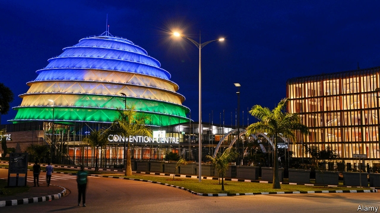

###### The devil in the details

# Has Rwanda been fiddling its numbers? 

 

> print-edition iconPrint edition | Middle East and Africa | Aug 17th 2019 

AT THE HEART of Rwanda’s capital sits the Kigali Convention Centre, a $300m monument that lights up the night with the national colours of blue, yellow and green. It symbolises modernity and prosperity in a country that has bounced back from a genocide in 1994 when perhaps 500,000 people, mostly Tutsis, were killed. 

As impressive as the skyline are Rwanda’s economic statistics. In the past decade the economy has expanded by 8% a year. The share of people classified as poor has fallen by seven percentage points since 2011, to 38% in 2017. 

Numbers such as these impress investors, donors and other African leaders. Many see Paul Kagame, the former general who ended the genocide and has called the shots in Rwanda ever since, as providing a model of development: that of an authoritarian who gets things done and helps the poor, even if he also tramples human rights. But what if the numbers are wrong? 

Questions have hung over Rwanda’s statistics since the government claimed in 2014 that poverty had declined to 39% from 45% in 2011. A closer examination of the data by Filip Reyntjens of the University of Antwerp found that the fall was largely due to a change in how it calculates the numbers. In 2011 Rwanda’s poverty line reflected the cost of consuming a basket of the foods that poor Rwandans were buying. For its 2014 calculation the agency replaced some low-calorie items the poor tend to buy with higher-calorie foods they could have bought instead. By changing the basket the agency reduced the income level that defines poverty by 19%. 

Had Rwanda used the same basket in both periods, the academics argued, the poverty rate would have increased by five to seven percentage points (depending on the basket). Rwanda’s statistics agency denies this, saying that poverty declined even if comparable poverty lines are used. 

But its rebuttal relied on an estimate of inflation that has invited new questions. One academic who has dissected the price figures is Sam Desiere of the University of Leuven in Belgium. He thought the official rate of food inflation was curiously low at 5.3% a year. After recalculating the figure using the statistics agency’s own survey data on how much households were spending, Mr Desiere found that food prices had increased by 9.4% a year. Other academics looking at the same data reckon that rising prices alone may have increased poverty by seven percentage points. 

These jumps in poverty, if indeed they took place, are surprising, given Rwanda’s rapid GDP growth of 8% a year. But some academics are questioning whether growth has been overstated, too. As evidence they point to a sharp divergence between two different official measures of consumption per person. In the national accounts, consumption is totted up across the economy and divided by the population. Then there are household surveys, in which people are asked how much they spend and consume. Both measures usually move together. In Rwanda they did until 2005. But since then the national accounts have shown consumption rising even as survey data showed it stagnating. By 2013 the gap between the two had widened to 50%, according to some economists. 

One reason for this could be that the benefits of economic growth went to a small elite, whose spending is poorly captured by household surveys. Other countries, such as India, have also seen a widening gap between the two measures. Another explanation is that robust economic growth in the national accounts has been overstated. 

The latter does not seem far-fetched if one looks at farming, which accounts for about 30% of GDP. It has been an important contributor to economic growth. Yet when Mr Deseire looked at the official figures claiming a 55% increase in crop yields between 2006 and 2013, he concluded that they were probably inflated. Other data sources suggest that the increase may have been only 20% or so. 

Questioning Rwanda’s statistics may seem to be no more than quibbling over numbers. But at stake is Mr Kagame’s reputation, and that of the developmental model he embodies. ■ 

