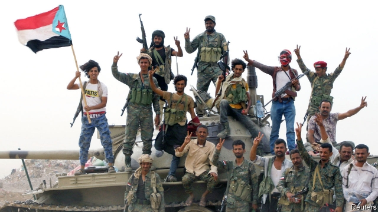
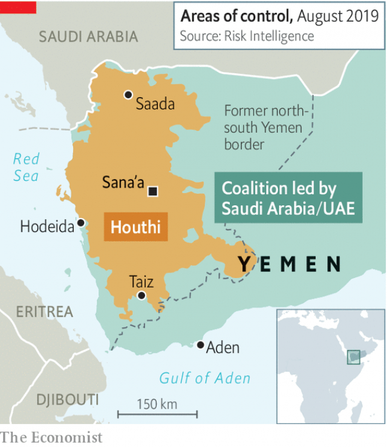

###### The war within the war

# Southern separatists are tearing Yemen apart 

 

> print-edition iconPrint edition | Middle East and Africa | Aug 17th 2019 

SAUDI ARABIA’S air strikes in Yemen have often missed their mark, causing hundreds of civilian casualties. But when the kingdom bombed its own allies on August 11th it was no mistake. The target was southern separatists, who had seized the city of Aden from Yemen’s internationally recognised government a day earlier. On paper, at least, the Saudis, the separatists and the government are all on the same side in Yemen’s war—members of a fragile alliance battling Iranian-backed Shia rebels called the Houthis. 

It has been more than four years since the Houthis pushed the government out of Sana’a, the capital, and captured most of the country. The Saudi-led coalition has since retaken the south, but it has failed to oust the Houthis from the north (see map). The fighting has shattered what was already the region’s poorest country. Tens of thousands of people have been killed. Hunger and cholera stalk the living. As if Yemen were not miserable enough, the war is growing more chaotic, making a lasting peace harder to imagine. 

 

The coalition assembled by Saudi Arabia and its main international partner, the United Arab Emirates (UAE), was never very coherent. It is a patchwork of local armed groups, all with their own, often competing, agendas. In Taiz alone, which has been besieged by the Houthis since 2015, more than 20 groups have fought for the coalition. Loyalty is fickle, with fighters drawn to whichever side pays more. Most coalition members readily admit that they dislike the government, which is corrupt and ineffective. They snigger at the fact that the president, Abd-Rabbu Mansour Hadi, has still not returned from his gilded exile in Riyadh. 

One of the coalition’s most dangerous fault-lines runs between the normally northern-based government and southern separatists. Their dispute dates back decades. South Yemen, then a separate country, fought two wars with the north in the 1970s. Unification in 1990 did not heal old wounds. Fighting erupted again in 1994, with the north coming out on top. Since then many in the south, which is less tribal, have viewed the government with suspicion. “It has prevented the south from developing, fearing it will secede,” says Saleh Alnoud of the Southern Transitional Council (STC), which speaks for many of the separatists. They are also divided. 

Tensions between the government and the STC flared last year, but the latest fighting looks more serious. It began on August 7th with a funeral procession for dozens of southern soldiers killed in a Houthi missile strike the week before. As the mourners passed the presidential palace, chanting anti-government slogans, bullets were exchanged with the presidential guards. The violence quickly escalated and, three days later, forces aligned with the STC had taken the palace and several military barracks. Pressure from the Saudis might lead to a face-saving deal that allows the government to return in some form, but the STC will probably remain in control. 

Publicly, at least, the leaders of Saudi Arabia and the UAE are speaking with one voice about the situation. But their call for talks belies tension in their own relationship. The UAE has focused on southern Yemen, where it has backed groups such as the STC in an effort to rout jihadists and Islamists. Some accuse it of creating a parallel state—on his way out of Aden, the interior minister blamed the UAE for the fighting. The Saudis, meanwhile, have focused on the north and restoring the government. They have worked with Islah, Yemen’s main Islamist group and a part of the administration, as well as others whom the UAE finds unsavoury. 

Whereas the Saudis have stuck mostly to the air, the UAE has led the charge on the ground and can claim most of the credit for what progress has been made against the Houthis. But with no end in sight, and as fear of conflict with Iran grows, the UAE is abandoning the war. Big new offensives by the coalition therefore seem unlikely. Saudi Arabia has the support of America’s president, Donald Trump, who has resisted congressional efforts to press the kingdom to end the war. Still, the prospect of a coalition victory is growing dimmer. And an old question has returned: can Yemen ever be stitched back together? ■ 

