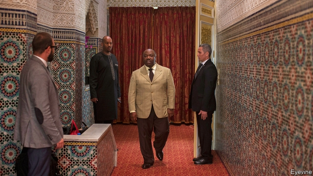

###### A scam too far

# Why many foreign companies are on the verge of leaving Gabon 

 

> print-edition iconPrint edition | Middle East and Africa | Aug 17th 2019 

IT IS OFTEN said of countries that their real wealth lies in their people. Few say this about Gabon. With 2m people and twice the land mass of England, it is among Africa’s richest countries, with a GDP per person of $8,300. Almost all of this comes from natural resources. Gabon exports oil, timber and palm oil. It is also the world’s third biggest producer of manganese, a metal used in producing stainless steel. 

The wealth masks the fact that Gabon is one of Africa’s worst-run countries. It has had only two presidents since 1967. The first, Omar Bongo, was a flamboyant despot. He kept a pet tiger, hobnobbed with French presidents and turned the country into a one-party state. After he died in 2009 his son, Ali, took over. He won an election in 2016 that many believe was rigged (turnout in his home province was 99.93%, with 95% voting for the president). 

Last year Ali (pictured) suffered a stroke and spent months in Morocco recovering. In January a few junior army officers tried, unsuccessfully, to mount a coup. Since then the state has shut down most news outlets and repeatedly blocked the internet. The economy is stagnant, largely thanks to growing corruption. 

A big new scam has targeted foreign businesses in Libreville, the capital. It relies on a law inherited from France, the former colonial power, that allows courts to order companies to pay their debts. That might make sense when the debts are genuine. But oil companies, banks and supermarkets have been targeted by firms that appear from nowhere, demanding payment of fictitious debts. Some businessmen think the courts are in on the scam: they make it difficult for companies to pay their debts, then hit them with large penalties when they do not. 

“It is a complete farce,” says Johanna Houdrouge of Mercure International, a firm based in Monaco that runs shopping malls in Gabon. The authorities seized 164m CFA francs ($280,000) from a subsidiary of Mercure based on the complaint of a company with an address, but little else. Ms Houdrouge says the court ordered the subsidiary to provide proof that it did not owe anything to the complainant—which was difficult, as firms tend not to keep records of non-existent debts. 

Other firms have been hit harder. An international oil company says it is being targeted at least four times a week, with seizures of as much as $10m. 

Gabon was never free of corruption, but it has reached levels that threaten the viability of foreign businesses. Some say they will leave soon. The deterioration seems linked to Mr Bongo’s stroke. Many Gabonese suspect that the president, who is 60 years old, will never be well enough to resume full-time work. Officials are trying to extort cash while they can, out of fear that they may eventually lose their jobs. 

Gabon’s neighbours, Congo-Brazzaville and Cameroon, are also former French colonies with plenty of oil. And both have ageing leaders who are rarely seen in public. Paul Biya, Cameroon’s 86-year-old president, spends much of his time in a suite at the InterContinental Hotel in Geneva. In his absence, protests in the English-speaking north of the country have turned into a civil war. Denis Sassou Nguesso, 76, has ruled Congo-Brazzaville for all but five of the past 40 years. On August 6th his son was accused by Global Witness, a watchdog, of stealing $50m of state funds. 

Since independence in 1960, Gabon has avoided civil war and coups. It maintains close relations with France. Yet it is becoming inhospitable for foreign businesses. Mr Bongo, for all his flaws, knew not to kill the golden goose. Some of his officials seem not to have learned the lesson. ■ 

-- 

 单词注释:

1.scam[skæm]:n. 骗局, 诡计；故事 

2.verge[vә:dʒ]:n. 边缘, 边界, 起始点 vi. 处在边缘, 接近, 下沉, 趋向 

3.gabon[^a'b]:n. 加蓬（非洲中西部国家） 

4.Aug[]:abbr. 八月（August） 

5.producer[prә'dju:sә]:n. 生产者, 制作者, 制作人 [化] 发生器; (炉煤气)发生炉; 制气炉; 生产者 

6.manganese['mæŋ^әni:z]:n. 锰 [化] 锰; 锰酸盐 

7.omar['әjmɑ:(r)]:n. 奥马尔（男子名） 

8.bongo['bɒŋgәu]:n. 邦戈羚羊(产于非洲), 小手鼓 

9.flamboyant[flæm'bɒiәnt]:a. 火焰似的, 辉耀的, 华丽的 

10.despot['despɒt]:n. 专制君主, 暴君 [法] 暴君, 专制君主 

11.hobnob['hɒbnɒb]:vi. 过从甚密, 共饮, 交谈 n. 共饮, 交谈 

12.ALI[]:[计] 异步线路接口 

13.rig[rig]:n. 装备, 帆装 vt. 装配, 装扮, 给船装帆, 垄断, 操纵 

14.turnout['tә:naut]:n. 聚集的人群, 出席者, 产量 [化] 输出; 产额 

15.Morocco[mә'rɒkәu]:n. 摩洛哥, 摩洛哥皮革 [机] 摩洛哥革 

16.unsuccessfully[]:adv. 无用；失败地 

17.coup['ku:]:n. 砰然的一击, 妙计, 出乎意料的行动, 政变 [医] 发作, 中, 击 

18.stagnant['stægnәnt]:a. 不流动的, 停滞的, 不景气的, 萧条的, 污浊的, 迟钝的 [经] 萧条的 

19.corruption[kә'rʌpʃәn]:n. 腐败, 堕落, 贪污 [计] 论误 

20.Libreville[,li:brә'vi:l]:利伯维尔[加蓬首都] 

21.colonial[kә'lәunjәl]:a. 殖民的, 殖民地的 [法] 殖民地居民 

22.fictitious[fik'tiʃәs]:a. 假想的, 编造的, 虚伪的 [法] 假定的, 假设的, 虚构的 

23.penalty['penәlti]:n. 处罚, 刑罚, 罚款, 罚球, 报应, 不利结果, 妨碍 [经] 罚金(款), 违约金 

24.farce[fɑ:s]:n. 闹剧, 滑稽剧, 胡闹 

25.johanna[dʒәj'hænә]:n. 约翰娜（女子名, 等于Joanna） 

26.mercure[]:水银 

27.Monaco['mɒnәkәu]:n. 摩纳哥 

28.mall[mɔ:l]:n. 林荫路 

29.cfa[]:abbr. 注册金融分析师（Chartered Financial Analyst） 

30.subsidiary[sәb'sidiәri]:n. 子公司, 附件, 辅助者 a. 辅助的, 次要的, 津贴的 

31.seizure['si:ʒә]:n. 捕获, 夺取, 占领, 捕获物, 没收, 充公 [医] 发作; 癫痫发作 

32.viability[.vaiә'biliti]:n. 生存能力, 发育能力 [医] [生]活[能]力, 生机 

33.deterioration[di.tiәriә'reiʃәn]:n. 恶化, 衰退, 退化 [医] 变坏, 变质, 颓废, 衰退 

34.Gabonese[,^ɑ:bә'ni:z]:n. 加蓬人 a. 加蓬的, 加蓬人的 

35.extort[ik'stɒ:t]:vt. 勒索, 敲诈, 强要 [医] 外旋 

36.Cameroon['kæmәru:n]:n. 喀麦隆 

37.paul[pɔ:l]:n. 保罗（男子名） 

38.biya[]: [地名] [俄罗斯] 比亚河 

39.intercontinental[,intә,kɔnti'nentl]:a. 大陆间的, 洲际的 

40.Geneva[dʒi'ni:vә]:n. 日内瓦, (荷兰)杜松子酒 

41.deni[]:n. (Deni)人名；(俄)杰尼；(意、阿拉伯)德尼 十数的 

42.sassou[]:[网络] 飒爽；萨苏；马自达飒爽 

43.nguesso[]:[网络] 恩格索 

44.watchdog['wɒtʃdɒg]:n. 看门狗, 监察人 [化] 监控设备; 监视器 

45.inhospitable[in'hɒspitәbl]:a. 冷淡的, 不适于居住的, 不相容的 

46.flaw[flɒ:]:n. 缺点, 裂纹, 瑕疵, 一阵狂风 [化] 划痕; 裂缝; 裂纹 

