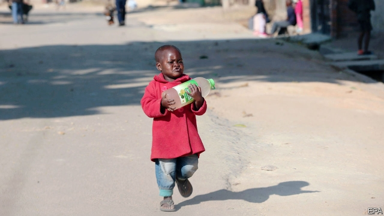
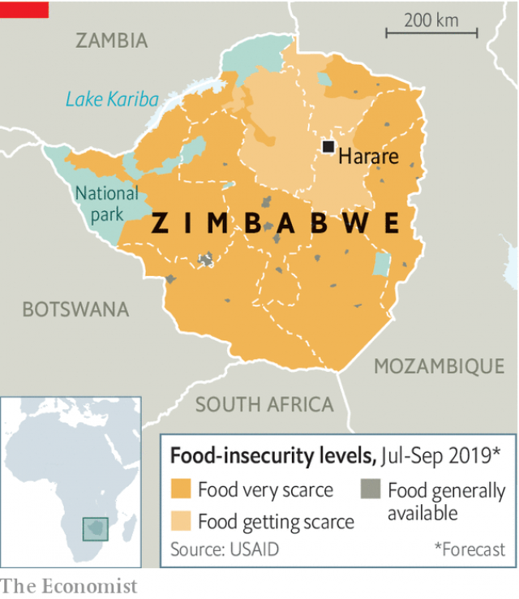

###### Not again

# Zimbabwe faces its worst economic crisis in a decade 

 

> print-edition iconPrint edition | Middle East and Africa | Aug 17th 2019 

AT HIS PENTECOSTAL church in Harare, Zimbabwe’s capital, Bishop Never Muparutsa sighs at the empty pews. In recent weeks, as the economy has deteriorated, his congregation has shrunk from 400 to 120. Mr Muparutsa sends Bible verses via WhatsApp to those too poor to travel. He tries to keep sermons upbeat. But he is worried about his formerly ebullient flock. “The joy I used to see is gone,” he says. “They might as well be Anglicans.” 

Zimbabwe is facing its worst economic crisis in a decade. Electricity is available for just six hours a day. Clean tap water runs once a week. Petrol stations either have no fuel or long queues. About 7.5m people, roughly half the country, will struggle to eat one meal a day by early next year, says the World Food Programme, a UN agency. Annual inflation is running at about 500%, reckons Msasa Capital, a local advisory firm. “I can’t see the light at the end of the tunnel,” says one businessman. “Just the light from an incoming train.” 

The government blames the weather. Cyclone Idai, which hit southern Africa in March, and a regional drought have contributed to a poor harvest. Scant rainfall has cut the supply of water to Lake Kariba, on the border of Zambia and Zimbabwe, and thus to an adjacent hydropower plant. Though the climate has been cruel to Zimbabwe, the mess is mostly man-made. 

Power shortages were avoidable. Low water levels at Kariba have been predicted for almost a year. A coal-fired power station in the west of the country ought to help fill the gap, but it is plagued by faults. Extra power could be bought from Eskom, but Zimbabwe has struggled to pay its debts to South Africa’s state-run utility. 

A lack of power is crippling what is left of Zimbabwean industry. Many factories open only for a brief night shift. The informal economy is struggling, too. Obey Mapupa, who makes tombstones in Mbare, a poor suburb of Harare, says that business should be good: more people are dying. But without power he cannot etch epitaphs. 

 

The shortage of water also stems from inept governance. Harare’s reservoirs are leaky. The chemicals used to clean them have not been imported because of a lack of foreign currency. Zimbabweans must instead queue at wells. At one in Chitungwiza, a dormitory town outside Harare, Gaudencia Maputi, 66, says she has been waiting for more than a day. She needs to wash and feed her 83-year-old brother, who has cancer. “I cannot do anything because there is no water,” she says. 

Looming hunger reflects state failings as well. The Grain Marketing Board (GMB), the pillar of Zimbabwe’s command economy in agriculture, once kept plentiful stores of maize. But today there may be just six weeks’ worth, reckons Eddie Cross, an opposition MP. He blames corruption. The board is racking up huge losses. It sells maize at $240 per tonne and buys it at $390, so it is easy for crooked insiders to drive from one depot to another, making $150 a time. (Assuming they can find petrol.) 

The food, water and power crises are part of a broader economic catastrophe. This can be traced back to the end of Robert Mugabe’s kleptocracy. In the years before he was toppled in a coup in November 2017, Mr Mugabe’s regime created money out of thin air to finance graft and profligacy. 

Unlike in 2008-09, when Zimbabwe printed bank notes with ever more zeroes on them, this time the government used a keyboard. It credited banks’ books with electronic “Real-Time Gross Settlement” (RTGS) dollars, which it said were equivalent to real dollars. But these electronic notes, or “zollars”, had no backing. It became hard, then impossible, to withdraw cash. On the black market zollars traded at various fractions of a greenback. 

After Emmerson Mnangagwa replaced Mr Mugabe, the regime initially kept claiming that a zollar was worth a dollar. But from October 2018, as black-market prices spiked, it seemed to give up the fiction. It first ring-fenced real dollar deposits, an admission that zollars were, in fact, a new currency. In February it went a step further, allowing banks to trade between the two. Mthuli Ncube, the finance minister, has also taken steps to balance the budget by cutting spending and raising taxes. 

In theory this all made sense. Zimbabwe was living beyond its means. In practice the reforms clashed with the instincts of the ruling Zanu-PF party: command, control, steal. Despite the government’s efforts to prop up the zollar, it lost 90% of its value versus the dollar from February to June. Civil servants and soldiers, who are paid in zollars, saw their earnings evaporate. 

Fearing protests from state employees who wanted to be paid in dollars, the government announced on June 24th that foreign currencies “shall no longer be legal tender”. As ever, though, it soon undermined its own policy. Exceptions to the ban have been granted to some businesses. 

Zimbabwe is locked in a downward spiral, fears Derek Matyszak of the Institute for Security Studies, a think-tank. The regime relies on exporters for its supply of dollars. But there will be few exports without raw materials and power. Tobacco farmers, for example, are already planning on planting fewer seeds next year. 

Helping countries hit with balance-of-payments crises is the job of the International Monetary Fund (IMF). But the IMF cannot lend to Zimbabwe until it clears its arrears to other international institutions, such as the World Bank. Zimbabwe will struggle to do that without another loan. 

Yet Western governments, led by America, are clear that political reform must precede economic assistance. Here Mr Mnangagwa has dragged his feet. The West has suggested that he remove two repressive laws as a starting point. Mr Mnangagwa has repeatedly promised to repeal them, but has not done so. His security services, meanwhile, keep shooting, abducting and beating his opponents with impunity. 

This terror has cowed civil society. But such is the anger among ordinary Zimbabweans that calls for further protests have grown. The opposition MDC Alliance will stage a rally in Harare on August 16th. 

Some Zimbabweans are protesting in a different way. By leaving. A decade ago economic crisis forced hundreds of thousands to flee. So far the new outflow is much smaller. But it has begun, reckons Bishop Muparutsa. He brings up the latest Bible verse he has distributed on WhatsApp. It is a passage from the Book of Exodus. ■ 

