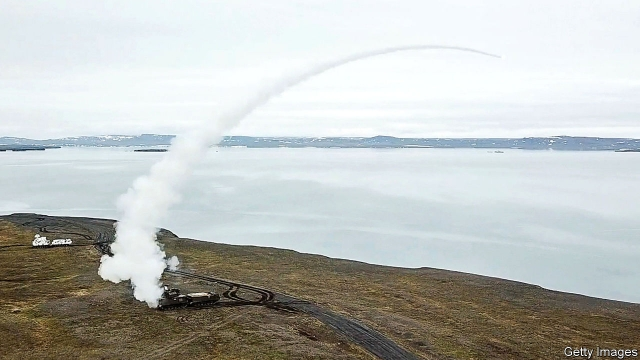

###### Nuclear propulsion

# An accident in Russia points to the risks of atomic aviation 

 

> print-edition iconPrint edition | Science and technology | Aug 17th 2019 

IN 1957 WORK began on Project Pluto, a treetop-skimming American missile loaded with hydrogen bombs. Nothing odd about that, except that the missile itself was also to be propelled by nuclear energy. A reactor on board would suck in air, heat and thus expand it, and then hurl it out of the back to provide thrust. Unfortunately, this also spewed out radioactive particles—which would hardly matter in war, but meant the missile could not be tested safely, and so the project was cancelled. 

America’s experience has not, however, deterred Vladimir Putin, Russia’s president. In March 2018 he announced the development of a Pluto-like missile called Burevestnik (“petrel”, a bird regarded by sailors of old as a harbinger of storms). This has since been tested in Novaya Zemlya, and has crashed several times. 

On August 8th there was another accident ascribed by many observers to Burevestnik. Seven scientists perished in a rocket explosion on an offshore platform near Arkhangelsk. The damage was widespread. Some reports suggest that on August 13th Nyonoksa, a village 40km away, was almost evacuated after radiation there exceeded background levels. 

As Michael Elleman, a missile expert at the International Institute for Strategic Studies, a think-tank, observes, nuclear propulsion can work in two ways. One is fission reaction—the sort used in power stations. But, as Project Pluto’s designers found, that is tricky to fit in a missile. 

The other option is radioisotope decay, which uses a substance such as polonium-218 to heat and evaporate a liquid. The gas generated might be employed to propel probes through the vacuum of space, but because it produces less thrust than fission the process has not been thought suitable for missiles. Mr Elleman hypothesises, however, that Russia may use it for another purpose: to create a long-lasting thermal battery which can provide unlimited electrical power for tasks such as missile guidance and warhead initiation. 

Russia has admitted that an “isotope power source” was being tested, and Rosatom, the country’s atomic-energy agency, has said a “nuclear battery” was involved. Some Russian sources suggest it was this—rather than a reactor—which failed, exploding when it was pulled from the water. 

Why go to such trouble in the first place? Russia has ballistic missiles that can reach any part of the world, but it is worried that they may be vulnerable to current or future American defences. Cruise missiles can fly along low, erratic paths capable of skirting those defences. But Russia’s longest-range cruise missile, Kalibr, can travel only a few thousand kilometres, so hitting America would require launching it from planes, ships or submarines. Burevestnik, by contrast, could be fired from deep inside Russian territory, and would thus be a more credible threat. 

Pranay Vaddi, an arms-control expert at the Carnegie Endowment, a think-tank, suggests it might also serve as a bargaining chip. “This may be an effort to gain leverage in arms-control negotiations, to force the United States to the table,” he says. New Start, a treaty that limits American and Russian nuclear forces, covers only ballistic missiles. America does not seem keen on renewing it when it expires in 2021. The Russians may hope that Burevestnik will change America’s attitude—if they can make it work.■ 
<<<<<<< HEAD

-- 

 单词注释:

1.propulsion[prә'pʌlʃәn]:n. 推进, 推进力 [医] 前冲, 慌张步态 

2.Aug[]:abbr. 八月（August） 

3.Pluto['plu:tәu]:n. 冥王星, 普路托(冥王) 

4.propel[prәu'pel]:vt. 推进, 驱使 [机] 推进 

5.reactor[ri'æktә]:n. 反应者, 反应器, 反应堆, 电抗器 [化] 反应釜; 反应锅 

6.hurl[hә:l]:n. 用力的投掷 vt. 用力投掷, 发射, 愤慨地说出, 丢下 vi. 猛投, 猛掷 

7.spew[spju:]:vi. 呕吐, 喷涌 vt. 呕出, 喷 n. 呕吐物, 喷涌物 

8.deter[di'tә:]:vt. 制止, 吓住, 威慑 

9.Vladimir[vlɑ'dimɪr]:n. 弗拉基米尔（古罗斯弗拉基米尔-苏兹达里公国的古都） 

10.putin['putin]:n. 普京（人名） 

11.Burevestnik[]:[地名] 布列韦斯特尼克 ( 哈 ) 

12.petrel['petrәl]:n. 海燕 

13.harbinger['hɑ:bindʒә]:n. 通告者, 预告者, 先驱, 预兆 vt. 预告, 充做...的前驱 

14.novaya[]: [地名] [俄罗斯] 诺瓦亚; [地名] [俄罗斯] 诺瓦亚河 

15.zemlya[]: [地名] 土地（俄语）; [电影]大地 

16.perish['periʃ]:vi. 毁灭, 丧生, 凋谢, 颓丧, 死亡, 腐烂 vt. 毁坏, 使麻木, 使丧生, 耗尽 

17.Arkhangelsk[ɑ:'kæn^elsk]:阿尔汉格尔斯克[苏联西北部港市] 

18.michael['maikl]:n. 迈克尔（男子名） 

19.fission['fiʃәn]:n. 裂开, 分裂, 分体 [化] 裂变 

20.designer[di'zainә]:n. 设计者, 谋划者, 制图者 [计] 设计员 

21.tricky['triki]:a. 狡猾的, 机敏的 

22.radioisotope[.reidiәu'aisәtәup]:n. 放射性同位素 [化] 放射性同位素 

23.probe[prәub]:n. 探索, 调查, 探针, 探测器 v. 用探针探测, 调查, 探索 

24.les[lei]:abbr. 发射脱离系统（Launch Escape System） 

25.hypothesise[haɪ'pɒθɪsaɪz]:v. （英）假定；设定；假设（等于hypothesize） 

26.thermal['θә:ml]:a. 热的, 热量的, 温泉的 n. 上升温暖气流 

27.unlimited[.ʌn'limitid]:a. 无限的, 不受限制的, 无条件的 [经] 无限的, 不定的 

28.warhead['wɒ:hed]:n. 弹头 

29.initiation[i.niʃi'eiʃәn]:n. 开始, 指引, 入会 [化] 引发 

30.isotope['aisәutәup]:n. 同位素 [化] 同位素 

31.Rosatom[]:[网络] 俄罗斯国家原子能公司；俄罗斯联邦原子能机构；俄罗斯原子能公司 

32.ballistic[bә'listik]:a. 弹道的 [医] 射击的, 冲击的 

33.vulnerable['vʌlnәrәbl]:a. 易受伤害的, 有弱点的, 易受影响的, 脆弱的, 成局的 [医] 易损的 

34.cruise[kru:z]:n. 巡航, 巡弋, 漫游 v. 巡航, 巡弋, 漫游 

35.erratic[i'rætik]:n. 古怪的人, 漂泊无定的人 a. 不稳定的, 奇怪的 

36.cruise[kru:z]:n. 巡航, 巡弋, 漫游 v. 巡航, 巡弋, 漫游 

37.credible['kredәbl]:a. 可信的, 可靠的 [法] 可信的, 可靠的 

38.pranay[]:[网络] 浪漫；生命能 

39.carnegie[kɑ:'ne^i]:n. 卡内基（姓氏） 

40.endowment[in'daumәnt]:n. 捐助, 天赋, 才能 [经] 捐赠, 捐款, 养老金 

41.chip[tʃip]:n. 屑片, 薄片, 碎片 vt. 削, 切, 削成碎片, 使摔倒, 凿 vi. 削下屑片 [计] 孔屑; 组件; 晶片; 芯片 

42.negotiation[ni.gәuʃi'eiʃәn]:n. 谈判, 磋商, 交涉 [经] 谈判, 协商 

43.expire[ik'spaiә]:vi. 期满, 呼气, 断气 vt. 呼出 
=======
>>>>>>> 50f1fbac684ef65c788c2c3b1cb359dd2a904378

