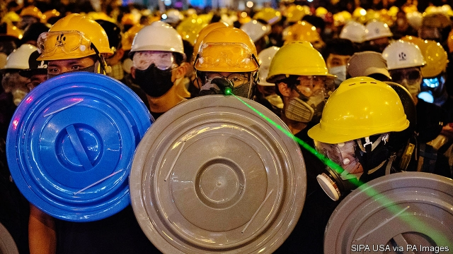
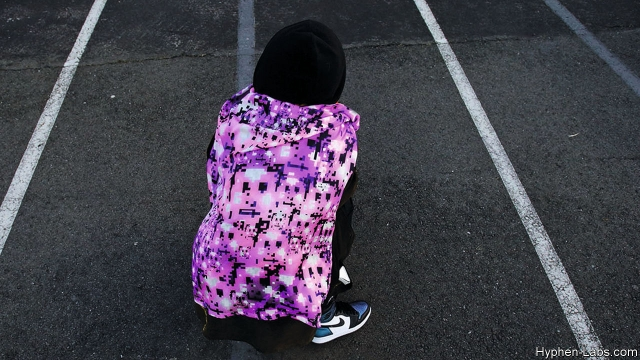

###### Fooling Big Brother

# As face-recognition technology spreads, so do ideas for subverting it 

 

> print-edition iconPrint edition | Science and technology | Aug 17th 2019 

POWERED BY advances in artificial intelligence (AI), face-recognition systems are spreading like knotweed. Facebook, a social network, uses the technology to label people in uploaded photographs. Modern smartphones can be unlocked with it. Some banks employ it to verify transactions. Supermarkets watch for under-age drinkers. Advertising billboards assess consumers’ reactions to their contents. America’s Department of Homeland Security reckons face recognition will scrutinise 97% of outbound airline passengers by 2023. Networks of face-recognition cameras are part of the police state China has built in Xinjiang, in the country’s far west. And a number of British police forces have tested the technology as a tool of mass surveillance in trials designed to spot criminals on the street. 

A backlash, though, is brewing. The authorities in several American cities, including San Francisco and Oakland, have forbidden agencies such as the police from using the technology. In Britain, members of parliament have called, so far without success, for a ban on police tests. Refuseniks can also take matters into their own hands by trying to hide their faces from the cameras or, as has happened recently during protests in Hong Kong, by pointing hand-held lasers at CCTV cameras. to dazzle them (see picture). Meanwhile, a small but growing group of privacy campaigners and academics are looking at ways to subvert the underlying technology directly. 

Face recognition relies on machine learning, a subfield of AI in which computers teach themselves to do tasks that their programmers are unable to explain to them explicitly. First, a system is trained on thousands of examples of human faces. By rewarding it when it correctly identifies a face, and penalising it when it does not, it can be taught to distinguish images that contain faces from those that do not. Once it has an idea what a face looks like, the system can then begin to distinguish one face from another. The specifics vary, depending on the algorithm, but usually involve a mathematical representation of a number of crucial anatomical points, such as the location of the nose relative to other facial features, or the distance between the eyes. 

In laboratory tests, such systems can be extremely accurate. One survey by the NIST, an America standards-setting body, found that, between 2014 and 2018, the ability of face-recognition software to match an image of a known person with the image of that person held in a database improved from 96% to 99.8%. But because the machines have taught themselves, the visual systems they have come up with are bespoke. Computer vision, in other words, is nothing like the human sort. And that can provide plenty of chinks in an algorithm’s armour. 

In 2010, for instance, as part of a thesis for a master’s degree at New York University, an American researcher and artist named Adam Harvey created “CV [computer vision] Dazzle”, a style of make-up designed to fool face recognisers. It uses bright colours, high contrast, graded shading and asymmetric stylings to confound an algorithm’s assumptions about what a face looks like. To a human being, the result is still clearly a face. But a computer—or, at least, the specific algorithm Mr Harvey was aiming at—is baffled. 

Dramatic make-up is likely to attract more attention from other people than it deflects from machines. HyperFace is a newer project of Mr Harvey’s. Where CV Dazzle aims to alter faces, HyperFace aims to hide them among dozens of fakes. It uses blocky, semi-abstract and comparatively innocent-looking patterns that are designed to appeal as strongly as possible to face classifiers. The idea is to disguise the real thing among a sea of false positives. Clothes with the pattern, which features lines and sets of dark spots vaguely reminiscent of mouths and pairs of eyes (see photograph), are already available. 

 

An even subtler idea was proposed by researchers at the Chinese University of Hong Kong, Indiana University Bloomington, and Alibaba, a big Chinese information-technology firm, in a paper published in 2018. It is a baseball cap fitted with tiny light-emitting diodes that project infra-red dots onto the wearer’s face. Many of the cameras used in face-recognition systems are sensitive to parts of the infra-red spectrum. Since human eyes are not, infra-red light is ideal for covert trickery. 

In tests against FaceNet, a face-recognition system developed by Google, the researchers found that the right amount of infra-red illumination could reliably prevent a computer from recognising that it was looking at a face at all. More sophisticated attacks were possible, too. By searching for faces which were mathematically similar to that of one of their colleagues, and applying fine control to the diodes, the researchers persuaded FaceNet, on 70% of attempts, that the colleague in question was actually someone else entirely. 

Training one algorithm to fool another is known as adversarial machine learning. It is a productive approach, creating images that are misleading to a computer’s vision while looking meaningless to a human being’s. One paper, published in 2016 by researchers from Carnegie Mellon University, in Pittsburgh, and the University of North Carolina, showed how innocuous-looking abstract patterns, printed on paper and stuck onto the frame of a pair of glasses, could often convince a computer-vision system that a male AI researcher was in fact Milla Jovovich, an American actress. 

In a similar paper, presented at a computer-vision conference in July, a group of researchers at the Catholic University of Leuven, in Belgium, fooled person-recognition systems rather than face-recognition ones. They described an algorithmically generated pattern that was 40cm square. In tests, merely holding up a piece of cardboard with this pattern on it was enough to make an individual—who would be eminently visible to a human security guard—vanish from the sight of a computerised watchman. 

As the researchers themselves admit, all these systems have constraints. In particular, most work only against specific recognition algorithms, limiting their deployability. Happily, says Mr Harvey, although face recognition is spreading, it is not yet ubiquitous—or perfect. A study by researchers at the University of Essex, published in July, found that although one police trial in London flagged up 42 potential matches, only eight proved accurate. Even in China, says Mr Harvey, only a fraction of CCTV cameras collect pictures sharp enough for face recognition to work. Low-tech approaches can help, too. “Even small things like wearing turtlenecks, wearing sunglasses, looking at your phone [and therefore not at the cameras]—together these have some protective effect”. ■ 

-- 

 单词注释:

1.subvert[sәb'vә:t]:vt. 推翻, 颠覆, 毁灭 [法] 颠覆, 推翻, 减亡 

2.Aug[]:abbr. 八月（August） 

3.AI[ai]:[计] 附加信息, 人工智能 [化] 人工智能 

4.knotweed['nɔtwi:d]:n. [植] 紫菀科植物, 蓼科杂草 

5.facebook[]:n. 脸谱网 

6.upload['ʌp,lәud]:[计] 上装, 加载, 储入 

7.smartphones[]: 智能手机（smartphone的复数） 

8.unlock[.ʌn'lɒk]:vt. 开...的锁, 开启, 表露, 放出 vi. 被开启, 揭开, 解放 [计] 解出锁定 

9.transaction[træn'sækʃәn]:n. 交易, 办理, 学报, 和解协议 [计] 事务处理 

10.drinker['driŋkә]:n. 饮者, 酒徒 

11.advertising['ædvәtaiziŋ]:n. 广告业, 广告 a. 广告的 [计] 发广告 

12.billboard['bilbɒ:d]:n. 广告牌, 布告板 vt. 宣传 

13.reckon['rekәn]:vt. 计算, 总计, 估计, 认为, 猜想 vi. 数, 计算, 估计, 依赖, 料想 

14.scrutinise[]:vt.vi. 细看, 仔细检查, 审查, 细阅 [经] 详细检查, 细细地看 

15.outbound['autbaund]:a. 开往国外的 [计] 出站 

16.surveillance[sә:'veilәns]:n. 监视, 监督 [电] 侦测 

17.backlash['bæklæʃ]:n. 后冲, 强烈反对 [电] 反撞, 逆栅流 

18.brew[bru:]:n. 酿造酒, 酝酿 v. 酿造, 酝酿 

19.san[sɑ:n]:abbr. 存储区域网（Storage Area Networking） 

20.francisco[fræn'siskәu]:n. 弗朗西斯科（男子名, 等于Francis） 

21.oakland['әuklәnd]:n. 奥克兰（美国加州西部城市） 

22.refusenik[rɪˈfju:znɪk]:n. 被拒绝移民者 

23.hong[hɔŋ]:n. （中国、日本的）行, 商行 

24.kong[kɔŋ]:n. 含锡砾石下的无矿基岩；钢 

25.CCTV[]:[计] 闭路电视 

26.dazzle['dæzl]:v. (使)眼花, 炫耀 n. 耀眼 

27.privacy['praivәsi]:n. 隐私, 隐居, 秘密 [计] 个人保密权 

28.campaigner[kæm'peinә]:n. 从军者, 老兵, 竞选者 

29.underlie[.ʌndә'lai]:vt. 位于...之下, 成为...的基础 

30.subfield['sʌbfi:ld]:[计] 子字段 

31.programmer['prәugræmә]:n. 程序员 [计] 程序设计员; 程序员 

32.explicitly[]:adv. 明确地；明白地 

33.correctly[kә'rektli]:adv. 对, 正确, 恰当, 符合一般性准则, 符合行为准则, 端正, 符合 

34.penalise[]:vt. 对...处以刑罚/刑事惩罚, 惩罚, 处罚, 使处于严重不利地位 

35.algorithm['ælgәriðm]:n. 算法 [计] 算法 

36.representation[.reprizen'teiʃәn]:n. 表示法, 表现, 陈述, 代表 [计] 表示法指定 

37.anatomical[.ænә'tɒmikl]:a. 解剖的, 解剖学的, 构造上的 [医] 解剖学的 

38.NIST[]:[计] 美国国家标准及技术研究所 

39.bespeak[bi'spi:k]:vt. 预约, 订, 表示 n. 预约 

40.chink[tʃiŋk]:n. 裂口, 裂缝, 弱点, 叮当声 vt. 使叮当响 vi. 堵裂缝, 叮当响 

41.armour['ɑ:mә]:n. 甲胄, 装甲, 潜水服 

42.thesis['θi:sis]:n. 论题, 论文 

43.york[jɔ:k]:n. 约克郡；约克王朝 

44.Adam['ædәm]:n. 亚当 [计] 自动直接存取管理 

45.harvey['hɑ:vi]:n. 哈维（男子名） 

46.cv[]:abbr. 简历（Curriculum Vitae） 

47.dazzle['dæzl]:v. (使)眼花, 炫耀 n. 耀眼 

48.recogniser[]:[网络] 识别器 

49.asymmetric[æsi'metrik]:a. 不对称的, 偏位的 [计] 非对称的, 不对称的, 不平衡的 

50.styling['stailiŋ]:n. 款式, 式样 

51.confound[kәn'faund]:vt. 使混淆, 使狼狈, 挫败 

52.baffle['bæfl]:vt. 困惑, 为难, 使挫折 vi. 徒作挣扎 n. 迷惑, 挡板 

53.deflect[di'flekt]:vt. 转移, 使偏斜 vi. 偏斜 

54.hyperface[]:[网络] 超面 

55.fake[feik]:n. 假货, 欺骗, 诡计 a. 假的 vt. 假造, 仿造 vi. 伪装 

56.blocky['blɔki]:a. 短而结实的, 斑驳的 

57.classifier['klæsifaiә]:n. 分类者, 分粒器, 分级机, 汉语中的量词 [计] 分类符, 分类器 

58.vaguely['veigli]:adv. 含糊地, 暧昧地 

59.reminiscent[.remi'nisnt]:a. 回忆的, 怀旧的 n. 往事叙述者, 回忆录作者 

60.subtl[]:[网络] 隐晦的 

61.Indiana[.indi'ænә]:n. 印地安那州 

62.Bloomington['blu:miŋtən]:n. 布卢明顿（美国城市名） 

63.alibaba[]:n. 阿里巴巴（公司名） 

64.diode['daiәud]:n. 二极管 [化] 二极管 

65.spectrum['spektrәm]:n. 光谱, 范围, 系列 [化] 光谱 

66.covert['kʌvәt. 'kәuvәt]:a. 隐蔽的, 偷偷摸摸的, 隐密的 n. 树丛, 隐藏处 

67.trickery['trikәri]:n. 欺骗, 欺诈, 诡计 [法] 诡计, 奸计, 诈骗 

68.google[]:谷歌；搜索引擎技术；谷歌公司 

69.illumination[i.lju:mi'neiʃәn]:n. 照明, 阐明, 启发 [医] 照明, 映光 

70.reliably[ri'laiәbli]:adv. 可靠地, 可信赖地 

71.sophisticate[sә'fistikeit]:n. 久经世故的人, 精于...之道的人 vt. 篡改, 曲解, 使变得世故, 掺合, 弄复杂 vi. 诡辩 

72.mathematically[ˌmæθə'mætɪklɪ]:adv. 算术地 

73.entirely[in'taiәli]:adv. 完全, 全然, 一概 

74.adversarial[,ædvә'seәriәl]:a. 敌手的,对手的,对抗(性)的 

75.misleading[mis'li:diŋ]:a. 引入歧途的, 使人误解的, 骗人的 [法] 误写姓名的, 误称的, 令人误解的 

76.meaningless['mi:niŋlis]:a. 无意义的 

77.carnegie[kɑ:'ne^i]:n. 卡内基（姓氏） 

78.mellon['melәn]:[化] 三聚二氰亚胺 

79.Pittsburgh['pitsbә:g]:n. 匹兹堡 

80.Carolina[.kærә'lainә]:n. 北(或南)卡罗来纳州 

81.milla[]:n. (Milla)人名；(意)米拉；(法)米亚；(西)米利亚 

82.jovovich[]:[网络] 约沃维奇 

83.Leuven[]:n. 勒芬（比利时一城市名） 

84.algorithmically[æl'ɡɒrɪθmɪklɪ]: [计] 在算法上 

85.cardboard['kɑ:dbɒ:d]:n. 薄纸板 [化] 咭纸; 特等纸板; 卡纸板; 卡片纸板 

86.eminently[]:adv. 很, 突出地, 非常 

87.computerise[kәm'pju:tәraiz]:vt. （英）用计算机处理；给…装备计算机（等于computerize） 

88.watchman['wɒtʃmәn]:n. 巡夜者, 看守人 [法] 看守人, 门警, 哨兵 

89.constraint[kәn'streint]:n. 强制, 约束 [计] 约束 

90.deployability[]:[网络] 部署性；部署能力；可部署的 

91.Essex['esiks]:n. 艾塞克斯郡(英格兰郡名) 

92.turtleneck['tә:tlnek]:n. 圆翻领, 高翻领毛衣 

93.sunglass['sʌnglæs]:n. 凸透镜, 太阳眼镜 

