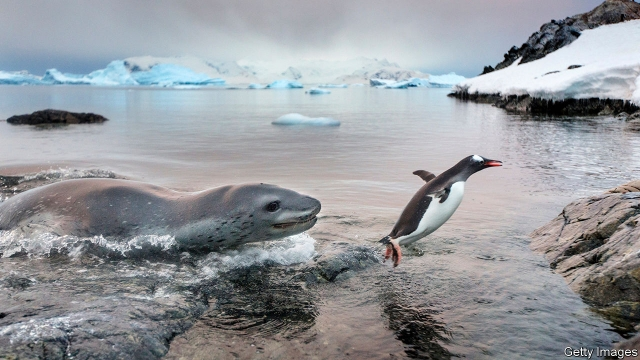

###### Animal behaviour

# Leopard seals share their suppers 

 

> print-edition iconPrint edition | Science and technology | Aug 17th 2019 

LEOPARD SEALS resemble their terrestrial namesakes in two ways. They have polka-dot pelts. And they are powerful, generally solitary carnivores that are quite capable of killing a human being if they so choose—as has indeed happened once, in 2003, when a British marine biologist was the victim. 

Curiously, though, there have also been reports of leopard seals behaving in a friendly manner towards people—apparently trying to present gifts, in the form of prey, to divers. Until now, there has been no explanation for this philanthropy. But work just published in Polar Biology by James Robbins of Plymouth University, in Britain, suggests that what the seals are actually looking for is a dining partner. 

Mr Robbins and his team were studying leopard seals in the waters around South Georgia, an island in the Southern Ocean 1,500km from the tip of the Antarctic peninsula. Instead of diving, or watching from ships, they used drones to carry out their observations. These drones recorded hitherto unobserved behaviour on the part of the animals. 

First, belying their solitary reputation, the seals came together in groups to attack king penguins (twice the size of the gentoo penguin in the photograph) that were entering the sea from a rookery on the island. Second, when a seal did catch a penguin in these circumstances it would sometimes offer to share it with a neighbour in a way reminiscent of divers’ tales of gift giving. What looked like an aberration might thus be a normal way of behaving. But why? 

Mr Robbins’s suggestion is that sharing a penguin with a neighbour makes it easier to eat. A close look at footage the drones recorded shows that seals in such partnerships take it in turns to feed. One holds the bird tight in its jaws while the other rips off a chunk of flesh and swallows it. Then they swap roles. By contrast, for a lone seal to reduce a penguin to bite-sized chunks means whipping the prey around in its jaws with as much force as it can muster, in order to tear lumps of flesh free from the carcass. This commonly happens, but is thought to be extremely tiring. Better, therefore, to find a buddy and enjoy a meal together.■ 
<<<<<<< HEAD

-- 

 单词注释:

1.leopard['lepәd]:n. 豹, 美洲豹 

2.Aug[]:abbr. 八月（August） 

3.leopard['lepәd]:n. 豹, 美洲豹 

4.terrestrial[tә'restriәl]:n. 地球上的人 a. 地球的, 陆生的, 陆地的, 人间的 

5.namesake['neimseik]:n. 同名人, 同名物 

6.pelt[pelt]:n. 投掷, 打击, 快速, 毛皮 vt. 剥...的皮, 连续投掷, 攻击, 抨击, 拍打 vi. 投击 

7.solitary['sɒlitәri]:n. 独居者 a. 孤独的, 独居的 

8.carnivore['kɑ:nivɒ:]:n. 食肉动物 [医] 食肉动物, 食虫植物 

9.biologist[bai'ɒlәdʒist]:n. 生物学家 [医] 生物学家 

10.curiously['kjuәriәsli]:adv. 好奇地 

11.leopard['lepәd]:n. 豹, 美洲豹 

12.prey[prei]:n. 被掠食者, 牺牲者 vi. 捕食 

13.diver['daivә]:n. 潜水者 

14.philanthropy[fi'lænθrәpi]:n. 慈善, 仁慈, 博爱, 慈善事业, 慈善机构(团体) 

15.polar['pәulә]:a. 两极的, 极地的, 正好相反的, 极性的 n. 极线, 极面 

16.jame[]: 灰岩井 

17.Robbins['rɔbinz]:罗宾斯(①姓氏 ②Frederick Chapman, 1916-, 美国医学家, 曾获1954年诺贝尔生理学-医学奖) 

18.plymouth['plimәθ]:n. 普利茅斯（英国一座城市） 

19.dining['dainiŋ]:n. 正餐, 宴会 

20.Georgia['dʒɒ:dʒjә]:n. 乔治亚州 

21.drone[drәun]:n. 雄蜂, 懒惰者, 嗡嗡的声音, 无人驾驶飞机(或船) vi. 嗡嗡作声, 混日子 vt. 低沉地说 

22.hitherto[.hiðә'tu:]:adv. 迄今, 至今 

23.unobserved['ʌnәb'sә:vd]:a. 没有观察到的, 没有受到注意的, 未被遵守的 [法] 未被遵守的, 未被注意的, 没有观察到的 

24.bely[]:n. (Bely)人名；(俄)别雷 

25.penguin['pengwin]:n. 企鹅, 空军地勤人员 

26.gentoo['dʒentu:]:n. 巴布亚企鹅 

27.rookery['rukәri]:n. 海豹群, 群栖处, 企鹅群, 贫民窟, 同类人的集中处, 同类物的集中处 

28.reminiscent[.remi'nisnt]:a. 回忆的, 怀旧的 n. 往事叙述者, 回忆录作者 

29.aberration[æbә'reiʃәn]:n. 离开正路, 偏离, 畸变, 光行差, 心理失常, 色差 [化] 光行差; 像差 

30.footage['futidʒ]:n. 英尺长度, 英板尺, (影片的)连续镜头 

31.partnership['pɑ:tnәʃip]:n. 合伙, 合股, 合作关系 [经] 合伙(合作)关系, 全体合伙人 

32.rip[rip]:n. 裂痕, 破绽, 拉裂, 浪子, 巨浪 vi. 被拉开, 裂开, 猛冲 vt. 撕, 扯, 劈 

33.chunk[tʃʌŋk]:n. 大块, 矮胖的人(或物) [经] 定样 

34.lone[lәun]:a. 孤单的, 孤立的, 单身的, 寂寞的 

35.muster['mʌstә]:n. 召集, 集合, 检阅, 清单, 花名册, 样品 vt. 召集, 集合, 应召 vi. 集合, 集中 

36.carcass['kɑ:kәs]:n. 尸体 [医] 屠体(宰后除脏的畜体) 

37.buddy['bʌdi]:n. 好朋友, 伙伴 
=======
>>>>>>> 50f1fbac684ef65c788c2c3b1cb359dd2a904378

