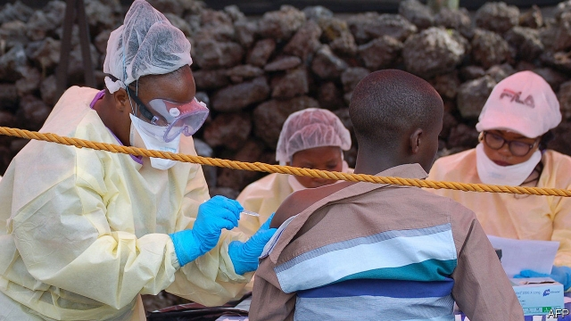

###### Ebola

# Two treatments for Ebola emerge from a clinical trial in Africa 

 

> print-edition iconPrint edition | Science and technology | Aug 15th 2019 

NEWS ABOUT Ebola, a viral disease that kills up to 90% of those it infects, is usually grim. The latest outbreak, in the Democratic Republic of Congo (DRC), has thus far killed nearly 1,900 people and rages on. But on August 12th the grimness lifted somewhat with the announcement that two anti-Ebola treatments being tested in the country have proved effective. If administered when the first signs of infection appear, they boost survival rates to about 90%. 

The treatments in question employ antibodies. These are special protein molecules made by the immune system in response to infection. They work by locking onto specific parts of invading pathogens, or of body cells infected by those pathogens—either gumming the target up and disabling it or marking it for destruction by other parts of the immune-system. It is possible, however, to give the immune system a helping hand by identifying suitable antibodies in advance, manufacturing them in bulk, and then injecting them into those infected by the target organism. 

One of the successful treatments, code-named REGN-EB3, is a cocktail of three such antibodies, mixed by Regeneron, an American biotechnology firm. The other, mAb114, is a single antibody developed by America’s National Institute for Allergies and Infectious Diseases. REGN-EB3 and mAb114 were among four experimental treatments tested in a randomised trial at clinics in the DRC. Based on preliminary results from 500 patients, an oversight committee led by the World Health Organisation concluded that the trial should be stopped immediately, in order that the two successful treatments could be made available to everyone. 

Prompt use after infection is vital. Overall, 29% of those receiving REGN-EB3 died. But of people treated when their viral loads were still low only 6% succumbed. For mAb114 the numbers were 34% and 11% respectively—superficially worse, but actually indistinguishable, statistically speaking, from the results for REGN-EB3. Two other candidates had significantly worse figures than these, and were therefore rejected by the overseers. 

Both REGN-EB3 and mAb114 have histories. Regeneron developed the former in 2016, in response to an Ebola epidemic in West Africa in which 11,000 people died. But that outbreak came to an end before the treatment could make its way into clinics, and until now there has been no opportunity to test it. The story of mAb114 goes back even further. Its pertinent antibody was isolated from a survivor of an epidemic of Ebola in the DRC in 1995. 

Both treatments will now be deployed in the field—but, given the smallish size of the trial that approved them, doctors will be looking closely at their relative efficacies to determine whether, in light of more data, one is actually better than the other. Regardless of that, effective treatment will surely help break the epidemic directly, by stopping those cured passing on the virus. And it may help indirectly, too. At the moment, those who have become infected, seeing others go into clinics alive only to leave in coffins, are understandably reluctant to follow suit. That means they remain in their homes and spread the illness to others. The prospect of going to a clinic for a cure will change this, and thus help also to break the chain of transmission. 

-- 

 单词注释:

1.ebola[i'bəulə]:n. 埃博拉病毒 

2.clinical['klinikәl]:a. 临床的, 门诊部的 [医] 临床的, 临证的 

3.Aug[]:abbr. 八月（August） 

4.viral['vairәl]:a. 病毒的, 病毒引起的 [医] 病毒的 

5.grim[grim]:a. 冷酷的, 坚强的, 残忍的, 可怕的, 讨厌的 

6.outbreak['autbreik]:n. 爆发, 暴动 [医] 暴发 

7.Congo['kɔŋ^әu]:n. 刚果, 刚果河, 工夫茶 [建] 刚果, 直接刚果红 

8.DRC[]:[计] 数据记录控制, 数据记录设备 

9.grimness['grimnis]:n. 严格, 冷酷, 严峻 

10.administer[әd'ministә]:vt. 管理, 料理, 执行 vi. 执行遗产管理人的职责, 给予帮助 

11.infection[in'fekʃәn]:n. 传染, 影响, 传染病 [医] 传染, 感染 

12.antibody['æntibɒdi]:n. 抗体 [化] 抗体 

13.immune[i'mju:n]:a. 免疫的, 免除的, 不受影响的 n. 免疫者 

14.pathogen['pæθәdʒ(ә)n]:n. 病原体 [医] 病原体 

15.manufacturing[.mænju'fæktʃәriŋ]:n. 制造业 a. 制造业的 

16.inject[in'dʒekt]:vt. 注射, 注入, 使入轨 [医] 注射 

17.cocktail['kɒkteil]:n. 鸡尾酒, 开味品 a. 鸡尾酒会的 

18.Regeneron[]:[网络] 里杰内隆；再生元；雷杰纳荣公司 

19.biotechnology[.baiәutek'nɔlәdʒi]:n. 生物工艺学；生物技术 

20.allergy['ælәdʒi]:n. 变应性, 反感, 厌恶 [化] 变态反应; 变应性 

21.infectious[in'fekʃәs]:a. 有传染性的, 易传染的 [医] 传染性的 

22.randomise['rændəmaiz]:vt. [主英国英语]＝randomize 

23.oversight['әuvәsait]:n. 勘漏, 失察, 失败, 照料 [经] 监督权 

24.organisation[,ɔ: ^әnaizeiʃən; - ni'z-]:n. 组织, 团体, 体制, 编制 

25.succumb[sә'kʌm]:vi. 屈从, 屈服, 死 

26.indistinguishable[.indis'tiŋgwiʃәbl]:a. 不能辨别的, 不能区别的 

27.statistically[]:adv. 用统计的方法, 统计学上 

28.significantly[]:adv. 值得注目地；意味深长地 

29.overseer[.әuvә'si:ә]:n. 监督, 工头 [经] 管理人, 监督, 盘工 

30.epidemic[.epi'demik]:n. 传染病, 流行病 a. 流行的, 传染性的 

31.pertinent['pә:tinәnt]:a. 相关的, 中肯的, 切题的 [法] 恰当的, 有关的 

32.survivor[sә'vaivә]:n. 生还者, 幸存者 [法] 生还者, 生存者, 辛存者 

33.deploy[di'plɒi]:v. 展开, 配置 

34.smallish['smɒ:liʃ]:a. 有点小的, 短小的 

35.efficacy['efikәsi]:n. 功效, 效力 [医] 效能, 功效, 效验 

36.datum['deitәm]:n. 论据, 材料, 资料, 已知数 [医] 材料, 资料, 论据 

37.indirectly[]:adv. 间接, 曲折, 迂回, 不直截了当, 不诚实, 不坦率 [计] 间接地 

38.coffin['kɒfin]:n. 棺材, 灵柩 vt. 把...装进棺材 

39.understandably[]:adv. 可懂, 可了解, 可理解 

