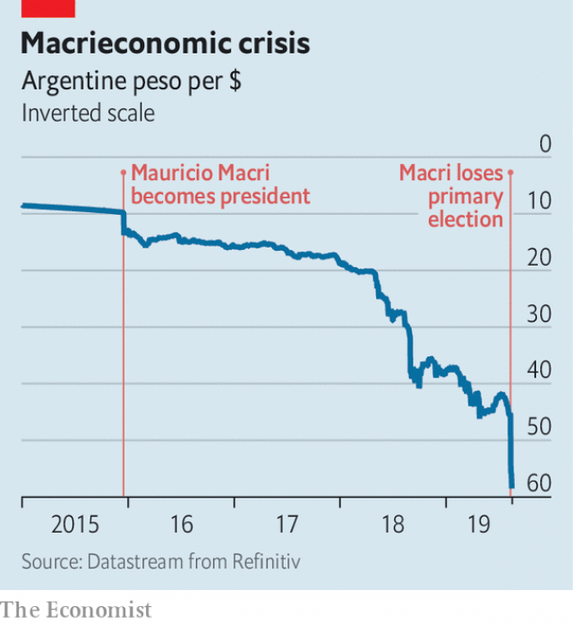

###### The bonds that tie

# Argentina faces the prospect of another default 

 

> print-edition iconPrint edition | The Americas | Aug 17th 2019 

THE ELECTION of Mauricio Macri in 2015 was supposed to usher in a new era in Argentina, a country with a reputation for toothsome steaks, rapid inflation and defaulting on its debts. Mr Macri promised to tame soaring prices with tight monetary policy, a problem Cristina Fernández de Kirchner, Argentina’s previous president, had tried to obfuscate by publishing dodgy macroeconomic data and imposing currency controls. Mr Macri abolished these, allowing the peso to float freely, and removed export quotas and tariffs. Investors applauded. After resolving long-standing disputes with bond investors, Argentina was able to issue debt once more. In June 2017 Mr Macri even issued $2.7bn worth of 100-year bonds at a yield of 8%. They were almost four times oversubscribed. 

Good fortune did not last. Unexpected changes to inflation targets and rapid debt issuance alarmed investors in 2017. These qualms mushroomed into a currency crisis last year. As the peso plunged, the central bank raised interest rates to 40%. Mr Macri was forced to seek a $57bn loan from the IMF. In order to satisfy the terms of the bailout, he has cut public spending and raised the prices of utilities, such as gas and electricity, and public transport. The crisis has taken a heavy toll on the economy. Argentina has been in recession for the past year; inflation is over 50%. The poverty rate, as measured by the Catholic University of Argentina, has climbed from 27% in 2017 to 35% now. 

 

Economic hardship has not played well with voters. “We voted last time for the president because we wanted a better life, especially for our children,” says Mercedes, a shop assistant in Buenos Aires. “But life was worse under him. We worked more to have less.” On August 11th they voiced their discontent in primary elections for the presidency. The opposition, led by a veteran Peronist, Alberto Fernández, with the former president Ms Fernández (no relation) as his running mate, won 47% of the vote. Mr Macri’s coalition won just 32%. 

The reaction of investors was swift and vicious. On August 12th they rushed to dump Argentine assets. Mr Macri may not have been a panacea for all Argentina’s ills, but his stewardship of the economy was far more sober than that of his predecessor, who now seems likely to be restored to high office. Argentina’s stockmarket, the Merval, fell by 37%. At one point in the day the peso was down by 30% before the central bank intervened and raised interest rates to 74%. It still closed 15% lower. In dollar terms, the stockmarket’s collapse is the second-biggest one-day drop recorded anywhere in the world since at least 1950. The 100-year bonds that investors had clamoured for when Mr Macri issued them are now worth just 54 cents on the dollar, implying a default risk of 57%. 

The rout in asset prices was severe, first, because the hope that Mr Macri can recover is small. On August 11th nobody actually won or lost office: the vote was technically a primary and the main candidates were uncontested in their parties. But since all Argentines over the age of 16 were legally obliged to vote, it functioned as a full dress rehearsal for the real election, which will be held at the end of October. If the Fernándezes win more than 45% of the vote again in October, they will seize victory in the first round. 

Second, investors are rightly fearful of the policies the pair may put in place. Ms Fernández’s spendthrift reputation precedes her. Mr Fernández warned in the final days of the campaign that devaluation of the peso was coming. He also promised to renegotiate the $57bn IMF loan, and said that he could in effect default on Argentine bonds. 

In the aftermath of the vote, Mr Fernández tried to strike a more moderate tone. “We weren’t crazy in government before,” he declared. Reducing expectations, one of his advisers points out that if Mr Fernández wins, a weak peso will make the job of being president “that much tougher”. But it may already be too late. As The Economist went to press, the peso had fallen by 25% against the dollar since the election. 

A weaker currency will push up the prices of imported goods, causing inflation to rise even further. It also has adverse implications for the country’s bonds. Argentina has defaulted on its sovereign debt eight times since independence in 1816, most recently in 2014 when Ms Fernández clashed with hedge funds. Government debt in Argentina is currently worth 88% of GDP. Three-quarters of it is denominated in foreign currency. A falling peso will push up the burden of servicing it. Economists at Bank of America now think the probability of a restructuring next year is high, and that the recovery value of Argentina’s debt could be as low as 40%. 

Could the markets’ collapse persuade Argentines to change their minds by October? Some voters surely took the chance to punish Mr Macri in the primary vote, and will come back to him in the real thing. But few think it will be enough. Eduardo D’Alessio, of D’Alessio/Berensztein, a polling firm, says it would take “a huge, obvious mistake” by los Fernández before October to keep Mr Macri in office. Inside the president’s camp, the mood was doom-laden. “This is a catastrophe,” said one of his advisers. “It’s almost impossible to come back from this.” 

Mr Macri has vowed to fight back. On August 14th he told voters: “I understand the anger.” He has introduced a $740m stimulus package of tax cuts, price freezes and higher benefit payments. Maybe it will help him claw back some votes. But whoever gets the job after the vote in October, it has just become much harder.■ 

-- 

 单词注释:

1.Argentina[.ɑ:dʒәn'ti:nә]:n. 阿根廷 

2.default[di'fɒ:lt]:n. 违约, 不履行责任, 缺席, 默认值 v. 疏怠职责, 缺席, 拖欠, 默认 [计] 默认; 默认值; 缺省值 

3.Aug[]:abbr. 八月（August） 

4.Mauricio[]:n. 毛利西奥（男子名） 

5.macri[]: [人名] 麦克里 

6.usher['ʌʃә]:n. 引座员, 招待员 vt. 引导, 招待 vi. 作招待员 

7.toothsome['tu:θsәm]:a. 可口的, 美味的 

8.inflation[in'fleiʃәn]:n. 胀大, 夸张, 通货膨胀 [化] 充气吹胀; 膨胀 

9.soar[sɒ:]:n. 高扬, 翱翔 vi. 往上飞舞, 高耸, 翱翔 

10.monetary['mʌnitәri]:a. 货币的, 金钱的 [经] 货币的, 金融的 

11.Cristina[]:n. 克里斯蒂娜（电视剧中的人物） 

12.de[di:]:[化] 非对映体过量 [医] 铥(69号元素铥的别名,1916年Eder离得的假想元素) 

13.kirchner[]:柯克纳（人名） 

14.obfuscate[ɒb'fʌskeit]:vt. 弄暗, 使模糊, 使迷惑 

15.dodgy['dɒdʒi]:a. 狡猾的, 逃避的, 难弄的 

16.macroeconomic[-mik]:n. 整体经济 

17.datum['deitәm]:n. 论据, 材料, 资料, 已知数 [医] 材料, 资料, 论据 

18.peso['peisәu]:n. 比索 [经] 比索 

19.quota['kwәutә]:n. 配额, 限额 [化] 定额 

20.tariff['tærif]:n. 关税, 关税表, 价格表, 收费表 vt. 课以关税 [计] 价目表 

21.investor[in'vestә]:n. 投资者 [经] 投资者 

22.oversubscribe[.әuvәsәb'skraib]:vt. 超额认购(公债等), 过量预订 [经] 超额认购(公债等), 订购(某物)过多 

23.unexpect[]:[网络] 意想不到；使意外 

24.issuance['iʃjuәns]:n. 发行, 发布 [经] 发行, 发给 

25.qualm[kwɒ:m]:n. 晕眩, 不安, 疑虑 [法] 疑虑, 不安, 内疚 

26.IMF[]:国际货币基金组织 [经] 国际货币基金 

27.bailout['beilaut]:跳伞 

28.toll[tәul]:n. 通行费, 代价, 钟声 vt. 征收, 敲钟, 鸣钟, 勾引, 引诱 vi. 征税, 鸣钟 

29.recession[ri'seʃәn]:n. 后退, 凹处, 衰退, 归还 [医] 退缩 

30.voter['vәutә]:n. 选民, 投票人 [法] 选民, 选举人, 投票人 

31.mercedes['mә:sidi:z]:n. 梅塞德斯（人名）；梅赛德斯（公司名） 

32.Buenos[]:n. (Buenos)人名；(西)布埃诺斯 

33.aire[]:n. 亚耳河（英国约克郡西部河流） 

34.les[lei]:abbr. 发射脱离系统（Launch Escape System） 

35.discontent[.diskәn'tent]:n. 不满 

36.presidency['prezidәnsi]:n. 总统职权, 总裁职位 

37.opposition[.ɒpә'ziʃәn]:n. 反对, 敌对, 相反, 在野党 [医] 对生, 对向, 反抗, 反对症 

38.Peronist[pә'rәjnist]:a. (阿根廷总统)庇隆的,庇隆主义的, 庇隆主义者的 

39.alberto[]:n. 阿尔贝托（阿塞拜疆教练） 

40.coalition[.kәuә'liʃәn]:n. 结合体, 结合, 联合 [经] 联合, 联盟 

41.vicious['viʃәs]:a. 邪恶的, 堕落的, 品性不端的, 恶毒的, 恶性的, 有错误的 [医] 缺点的, 恶的 

42.argentine['ɑ:dʒәntain]:n. 银, 银白色金属, 银白色鱼鳞, 阿根廷人 a. 银的, 银色的, 阿根廷的 

43.asset['æset]:n. 资产, 有益的东西 

44.panacea[.pænә'siә]:n. 万能药, 灵丹妙药 [医] 万应药 

45.stewardship['stju:wәdʃip]:n. steward的职务, 管理工作 

46.predecessor[.predi'sesә]:n. 前任, 先辈, 前身 [医] 初牙, 前辈, 祖先 

47.stockmarket[s'tɒkmɑ:kɪt]: 证券市场; 证券交易所; 证券行情 

48.intervene[.intә'vi:n]:vi. 插入, 调停, 干涉 [经] 进场干预 

49.clamour['klæmә]:n. 喧闹 v. 大声地要求 

50.rout[raut]:n. 溃败, 大败, 乌合之众, 盛大晚会 vt. 使溃败, 使败逃, 打垮, 用鼻拱, 挖起, 搜, 唤起 vi. 用鼻拱地, 搜 

51.technically['teknikli]:adv. 技术上, 学术上, 专门地 

52.uncontested[.ʌnkәn'testid]:a. 没有人争的, 无竞争的, 明显的 [法] 无争议的, 无竞争的, 无异议的 

53.argentine['ɑ:dʒәntain]:n. 银, 银白色金属, 银白色鱼鳞, 阿根廷人 a. 银的, 银色的, 阿根廷的 

54.legally['li:gәli]:adv. 法律上, 合法地 [法] 法律上, 合法地, 法定地 

55.rightly['raitli]:adv. 合适地, 正当地, 正确地 

56.spendthrift['spendθrift]:n. 浪费的人 a. 浪费的, 挥霍无度的 

57.precede[.pri:'si:d]:vt. 在...之前, 优于, 较...优先 vi. 在前面 

58.devaluation[,di:vælju'eiʃәn]:n. 降低价值, 贬值 [经] 贬值 

59.renegotiate[.ri:ni'gәuʃieit]:vt. 重新谈判 

60.aftermath['ɑ:ftәmæθ]:n. 结果, 后果 [法] 后果, 结果 

61.adviser[әd'vaizә]:n. 顾问, 劝告者, 指导教师 [法] 顾问, 劝告者 

62.economist[i:'kɒnәmist]:n. 经济学者, 经济家 [经] 经济学家 

63.adverse['ædvә:s]:a. 不利的, 敌对的, 相反的, 逆的 [法] 相反的, 敌对的, 逆的 

64.sovereign['sɒvrin]:n. 元首, 独立国 a. 具有主权的, 至高无上的, 国王的, 完全的 

65.clash[klæʃ]:n. 冲突, 撞击声, 抵触 vi. 冲突, 抵触 vt. 使发出撞击声 [计] 对撞 

66.currently['kʌrәntli]:adv. 现在, 当前, 一般, 普通 [计] 当前 

67.denominate[di'nɒmineit]:vt. 命名 

68.economist[i:'kɒnәmist]:n. 经济学者, 经济家 [经] 经济学家 

69.restructuring[]:[计] 重构的 

70.Eduardo[]:n. 爱德华多（姓氏） 

71.los[lɔ:s]:abbr. 月球轨道航天器（Lunar Orbiter Spacecraft）；视线（Line of Sight） 

72.vow[vau]:n. 誓约, 誓言, 许愿 vi. 起誓, 发誓, 郑重宣言 vt. 立誓, 起誓要, 郑重地宣布 

73.stimulus['stimjulәs]:n. 刺激, 激励, 刺激品 [医] 刺激特, 刺激 

