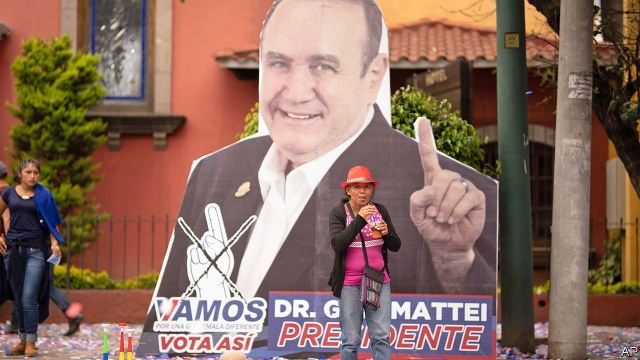

###### Giammattei tomorrow

# Guatemala’s president-elect promises “sufficient testosterone” 

 

> print-edition iconPrint edition | The Americas | Aug 17th 2019 

“WE HAVE TWO very bad options. You have to choose the less bad one.” So reckoned Heydee Berrascout, a physiotherapist in designer sunglasses outside a voting booth in a posh suburb of Guatemala City. “You have to pick someone. But I’m not convinced by either of them,” said Oscar Marroquín, a shoe-factory worker across town in the poorer area of Bethania. Rich or poor, many in the capital disliked the candidates in the run-off of Guatemala’s presidential election, on August 11th. Both Heydee and Oscar opted for Alejandro Giammattei, as did 84% of the city. 

Mr Giammattei, a conservative who was on his fourth attempt at the presidency, collected 58% of the vote. His opponent, Sandra Torres, who served as first lady from 2008 to 2012, got 42%. Turnout, at 40%, was the lowest this century. The country must wait five months until the current president, Jimmy Morales, finishes his term in January. But the malaise that Mr Giammattei will inherit is already clear. On the trail the president-elect told voters he does not want to be remembered as “one more son of a bitch”. That would be a novel achievement in a country where faith in politicians long ago melted away. 

Mr Morales, a former comedian, had briefly inspired hope, raging against corruption. But he has spent much of his term obsessed with destroying the International Commission against Impunity (CICIG), a UN-backed anti-graft agency which has investigated not just Mr Morales but both Mr Giammattei and Ms Torres (who could yet end up in jail once her immunity as a presidential candidate ends). The agency’s mandate will expire next month, after Mr Morales refused to extend it. 

His critics say Mr Giammattei represents the continuation of a shadowy coalition of businessmen, organised crime bosses and military men who have long ruled Guatemala. When campaigning, Mr Giammattei travelled in a helicopter whose licence-plate number is registered to a company co-owned by Luis Francisco Ortega Menaldo, a retired general. 

His in-tray is unenviable. Malnutrition and stunting are rife in the countryside. A survey in 2011 of women in 54 poor countries found Guatemalans to be the shortest of all. Some 200,000 people enter the workforce annually, yet last year the private sector added just 3,000 formal positions. In Latin America only the dictatorships of Nicaragua and Venezuela score worse on Transparency International’s index for perceptions of government corruption. A quarter of a million Guatemalans have been apprehended on the United States’s southern border since October. Gangs terrorise those who stay. 

Fear not, says Mr Giammattei. His government will have “the sufficient level of testosterone” to tackle organised crime. His mano dura approach extends to a ban on conjugal visits for prisoners (they will have to “settle among themselves”, he says). To boost growth, Mr Giammattei promises to summon up a “wall of investment”. He plans to build a high-speed train across the country’s hinterlands to its cities and ports. He has promised more social programmes for rural women, a pledge once unthinkable from a Guatemalan right-winger. Special economic zones and tax reform are among the wheezes his wonks propose. 

Yet the most immediate problem Mr Giammattei will face is how to manage the safe-third-country deal reached by Mr Morales and Donald Trump last month, which will force asylum-seekers passing through Guatemala to take refuge there rather than in the United States. It is unpopular and possibly unconstitutional. Mr Giammattei has hinted that he wants to tweak the deal. To accept it, he may need political cover from America in the form of renewed aid (Mr Trump cut it off this year) or assurances that Guatemalans will get more permits to do farm work in the United States. 

One less headache will be the departure of CICIG and its top-notch lawyers next month, allowing Mr Giammattei to rest easier. The president-elect insists that the fight against corruption will continue. If CICIG has done its job equipping local institutions, says a future cabinet member, then Guatemala should be well placed to fight graft on its own. Whether it will depends on whether Mr Giammattei has the cojones to do it. ■ 

