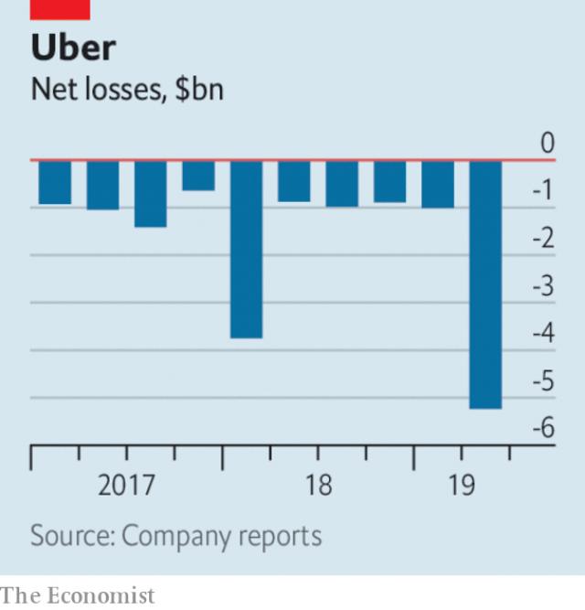

###### The world economy

# Business this week 

> Aug 17th 2019 

Spooked by concerns over trade, geopolitical tensions and the possibility of recession, stockmarkets had their worst day of the year so far. The s&P 500, Dow Jones Industrial Average and NASDAQ indices all fell by 3% in a day. In Europe the DAX was down by 2.2% and the FTSE 100 by 1.4%. Investors were particularly concerned by the yield on long-term American government bonds falling below that on short-term bonds for the first time since 2007. Such a yield-curve inversion is usually seen as a harbinger of a downturn. See article. 

Also weighing on markets was news that Germany’s GDP shrank by 0.1% in the second quarter compared with the previous three months, underlining the recent fall in German exports and industrial output. Britain’s economy also shrank in the second quarter, by 0.2%, the first contraction of British GDP since the end of 2012. See article. 

Meanwhile, the growth rate of Chinese industrial output slowed to 4.8% in July compared with the same month last year. That was the slowest pace in more than 17 years and more evidence of the chilling effects of the trade war on the Chinese economy. 

Earlier in the week, despondent markets had lifted when the Trump administration said it would postpone a 10% tariff on some Chinese imports until December 15th. The list of goods includes smartphones, laptops, video-game consoles and toys, which Donald Trump suggested would benefit shoppers in the run-up to Christmas. The delay applies to two-thirds of the products subjected to this particular levy. A 10% tariff will be collected on the other Chinese goods from September 1st. See article. 

South Korea removed Japan from its list of trusted trading partners, escalating a trade dispute between the pair (Japan dropped South Korea’s preferential trading status earlier this month). Trade between the two countries will now have to go through more red tape. 

Saudi Aramco, Saudi Arabia’s state oil company, is to take a 20% stake in the refining and chemicals assets owned by Reliance Industries, an Indian conglomerate. The deal, which is still being negotiated, deepens existing ties between the companies and will be one of the biggest foreign investments in India to date. See article. 

Boeing delivered just 19 planes in July, the least since the financial crisis. The company is holding more than 150 of its 737 MAX aircraft, which have been grounded after two fatal crashes. The ripples from the grounding continue to spread. Norwegian airline said it was ending flights from Ireland to America in part because of the “continued uncertainty” of the 737 MAX’s return to service. It is Norwegian’s first retreat from a transatlantic market it had entered assertively. 

Cathay Pacific’s share priceregained the ground it lost amid protests at Hong Kong’s airport. The territory’s biggest airline was also ordered by China’s aviation authority to take crew off any plane bound for the mainland if they supported the protesters. Cathay said it would comply, leaving it vulnerable to claims of being pro-Chinese. See article. 

After years of on-off negotiations with a plot worthy of a soap opera, Viacom and CBS agreed to merge, reuniting two media companies that were split in 2006 and combining assets such as Paramount and MTV with one of America’s big four networks. Shari Redstone, whose family controls both companies, will become chairwoman of ViacomCBS. See article. 

Britain’s advertising authority banned two TV ads under new rules on gender stereotyping. One ad, for Volkswagen, depicted men being more adventurous than women. The other, for Philadelphia cream cheese, showed two men distracted by lunch neglecting their babies. Mondelez, the maker of Philadelphia, said it chose two dads “to deliberately avoid the typical stereotype” of two mothers. The regulator disagreed, ruling that “the men were portrayed as somewhat hapless” and that the “humour in the ad derived from the use of the gender stereotype”. 

WeWork’s parent company filed documents for its eagerly awaited IPO, which might happen next month. The office rental firm is the latest in a string of high-profile startups to float on the stockmarket this year. Like many of its contemporaries, WeWork’s filing suggests it struggles to make a profit. In the first half of this year it recorded a $905m loss. See article. 

 

Uber’s share price fell by a fifth in the days after it revealed a $5.2bn quarterly loss. Most of that was because of share-based compensation paid to workers after Uber’s IPO, but even on its favoured measure of profitability it made a loss of $656m, more than in the same quarter last year. Dara Khosrowshahi, the chief executive, accepted that investors were frustrated with mounting losses, conceding that “There’s a meme around, which is, can Uber ever be profitable?”. 

