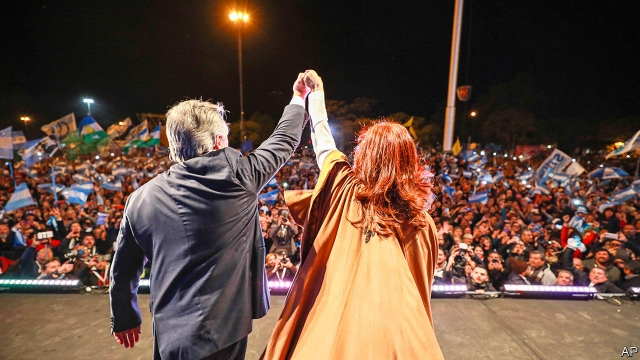

###### The world economy

# Politics this week 

 

> Aug 17th 2019 

An indicative vote in Argentina’s presidential election suggested that the opposition, led by Alberto Fernández with the country’s previous president, Cristina Fernández de Kirchner (no relation), as his running-mate, would handily win the actual election in October. The Argentine peso shed a quarter of its value against the dollar and its main stockmarket fell by 37%. Investors fear the return of Ms Fernández, whose policies between 2007 and 2015 ruined the economy. See article. 

The result was a blow to the incumbent Argentine president, Mauricio Macri. After the poll he announced a number of giveaways to win over voters, including tax cuts, more welfare subsidies and a three-month freeze in petrol prices. See article. 

The election of Alejandro Giammattei as Guatemala’s president threw doubt on the safe-third-country agreement signed by the outgoing president, Jimmy Morales, with the United States. Under the deal some migrants would seek asylum in Guatemala rather than travelling through Mexico to the American border. Mr Giammattei thinks Guatemala might not be able to honour that commitment. See article. 

The nomination by Brazil’s president, Jair Bolsonaro, of his son, Eduardo, as ambassador to the United States prompted the public prosecutor’s office to ask a federal court to rule on the formal qualifications required to be a diplomat. Eduardo Bolsonaro’s appointment must still be confirmed by the senate in Brasília, but that hasn’t stopped the opposition from crying foul, saying his only diplomatic credentials seem to be that he is a friend of the Trump family. 

Canada’s ethics commissioner criticised Justin Trudeau, the prime minister, for pressing a former attorney-general to drop charges against a firm accused of bribery in Libya. The commissioner said Mr Trudeau and his office acted outside the bounds of convention, and that their behaviour was “tantamount to political direction”. His report complicates Mr Trudeau’s bid for re-election in October. 

Two treatments for Ebola proved to be effective in tests conducted in the Democratic Republic of Congo, where the latest outbreak has killed 1,900 people. The survival rate jumps to 90% if the treatments, which employ special antibodies, are given soon after infection. If untreated, most people who catch Ebola die. See article. 

Southern separatists in Yemen seized the city of Aden from forces loyal to the internationally recognised government. The separatists and the government are part of a Saudi-led coalition fighting the Iranian-backed Houthi rebels, who control much of the country. Many in the south dislike the government, as well as the Houthis, and hope to secede. See article. 

Mystery surrounded an explosion in Russia’s far north, which led to a spike in radiation in nearby towns. The Russians said only that a rocket had exploded, killing five scientists. Analysts think it may have been a Skyfall, a cruise missile powered by a tiny nuclear reactor that the Russians are developing. See article. 

Another huge weekend protest, this one the biggest yet, was held in Moscow in opposition to the authorities’ decision to bar certain candidates from contesting elections to the city council. The demonstration had been authorised, but police still beat up many of those taking part. See article. 

John Bolton, Donald Trump’s national security adviser, visited Boris Johnson, the new British prime minister, in London. Mr Bolton held out the prospect of a quick trade deal, negotiated sector by sector (to placate those worried by American designs on Britain’s health service) in the case of a no-deal Brexit. But a few days later Nancy Pelosi, the Democratic Speaker of Congress, again scotched any hope of a deal if Britain reinstates border controls with Ireland post-Brexit. 

Chinese state media adopted a harsher tone against the protesters in Hong Kong, warning that they were “asking for self-destruction”. Video footage was released purporting to show manoeuvres by Chinese troops near the border with Hong Kong. China described the demonstrations as “behaviour that is close to terrorism”. Hundreds of flights in and out of Hong Kong were again cancelled when protesters occupied its airport. See article. 

America’s envoy to Afghanistan described the latest round of peace talks with the Taliban as “productive”. The talks, held in Qatar, ended without a deal by which American troops would leave Afghanistan. America is hoping to secure an agreement soon, ahead of a postponed presidential election in Afghanistan that is scheduled for September 28th. Ashraf Ghani, the Afghan president, this week rejected what he described as foreign interference in his country. See article. 

A communications blackout was still in force in most of Indian-administered Kashmir following the government’s decision to strip the region of its autonomy and split it into two territories that will in effect be controlled from Delhi. Sporadic protests broke out. The biggest took place in Srinagar, Kashmir’s main city, where thousands of Muslims took to the streets after Friday prayers. See article. 

A former president of Kyrgyzstan, Almazbek Atambayev, was charged with collusion in the early release of a mafia boss. Mr Atambayev has fallen out with his successor and former protégé, Sooronbay Jeyenbekov. Investigators say Mr Atambayev could face other charges, including of murder, after a dramatic siege of his home left a police officer dead. See article. 

The Trump administration published a rule that would stop legal migrants from becoming permanent residents in America if they use public-welfare programmes, such as food stamps. Migrants must already prove they will not rely on government assistance if they want to stay. The new rule specifies that receiving certain benefits will be a disqualifying factor. Ken Cuccinelli, who heads the immigration agency, said that America wants “self-sufficient” immigrants. 

America’s attorney-general, William Barr, ordered an inquiry into the suicide of Jeffrey Epstein. Mr Epstein, once a wealthy financier, was in jail awaiting trial for trafficking under-age girls for sex. 

The release of a film reportedly premised on a global elite who shoot “deplorables” (ie, Trump supporters) for sport was postponed in the wake of recent mass shootings. “The Hunt” is described as a “satirical social thriller” by Universal Pictures. 

