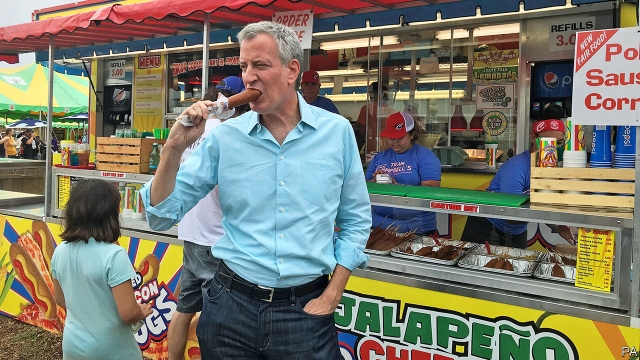

###### Among the 1%

# Adventures with long-shot candidates 

 

> print-edition iconPrint edition | United States | Aug 17th 2019 

NEARLY TWO dozen presidential candidates descended on Iowa’s State Fair, which began on August 8th, each with a different style and number of supporters. Elizabeth Warren’s were young, loud and pre-loaded with chants. Kamala Harris’s formed a yellow-shirted, fresh-faced, hyper-enthusiastic wave that left stickered, dazed-looking Iowans in its wake. Jay Inslee’s fan club comprised Channing Dutton, an amiable personal-injury lawyer from Des Moines, who held up a home-made sign that read, “Talk Climate!”—referring to Mr Inslee’s signature issue. 

Mr Inslee served eight terms in Congress and is in his second as Washington’s governor, where he has enacted a Democratic wish-list of policies, including a moratorium on capital punishment, expanded parental leave and an impressively detailed path to clean energy by 2045. He is tall, square-jawed, handsome and married to his high-school sweetheart. Yet he has struggled in a crowded field, and is polling below 1%, both nationally and in Iowa. 

In fact, just three candidates—Ms Warren, Ms Harris and Joe Biden—are polling in double digits in the state. Nationally, Ms Harris drops to 9% in The Economist’s average of polls, while Bernie Sanders is at 14% (a bit lower in Iowa). Sixteen candidates are bumbling along at 1%. Thus there were two contests playing out at the fair: four or five front-runners fought to be top dog, while the rest fought for a bit of attention. 

For some that was hard to come by. Mike Schweiger, a lean, white-haired electrician wearing a T-shirt emblazoned with the name of his union, said he supports Ms Warren, because “she talks about the need for a union resurgence, and that’s my issue. It’s not abortion, not the influx of aliens. That will bring back the middle class.” As he was explaining himself, Tim Ryan, a congressman from Youngstown, Ohio and a fervent union advocate, was on stage just a few feet away. Mr Schweiger said he had never heard of Mr Ryan; his wife asked if he was the one who ran with Hillary Clinton (that was Tim Kaine). 

“Every time a poll comes out and I’m at 2%, I think, ‘Oh my God, in the next one am I going to be at 4%?,” says John Hickenlooper, a former governor of Colorado, who is stuck on 1%. Mr Hickenlooper touts his record of bipartisan achievement. “I’m the only candidate who does what everyone talks about,” he tells reporters after his speech, his omnipresent smile hardening into a rictus. “If I keep saying it often enough, it’ll get through their heads.” 

There is still time to say it often enough. Iowa’s caucuses in February are the primary season’s first contest. Winners do not always capture their party’s nomination, as Tom Harkin (1992), Mike Huckabee (2008) and Ted Cruz (2016) can attest, but a poor performance can end a campaign. Some Democrats grumble about the size of the field, but—short of running out of money—no candidate yet has a strong enough incentive to drop out. 

The field is more open than it seems. Mr Biden holds a comfortable lead but he is gaffe-prone and would take office at 78, which would make him the oldest man to do so. His performances on the trail have been meandering and unimpressive; he seems to inspire more affection than genuine enthusiasm. If he begins leaking support, every other candidate wants to be there with a bucket. 

Still, short of an incredible run of luck, none of the stragglers seems likely to break through as long as the field remains so crowded. Mr Dutton believes that Mr Inslee is “a wildfire just waiting for a spark”. But asked what that spark might be, he is circumspect. “If I knew, I’d light it myself.”■ 

-- 

 单词注释:

1.Aug[]:abbr. 八月（August） 

2.presidential[.prezi'denʃәl]:a. 总统制的, 总统的, 首长的, 统辖的 [法] 总统的, 议长的, 总经理的 

3.supporter[sә'pɒ:tә]:n. 支持者, 后盾, 迫随者, 护身织物 [法] 支持者, 赡养者, 抚养者 

4.elizabeth[i'lizәbәθ]:n. 伊丽莎白（女子名） 

5.kamala[kә'meilә]:n. [植] 粗糠柴 

6.stickered[]:[网络] 粘着 

7.Iowan['aiəwən; 'aiəuən]:n. 爱荷华州人 a. 爱荷华州的 

8.jay[dʒei]:n. 鸟, 喋喋不休的人, 傻瓜 

9.chan[]:n. 通道（槽, 沟） 

10.Dutton[]:达顿（人名） 达顿（地名） 

11.amiable['eimjәbl]:a. 亲切的, 和蔼可亲的 [法] 亲和的, 和蔼可亲的 

12.de[di:]:[化] 非对映体过量 [医] 铥(69号元素铥的别名,1916年Eder离得的假想元素) 

13.moines[]:[网络] 雷神 

14.inslee[]: [人名] 英斯利 

15.enact[i'nækt]:vt. 制定法律, 扮演, 颁布 [法] 法令, 法规, 条例 

16.moratorium[.mɒrә'tɒ:riәm]:n. 延期偿付, 暂停 [法] 延期偿付, 延缓履行, 延期偿还期 

17.parental[pә'rentәl]:a. 父母亲的, 做双亲的, 作为渊源的 [医] 父母的, 双亲的 

18.impressively[]:adv. 令人难忘地；感人地 

19.sweetheart['swi:thɑ:t]:n. 心上人, 爱人 vi. 爱慕 vt. 向...求爱 

20.nationally['næʃәnәli]:adv. 作为整个民族, 举国一致地, 全国性地 

21.Iowa['aiәwә]:n. 衣阿华州 

22.warren['wɒrәn]:n. 养兔场, 拥挤的地区 

23.harris['hæris]:n. 哈里斯（英国苏格兰一地区）；哈里斯（姓氏） 

24.joe[dʒәu]:n. 乔（男子名） 

25.digit['didʒit]:n. 数字, 位数, 指头 [计] 数位; 位 

26.nationally['næʃәnәli]:adv. 作为整个民族, 举国一致地, 全国性地 

27.bernie['bә:ni]:n. 伯尼（男子名）；[俚]可卡因（等于cocaine） 

28.sander['sændә]:[电] 散沙 

29.bumble['bʌmbl]:vi. 结结巴巴地说, 犯大错, 踉跄, 跌倒 

30.mike[maik]:vi. 偷懒, 游手好闲 n. 休息, 游手好闲, 扩音器, 话筒 

31.schweiger[]:[网络] 顶端；舒威格 

32.electrician[.ilek'triʃәn]:n. 电学家, 电气技师, 电工 [化] 电工; 电气工人 

33.emblazon[im'bleizn]:vt. 用纹章装饰, 盛饰, 颂扬 

34.resurgence[ri'sә:dʒәns]:n. 再起, 复活, 再现 

35.influx['inflʌks]:n. 流入, 河口, 汇集 [医] 注入, 流入 

36.alien['eiljәn]:n. 外国人, 外侨 a. 外国的, 相异的 

37.tim[tim]:n. 蒂姆（男子名） 

38.ryan['raiәn]:n. 赖安（男子名） 

39.congressman['kɒŋgresmәn]:n. 国会议员, 众议院议员 [法] 国会议会 

40.youngstown['jʌŋztajn]:n. 扬斯敦（美国俄亥俄州东北部城市） 

41.Ohio[әu'haiәu]:n. 俄亥俄 

42.fervent['fә:vәnt]:a. 热的, 炎热的, 热心的 

43.Hillary['hiləri:]:n. 希拉里（美国现任国务卿） 

44.clinton['klintәn]:n. 克林顿（男子名） 

45.kaine[]: [人名] 凯恩 

46.john[dʒɔn]:n. 盥洗室, 厕所, 嫖客 

47.hickenlooper[]: [人名] 希肯卢珀 

48.Colorado[,kɔlә'rɑ:dәu]:n. 科罗拉多, 科罗拉多河 

49.tout[taut]:vi. 招徕顾客, 兜售物品 vt. 招徕, 刺探...情报 n. 兜售者, 侦查者 

50.bipartisan[bai,pɑ:ti'zæn]:a. 两党连立的 

51.omnipresent[.ɒmni'prezәnt]:a. 无所不在的, 普通存在的 

52.rictus['riktәs]:[医] 裂, 裂口, 呵欠 

53.alway['ɔ:lwei]:adv. 永远；总是（等于always） 

54.nomination[.nɒmi'neiʃәn]:n. 提名, 任命, 提名权 

55.tom[tɒm]:n. 雄性动物, 雄猫 

56.harkin[]: [人名] [英格兰人姓氏] 哈金 Hard的昵称 

57.huckabee[]:[网络] 哈克比；州长罗姆尼；阿肯色州州长赫卡比 

58.ted[ted]:vt. 翻晒 

59.cruz[]:n. （西）克鲁兹（男子名） 

60.attest[ә'test]:vi. 证明, 表明, 作证 vt. 为...作证 

61.democrat['demәkræt]:n. 民主人士, 民主主义者, 民主党党员 [经] 民主党 

62.grumble['grʌmbl]:n. 怨言, 满腹牢骚 vi. 抱怨, 发牢骚, 发隆隆声 vt. 抱怨 

63.incentive[in'sentiv]:n. 动机 a. 激励的 

64.biden[baidən]: [人名] 拜登 

65.meander[mi'ændә]:n. (河流的)蜿蜒, 漫步, 迂回旅行 vi. 蜿蜒流动, 漫步 vt. 使蜿蜒曲折 

66.unimpressive[.ʌnim'presiv]:a. 不惹人注意的, 给人印象不深的 

67.incredible[in'kredәbl]:a. 难以置信的 

68.straggler['stræglә]:n. 游荡者, 朱经请假擅离船舰的人员, 掉队者 

69.wildfire['waildfaiә]:n. (古时战争时所用的)燃料剂, 磷火, 鬼火, 野火 

70.circumspect['sә:kәmspekt]:a. 细心的, 慎重的 

