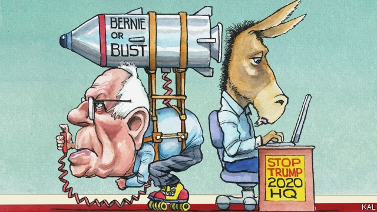

###### Lexington

# Bernie Sanders’s permanent revolution 

 

> print-edition iconPrint edition | United States | Aug 15th 2019 

THE BERNIE BARNSTORM held in Fort Collins, home of Colorado State University, started a few minutes late. “I know, ‘Bernie time’ right?” joshed an organiser sent from Washington, DC, to the crowd of 80 who had turned up to volunteer for Bernie Sanders’s nascent campaign in the state. Some were signed up to host a phone bank, which involves using a digital system known as “the Bernie dialler”. Others pledged to canvass and to put the results into a database called the BERN app. Meanwhile, the assembled Sandernistas were invited to come to the mic and say why they were “so excited about Bernie”, with a little steer from another campaign staffer: “You have the same feeling in your heart that I have and you are dedicated and loyal!” 

The declarations this elicited said a lot about the senator from Vermont’s effect on his followers. Several described Mr Sanders as a sort of benevolent guru. “Bernie is a humanist and a visionary and a radical,” said one; “I’m for Bernie because he’s for me,” said another. All considered Mr Sanders to be more authentic than other politicians. “Donald Trump pretends to be a populist, Bernie’s the real thing,” said a 22-year-old transgender Sanders fan. Many stressed their suspicion of his rivals. “I’m doing my best not to dog on other candidates—but that Kamala Harris health-care plan…” said Joe Salazar, a failed (though Sanders-endorsed) candidate for Colorado’s attorney-general. By contrast, “Bernie’s plan’s been refined through fire,” he claimed. “He’s been working on it, getting all the numbers down, for years.” 

Not since Eugene McCarthy in 1968 have Democrats faced such an anomaly. After the unexpected success of his 2016 presidential run, Mr Sanders has developed an almost cult-like hold on a small but meaningful minority of the Democratic electorate. By tapping it for cash, he appears also to have a durable campaign; he is among the first candidates on the ground in Colorado, a state he won easily in 2016, and last month had nearly $30m in hand. Even if he looked unable to win the nomination, he would be able to stay in the contest—and, having pointedly refused to commit to supporting the winning candidate, he might well do so. That could matter a great deal, because the chances are Mr Sanders cannot win. 

The 43% of the vote he won in 2016 (which makes that contest seem closer than it was) is a distant memory. Having performed strongly in early polling this year, he has slid as Elizabeth Warren has risen. The senator from Massachusetts is not as left-wing as Mr Sanders; she presents herself as a disappointed capitalist, not a socialist, which is a more digestible position on the Democratic left. Contrary to what Mr Salazar thinks, she also has a much firmer grip on policy. Above all, she is a Democrat—not an aggrieved independent as Mr Sanders is—who would support any of her 23 rivals if she lost. The two left-wingers are each polling at around 15% of the vote—a strikingly poor result for Mr Sanders’s superior resources and name recognition. Earlier in the campaign it seemed possible that he could emulate Mr Trump, by sneaking through a crowded contest with a loyal minority. His minority now looks too small. This raises a fundamental question, about what Mr Sanders’s rise and fall says about the left, and several tactical ones. 

Starting with the first, Mr Sanders’s erstwhile success appears to have owed less to his left-wing proposals than a vaguer appetite for disruption. The fact that 12% of his supporters in 2016 voted for Mr Trump illustrates that. Those who care mostly about health care or education policy appear since to have shifted to Ms Warren. The remaining diehards seem more energised by anti-establishment grievance. An Iranian-American Sanders fan in Fort Collins drew an approving cheer for hailing his hero as “the Mossadegh of America”. Only at a Sanders rally could an Iranian nationalist overthrown by a CIA-inspired plot count as a point of reference. Most of the volunteers said they expected the Democratic Party to rig the election against Mr Sanders. Many said they would not support any other winning candidate. 

 

Democratic politicians still believe Mr Sanders’s 2016 insurgency showed the party had moved in a big way to the left—hence the alacrity with which many of his rivals have aped his free-college-style proposals. But the burn-it-down iconoclasm of his base does not seem so consistent or easily mollified as that would imply. “Elizabeth Warren can kiss my ass,” said Rose, a socialist office clerk. “Joe Biden is a moderate Republican—they’ve totally infiltrated the Democrats,” said Remy, a democratic-socialist acupuncturist (who offered free treatments to any volunteer who showed up to her phone bank). 

In terms of tactics, Mr Sanders is most pressingly a problem for Ms Warren. After flirting with more moderate positions, notably on health care, she has essentially adopted a more informed and nuanced version of Mr Sanders’s policies. In other words, she is going after his supporters. Yet if Mr Sanders stayed in the race come what may, dividing the Democratic left, that could prove to be a fatal mistake. It might well hand the ticket to a moderate—most probably Mr Biden, still the front-runner. 

Thereafter, an unreconciled Mr Sanders would become a general-election problem for Democrats. His aggrieved minority is easily sufficient to deny their candidate victory in close-fought states such as Michigan or Wisconsin. Thus did McCarthy help ensure Hubert Humphrey’s defeat by Richard Nixon in 1968—and Mr Sanders help ensure Hillary Clinton’s to Donald Trump. 

Almost all the Sandernistas in Fort Collins who admitted to having voted for Mrs Clinton said they were embarrassed to have done so. And, it must be said, the blithe status quo-ism of Mr Biden could be even more off-putting to Mr Sanders’s supporters than her wonkish pragmatism. Victory for Mr Biden, then for Mr Trump—that would be a poor return on Mr Sanders’s promise of political revolution. Yet it is far more imaginable.■ 

