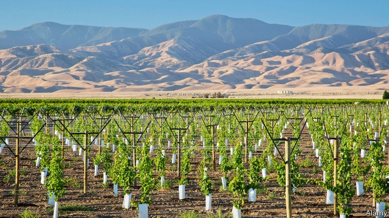

###### A liquid market

# Caps on groundwater use create a new market in California 

 

> print-edition iconPrint edition | United States | Aug 17th 2019 

A LONG STRETCH of highway running between Los Angeles and San Francisco separates the dry hills to the west from the green plains of the San Joaquin Valley to the east, where much of America’s fruit, nuts and vegetables are grown. Every couple of miles billboards hint at the looming threat to the valley. “Is growing food a waste of water?” one billboard asks. Another simply says, “No Water, no Jobs”. 

In the San Joaquin Valley agriculture accounts for 18% of jobs and agriculture runs on water. Most of it comes from local rivers and rainfall, some is imported from the river deltas upstate, and the rest is pumped out of groundwater basins. During the drought of 2012-16 landowners pumped more and more groundwater to compensate for the lack of rain. Thousands of wells ran dry. As a result, California passed a law requiring water users to organise themselves into local Groundwater Sustainability Agencies (GSAs), with the aim of bringing groundwater use to sustainable levels by the early 2040s. In the driest basins, GSAs must file plans on how to do so by the end of January 2020. 

The Public Policy Institute of California (PPIC), a think-tank, estimates that this could result in as much as 15% of the valley’s 5.2m acres of irrigated cropland lying fallow. At first glance, each farmer seems to be faced with a choice: let land go fallow or grow crops which use less water. But if landowners in the San Joaquin Valley traded both groundwater and surface water, they could cut their revenue losses by half, according to the PPIC’s estimates. 

“Water is an asset and markets would allow you to allocate it in the right way,” says Edgar Terry, a farmer in Ventura County, 50 miles south of the San Joaquin Valley. If landowners lease pumping rights to others for more than they would earn from using the water to grow additional crops, they benefit. Buyers may make larger profits from the additional crops they can grow than the water costs them. Towns or industrial users may pay landowners for additional pumping rights. The scarce resource would flow towards its most efficient use. 

Given the potential benefits of a market-based approach, non-profits such as the Environmental Defence Fund, the Fresh Water Trust and the Nature Conservancy have stepped in to advise the GSAs on how to set up markets around California. Mr Terry’s wells, like others in Ventura, are equipped with meters, which send data to an online platform. The local water manager can check that everyone has complied with their respective cap. Participants who want to buy additional water can place a bid online. Those who want to sell do the same. A system matches bids and offers. 

Allocating pumping rights is the hardest part. Californian law allows landowners to use the groundwater under their property. But since a water basin connects all landowners underground, it suffers from the tragedy of the commons. When users cannot agree how to allocate quotas, courts will have to settle the dispute. Mr Terry and the market pioneers in Ventura County are trying to avoid this. “We tried to produce something that could plausibly be an adjudication,” says Matthew Fienup, an economist who helped set up the market in Ventura. “So if we end up in a courtroom we can just say, ‘Look, here’s our agreement, and get a stamp’.” If they can make it work, Mr Terry and friends may create a model for the rest of the state.■ 
<<<<<<< HEAD

-- 

 单词注释:

1.groundwater['graundwɒ:tә]:n. 地下水 

2.California[.kæli'fɒ:njә]:n. 加利福尼亚 

3.Aug[]:abbr. 八月（August） 

4.los[lɔ:s]:abbr. 月球轨道航天器（Lunar Orbiter Spacecraft）；视线（Line of Sight） 

5.angeles[]:n. 安杰利斯（姓氏）；天使城（菲律宾地名） 

6.san[sɑ:n]:abbr. 存储区域网（Storage Area Networking） 

7.francisco[fræn'siskәu]:n. 弗朗西斯科（男子名, 等于Francis） 

8.joaquin[]:n. 杰奎因（足球运动员） 

9.billboard['bilbɒ:d]:n. 广告牌, 布告板 vt. 宣传 

10.loom[lu:m]:n. 织布机, 若隐若现的景象 vi. 朦胧地出现, 隐约可见, 可怕地出现 

11.delta['deltә]:n. 三角洲, 希腊字母的第四个字 [医] δ(希腊文的第四个字母), 丁种, 三角, 三角形区 

12.upstate['ʌp'steit]:a. 偏僻的, 州的北部的 n. 州的北部 adv. 在州的北部 

13.landowner['lændәunә]:n. 地主 [法] 土地所有人, 地主 

14.groundwater['graundwɒ:tә]:n. 地下水 

15.sustainability[sə,stenə'bɪlɪti]:n. 持续性, 能维持性, 永续性 

16.GSA[]:abbr. 总务管理局（General Services Administration）；美国地质学会（Geological Society of America） 

17.sustainable[sә'steinәbl]:a. 足可支撑的, 养得起的, 可以忍受的 

18.cropland['krɔplænd]:[经] 农地 

19.fallow['fælәu]:n. 休耕地 a. 休耕的, 淡棕色的 

20.les[lei]:abbr. 发射脱离系统（Launch Escape System） 

21.asset['æset]:n. 资产, 有益的东西 

22.edgar['ed^ә]:n. 埃德加（男子名） 

23.terry['teri]:n. 毛圈, 毛圈织物 

24.Ventura[ven'turə]:n. 凡吐拉市（美国加州） 

25.lease[li:s]:n. 租约, 租期, 租 vt. 出租, 租出, 租得 

26.buyer['baiә]:n. 买主, 买方 [经] 买主, 买方, 买手 

27.environmental[in.vaiәrәn'mentәl]:a. 周围的, 环境的 [经] 环境的, 环保的 

28.conservancy[kәn'sә:vәnsi]:n. 保存, 保护, 管理 [医] 保存; 保护, 管理 

29.meter['mi:tә]:n. 米, 公尺, 仪表, 计量器 vt. 以仪表计量 

30.datum['deitәm]:n. 论据, 材料, 资料, 已知数 [医] 材料, 资料, 论据 

31.online[]:[计] 联机 

32.comply[kәm'plai]:vi. 顺从, 依从 [法] 遵守, 承诺, 照做 

33.participant[pɑ:'tisipәnt]:n. 参加者, 参与者 a. 有份的, 参加的, 参与的 

34.Californian[.kæli'fɒ:njәn]:n. 加利福尼亚州人 a. 加利福尼亚的 

35.cannot['kænɒt]:aux. 无法, 不能 

36.quota['kwәutә]:n. 配额, 限额 [化] 定额 

37.plausibly[ˌplɔ:zəblɪ]:adv. 似真地 

38.adjudication[ә.dʒu:di'keiʃәn]:n. 判决, 裁定, 宣告 [经] 判决, 裁决 

39.Matthew['mæθju:]:n. 马太, 马太福音 

40.economist[i:'kɒnәmist]:n. 经济学者, 经济家 [经] 经济学家 

41.courtroom['kɒ:trum]:n. 法庭, 审判室 [法] 法庭, 审判室 
=======
>>>>>>> 50f1fbac684ef65c788c2c3b1cb359dd2a904378

