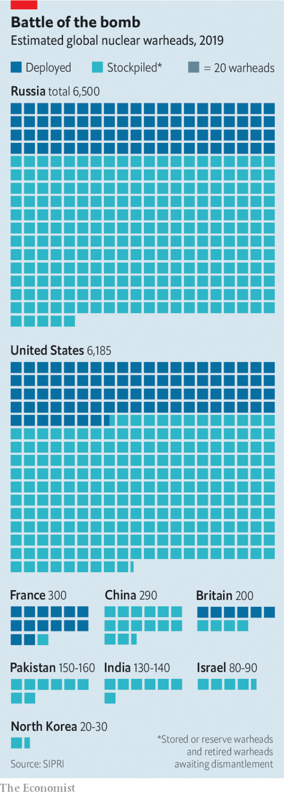

###### You first

# Should America rule out first use of nuclear weapons? 

 

> print-edition iconPrint edition | United States | Aug 17th 2019 

PRESIDENT BARACK OBAMA promised that he would reduce the role that nuclear weapons played in America’s national security strategy. His successor has done the opposite. In a review of nuclear policy published in February 2018, Donald Trump seemed to expand the circumstances in which America might use nuclear weapons first, to include cyber-attacks on the networks that transmit presidential orders to silos, submarines and bombers. He also ordered the manufacture of new low-yield warheads (these are equivalent to about half a Hiroshima), which critics fear are more likely to be used. And he has issued hair-raising threats against North Korea, alarming those who worry about his impulsiveness. All this is fuelling a debate about nuclear risks. 

Elizabeth Warren, a Democratic presidential contender, wants to start with American nuclear doctrine. Every president since Harry Truman has reserved the right to use nuclear weapons in a conflict even if an enemy has not unleashed them first. In January Ms Warren introduced a Senate bill that would mandate a policy of what wonks call No First Use (NFU). Such pledges are common: China and India committed themselves to versions of NFU decades ago, as did the Soviet Union. But in America it would reverse over seven decades of nuclear thinking. 

Proponents of NFU argue that launching nuclear weapons first in a conflict is neither necessary nor wise. It is not necessary because America’s regular armed forces are strong enough to defeat enemies without recourse to weapons of mass destruction. It is not wise because an adversary that fears an American bolt from the blue is more likely to put its own arsenal on hair-trigger alert, increasing the risk of unauthorised or accidental launch. An adversary might also be tempted to pre-empt America by going even faster, a dangerous dynamic that Thomas Schelling, an economist and nuclear theorist, called the “reciprocal fear of surprise attack”. 

That is all well and good, say critics of NFU. But America is in a different position from China and India. It not only defends itself, but also extends a protective nuclear umbrella over allies around the world. If North Korea were to invade South Korea with its ample army, it must reckon with the possibility of a nuclear response from America. The South Korean government would like to keep it that way. 

Estonia and Taiwan would like Russia and China, respectively, to face similar uncertainty. Thus when Mr Obama toyed with the idea of pledging NFU during his administration, Britain, Japan, France and South Korea—all American allies facing more populous foes—lobbied successfully against such a move. 

 

NFU-sceptics also point to the increasing potency of non-nuclear weapons. Like America, China and Russia are both developing hypersonic missiles capable of crossing oceans at over five times the speed of sound. Some might destroy targets with nothing more than their kinetic energy—no need for nuclear tips. Chemical and biological weapons could also wreak havoc without splitting atoms. 

That would put an NFU-bound America in an invidious position. If such non-nuclear missiles were falling on Washington, should a nuclear response be off the table? And even if it was declared to be so, would adversaries believe it? After all, Pakistan is scornful of India’s own NFU pledge, just as America is sceptical of China’s. Talk is cheap, trust is in short supply and the stakes could not be higher. 

Whereas Ms Warren’s proposal would outlaw first use under any circumstances, others merely wish to place checks on this untrammelled presidential launch authority. America’s nuclear chain of command was designed to concentrate decision-making in the White House and to keep it away from generals. James Mattis, Mr Trump’s defence secretary until last year, reassured outsiders that he would serve as a check, telling Strategic Command “not to put on a pot of coffee without letting him know”, according to the Washington Post. But he had no foolproof means to guarantee he could do this. 

“The weight of the open evidence” suggests that “the Secretary of Defence is not just unnecessary, but not even in the nuclear chain of command,” says Alex Wellerstein, an expert on nuclear history at the Stevens Institute of Technology. William Perry, a former defence secretary, agrees. The president is free to instruct the chairman of the joint chiefs of staff, the top military officer, as he wishes. “We built a system that depends on having a rational actor in the White House,” says Alexandra Bell, a former State Department official now at the Centre for Arms Control and Non-Proliferation. “We now know the system is flawed.” 

In January Congressman Ted Lieu and Senator Ed Markey, both Democrats, reintroduced a bill, originally proposed in 2016, that would force the president to seek a congressional declaration of war (last done in 1942) with express approval for nuclear first use. Nancy Pelosi, the Democratic leader of the House of Representatives, endorsed the idea in 2017. 

There are also wider efforts to prune the arsenal. Adam Smith, the chairman of the House Armed Services Committee and co-sponsor of Ms Warren’s NFU bill, has sought to cut funding for Mr Trump’s mini-nuke and to limit its deployment on submarines. To the Pentagon’s horror, he has also suggested scrapping America’s silo-based missiles, leaving the job to submarines and bombers. 

Politicians should not expect clear guidance from voters. A survey in 2010 found that 57% agreed with Ms Warren that “the US should only use nuclear weapons in response to a nuclear attack by another nation.” Yet it turns out that Americans also quite like fire and fury. A paper by Scott Sagan of Stanford University and Benjamin Valentino of Dartmouth College, published in 2017, found that a clear majority approved of using nuclear weapons first if doing so would save the lives of 20,000 American soldiers—even if it killed 2m Iranian civilians. “The conventional wisdom around nuclear weapons remains strongly embedded,” says Jon Wolfsthal, director of the Nuclear Crisis Group and a former official in Mr Obama’s administration. “I am not sure there will be changes, but big changes are being discussed more openly now than in a long time.”■ 

