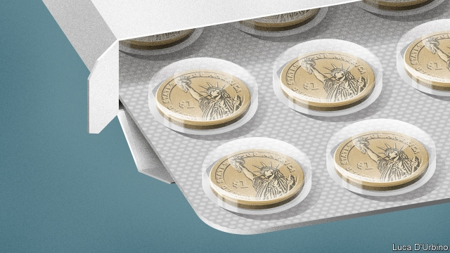

###### Generous to a fault

# Why America’s biggest charities are owned by pharmaceutical companies 

 

> print-edition iconPrint edition | United States | Aug 15th 2019 

WHEN A PATIENT in need of a drug in America goes to fulfil their prescription, the price they have to pay can vary wildly. For generic off-patent drugs, prices are usually low for the uninsured and free for those with insurance. But for newer, patent-protected therapies prices can be as high as several thousand dollars per month. Those without insurance may end up facing these lofty list prices. Even those with coverage will often have to fork out some of the cost, called a co-payment, while their insurance covers the rest. 

These co-payments, which for the most expensive drugs can themselves be prohibitively high, can act as a deterrent to collecting a prescription. Into this gap a new type of charity has emerged, one that offers to make your co-payment for you. They come in two main types: independent ones, like the Patient Advocate Foundation, which spent $380m on co-payments in 2016, and co-pay charities affiliated with drugmakers themselves. 

According to public tax filings for 2016, the last year for which data are available, total spending across 13 of the largest pharmaceutical companies operating in America was $7.4bn. The charity run by AbbVie, a drugmaker that manufactures Humira, a widely taken immuno-suppressant, is the third-largest charity in America. Its competitors are not far behind. Bristol-Myers Squibb, which makes cancer drugs, runs the fourth-largest. Johnson & Johnson, an American health conglomerate, runs the fifth-largest. Half of America’s 20 largest charities are affiliated with pharmaceutical companies. 

Not everyone qualifies for their help. Unsurprisingly, pharma-affiliated charities fund co-payments only on prescriptions for drugs that they manufacture. There is often an income threshold, too, which excludes the richest Americans—though it is usually set quite high, at around five times the household poverty line. They are prohibited from funding co-payments for those on Medicaid (which helps the poor) and Medicare (which helps the elderly) by the anti-kickback statute, which prevents private companies from inducing people to use government services. Those patients can accept co-pay support from independent charities, such as the Patient Advocate Foundation. 

The impact of these charities is large and growing. Most of them are less than 15 years old. In 2001 just five drugmakers operated charities, spending a total of $370m. That had risen 20-fold, to $7.4bn, by 2016. According to Ronny Gal, an analyst at Berstein, a research firm, the co-payment on the price of a drug is usually just 10% of the cost the pharmaceutical company ultimately charges to the insurance provider. This would mean that $7.4bn, if it were all spent on co-payments, could earn drugmakers $74bn in revenues—which would account for nearly a quarter of total drug spending in America. 

Pharmaceutical companies will often claim that helping patients with their co-payments is a way of making costly drugs more accessible. But it has the fortunate consequence of making their customers price-insensitive, because insurance companies will often use high co-payments to nudge their customers into opting for generics over costlier branded drugs: no co-pay, no incentive to save money. 

Say a patient is prescribed a statin, a type of drug to lower cholesterol which has proved useful in reducing heart disease. They could take Lipitor, a branded drug manufactured by Pfizer, with a list price of around $165 per month. But a generic, Atorvastatin, has also recently become available for just $10 per month. In the absence of help from a charity, a patient with private insurance would probably be able to get Atorvastatin free, but would have to pay some of the cost for Lipitor. With help from Pfizer’s co-pay charity, both are free. “It is entirely to their advantage because consumers only care about what it costs them,” says Adriane Fugh-Berman of Georgetown University. “It’s not charity, it’s cheating.” 

There is also evidence that pharmaceutical companies bump up the scope of their co-payment programmes shortly after they increase drug prices. When Martin Shkreli, the former boss of Turing Pharmaceuticals (who has since been imprisoned for securities fraud), increased the price of Daraprim 50-fold in 2015, he also donated to a fund to cover co-pays for patients with toxoplasmosis, a disease treated using Daraprim. The ability of insurance companies to push these price increases back onto drugmakers, by raising co-payments, is limited. 

American authorities are trying to curb the effects these charities may be having on prices. In California in 2017 a bill was passed banning companies from providing co-pay assistance in some situations, such as if a patient’s insurance company offered a drug on a lower cost that the Food and Drug Administration, America’s drug regulator, had deemed therapeutically identical, or when the active ingredient is available over-the-counter at a lower cost. 

The Securities and Exchange Commission (SEC) is also looking more closely at independent charities that are sometimes sponsored by pharmaceutical firms. One independent charity offered co-pay support only for a specific type of “breakthrough pain” for cancer patients, a condition its sponsor had a 40% market share in treating. An SEC probe has already settled claims with some pharmaceutical firms, though none has admitted wrongdoing. United Therapeutics has settled the biggest claim, worth $210m, with the Department of Justice. Lundbeck, a Danish drugmaker, and Pfizer have settled smaller claims. “Pfizer knew that the third-party foundation was using Pfizer’s money to cover the co-pays of patients taking Pfizer drugs,” according to Andrew Lelling, a US attorney, “masking the effect of Pfizer’s price increases.” Johnson & Johnson, Astellas, Gilead Sciences, Celgene, Biogen and others face investigations. 

Using co-pay charities to support high prices is good for business, but charitable contributions foster healthy profits in another way, too: they are tax-deductible. The corporate tax codes of most countries allow companies to deduct the cost of any charitable giving from pre-tax profits. But in America the system is more generous, says Jason Factor, a tax lawyer at Cleary Gottlieb Steen and Hamilton. Companies that give products for the benefit of the “needy or ill” can deduct up to twice the cost of donated goods. How convenient!■ 

-- 

 单词注释:

1.pharmaceutical[,fɑ:mә'sju:tikәl]:a. 药学的, 制药的, 药用的, 药物的, 药剂师的, 药师的 n. 药品, 成药, 药剂 

2.Aug[]:abbr. 八月（August） 

3.wildly[]:adv. 狂暴地, 激动地, 狂热地, 鲁莽地, 轻率地 

4.generic[dʒi'nerik]:a. 属类的, 一般的 [计] 一般的 

5.uninsured['ʌnin'ʃuәd]:a. 未保过险的 [法] 未保险的, 未经保险的 

6.therapy['θerәpi]:n. 治疗 [医] 疗法, 治疗 

7.lofty['lɒfti]:a. 高的, 傲慢的, 崇高的, 高级的, 玄虚的 

8.coverage['kʌvәridʒ]:n. 覆盖的范围, 保险总额, 新闻报导 [化] 可达范围; 覆盖度 

9.prohibitively[]:adv. 禁止, 起阻止作用, 抑制 

10.deterrent[di'tә:rәnt]:a. 制止的, 威慑的, 遏制的 n. 威慑力量(或因素), 制止物 

11.affiliate[ә'filieit]:vt. 使紧密联系, 使附属, 接纳, 收养 vi. 发生联系, 参加 

12.drugmaker['drʌ^,meikә(r)]:制药者 

13.filing['failiŋ]:n. 锉, 琢磨, 锉屑 [计] 编档; 文件编排 

14.datum['deitәm]:n. 论据, 材料, 资料, 已知数 [医] 材料, 资料, 论据 

15.AbbVie[]:[网络] 艾伯维；雅培生命；雅培生命公司 

16.Humira[]:[网络] 阿达木单抗；修美乐；雅培阿达木单抗 

17.squibb[]: [人名] [英格兰人姓氏] 斯奎布可能是绰号，爱嘲讽的人，来源于早期现代英语，含义是“讽刺诗文”(lampoon) 

18.johnson['dʒɔnsn]:n. 约翰逊（姓氏） 

19.conglomerate[kәn'glɒmәrit]:a. 聚成球形的, 砾岩性的 n. 集成物, 混合体, 砾岩 v. (使)凝聚成团 

20.unsurprisingly[]:adv. 不出所料的；不出奇的；意料中的 

21.threshold['θreʃәuld]:n. 门槛, 入口, 开端, 阈 [计] 阈; 阈值 

22.medicaid['medikeid]:n. 医疗补助方案, 医疗补助项目 [法] 公费医疗补助制, 医疗保健业, 医疗补助方案 

23.medicare['medi,keә]:n. 医疗照顾方案, 医疗照顾项目 [法] 公办的医疗保险制 

24.induce[in'dju:s]:vt. 引诱, 招致, 归纳出, 感应 [医] 诱导, 感应 

25.les[lei]:abbr. 发射脱离系统（Launch Escape System） 

26.Ronny[]:n. (Ronny)人名；(瑞典)龙尼 

27.gal[^æl]:[化] 伽(重力加速度单位,等于1厘米/秒,2) 

28.analyst['ænәlist]:n. 分析者, 精神分析学家 [化] 分析员; 化验员 

29.berstein[]:n. (Berstein)人名；(德)贝尔施泰因；(法)贝尔斯坦 

30.provider[prә'vaidә]:n. 供应者, 供养人, 伙食承办人 [计] 提供器 

31.pharmaceutical[,fɑ:mә'sju:tikәl]:a. 药学的, 制药的, 药用的, 药物的, 药剂师的, 药师的 n. 药品, 成药, 药剂 

32.nudge[nʌdʒ]:n. 用肘轻推, 推动, 讨厌家伙 

33.opt[ɒpt]:vi. 选择 

34.incentive[in'sentiv]:n. 动机 a. 激励的 

35.statin['stætɪn]:n. 斯达汀（药物名）; [医]抑制素[类名, 包括促生长素抑制素、促黑素抑制素、促乳素抑制素等] 

36.cholesterol[kә'lestәrɒl]:n. 胆固醇 [化] 胆固醇; 胆固醇 

37.lipitor[]:n. 立普妥（药品名） 

38.pfizer[]:n. 辉瑞（美国制药公司） 

39.atorvastatin[ə,tɔ:və'stætn]:n. 阿托伐他汀（降血脂药） 

40.entirely[in'taiәli]:adv. 完全, 全然, 一概 

41.adriane[]:n. 【女名】女子名 [网络] 艾德利安；艾德里安妮 

42.georgetown['dʒɔ:dʒtaun]:n. 乔治城（圭亚那首都） 

43.bump[bʌmp]:n. 撞击, 肿块 vt. 碰撞 vi. 撞, 颠簸而行 

44.Martin['mɑ:tin]:n. 马丁, 圣马丁鸟 

45.ture[]: 油温测量装置；介观结构 

46.fraud[frɒ:d]:n. 欺骗, 欺诈, 诡计, 骗子 [经] 欺诈, 舞弊, 骗子 

47.daraprim[]:[化] 乙胺嘧啶 [医] 达拉匹林, 乙氨嘧啶(抗疟药) 

48.donate['dәuneit]:v. 捐赠 

49.toxoplasmosis[,tɔksәuplæz'mәusis]:n. 弓形体病, 弓浆虫病 [医] 弓形体病 

50.curb[kә:b]:n. 抑制, 勒马绳, 边石 vt. 抑制, 束缚, 勒住 

51.California[.kæli'fɒ:njә]:n. 加利福尼亚 

52.regulator['regjuleitә]:n. 调整者, 校准者, 校准器, 调整器, 标准钟 [化] 调节剂; 调节器 

53.deem[di:m]:v. 认为, 相信 

54.therapeutically[,θerə'pju:tikli]: [医]adv.在治疗上 

55.SEC[sek]:[计] 秒, 辅助 [化] 尺寸排阻色谱法 

56.probe[prәub]:n. 探索, 调查, 探针, 探测器 v. 用探针探测, 调查, 探索 

57.wrongdoing['rɒŋ'du:iŋ]:n. 干坏事, 坏事 

58.therapeutics[.θerә'pju:tiks]:n. 治疗学 [医] 治疗学; 疗法, 治疗 

59.Danish['deiniʃ]:n. 丹麦文 a. 丹麦的, 丹麦人的, 丹麦文的 

60.andrew['ændru:]:n. 安德鲁（男子名） 

61.attorney[ә'tә:ni]:n. 代理人, 律师 [经] 律师, 代理人 

62.gilead[]: [地名] [美国] 吉利厄德 

63.celgene[]:[网络] 塞尔基因；赛尔基因；新基 

64.biogen[]:[医] 生原体, 初浆体 

65.charitable['tʃæritәbl]:a. 大慈大悲的, 宽厚的, 慈善的 [法] 慈善的, 慷慨的, 宽恕的 

66.foster['fɒstә]:a. 收养的, 养育的 vt. 养育, 抚育, 培养, 鼓励, 抱(希望) 

67.corporate['kɒ:pәrit]:a. 社团的, 合伙的, 公司的 [经] 团体的, 法人的, 社团的 

68.deduct[di'dʌkt]:vt. 扣除, 减去 [经] 扣除, 减去, 折扣 

69.jason[]:n. 詹森（男子名） 

70.Cleary[]:n. (Cleary)人名；(英)克利里 

71.Gottlieb[]:戈特利布（人名） 

72.steen[sti:n. stein]:a. [俚]许许多多的（等于umpteen） 

73.hamilton['hæmiltәn]:n. 汉密尔顿（男子名）；哈密尔顿（美国城市名） 

74.needy['ni:di]:a. 贫穷的, 贫困的, 生活艰苦的 

