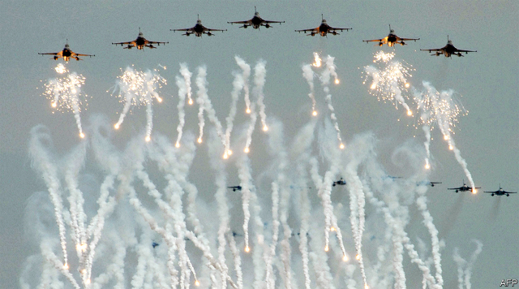

###### Tsai’s prize

# America angers China with a sale of fighter jets to Taiwan 

 

> print-edition iconPrint edition | Asia | Aug 22nd 2019 

FOR TAIWAN, there is nothing like an American president who is not squeamish about outraging China. Even before he took office Donald Trump stirred indignation in Beijing by answering a congratulatory phone call just after his election from Tsai Ing-wen, the president of Taiwan. (China saw this as a breach of the “one-China principle”, under which it demands that countries that maintain diplomatic ties with it do not also have them with Taiwan, which it views as part of China.) He recently allowed Ms Tsai one of the longest visits to America ever granted to a Taiwanese president, and sold Taiwan tanks and anti-aircraft missiles worth $2.2bn. But this week Mr Trump took a step that China will see as an even bigger affront. 

On August 18th Mr Trump decided to sell Taiwan 66 new F-16 fighter jets. The sale, worth $8bn, still needs congressional approval. But leading Republicans and Democrats alike have championed it, seeing Taiwan as a bulwark against China’s growing assertiveness in South-East Asia and the Pacific.  

The fleet of new F-16s will boost Taiwan’s ageing air force, but hardly tip the military balance against China’s increasingly powerful armed forces. The real power they embody is that of a psychological shock for the one-party state across the strait. The last time America sold fighter jets to Taiwan was in 1992.  

Taiwan first asked America for more F-16s in 2006, under the previous president from Ms Tsai’s Democratic Progressive Party, which typically has especially testy relations with China. His successor, Ma Ying-jeou, of the more China-friendly party, the Kuomintang (KMT), reiterated the request. But China persuaded the administrations of both George W. Bush and Barack Obama to refuse. During Mr Obama’s presidency in particular, China portrayed the sale of F-16s as a red line. It never tires of reminding America that in 1982 it promised to reduce arms sales to Taiwan. 

Ms Tsai, who is campaigning for re-election in early 2020, was delighted with the news. Her campaign presents her as a foil to an ever more repressive, assertive China. Her KMT challenger, Han Kuo-yu, whom critics accuse of being too cosy with China, also applauded Mr Trump’s decision and pledged to deepen military ties with America if elected. Arthur Ding, of National Chengchi University, thinks the deal, despite its hefty price tag, will fly swiftly through the sometimes combative legislature. 

China was not so happy. A spokeswoman for the foreign ministry said on August 16th that American arms sales “severely violate the one-China principle”. But it is not clear if it plans anything more than a rhetorical response, such as suspending military exchanges with America. The impact on other disputes between the two countries—over trade, for example, or the protests in Hong Kong—is also uncertain.■ 

