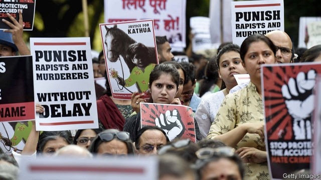

###### Silence or the grave

# India’s justice system does far too little to protect witnesses 

 

> print-edition iconPrint edition | Asia | Aug 22nd 2019 

THE TEENAGER riding down National Highway 31 was already living a nightmare. Two years earlier she had been raped, she claimed, by a group of men starting with Kuldeep Singh Sengar, a powerful politician in her home district of Unnao, in Uttar Pradesh, India’s most populous state. Her family tried to file a complaint with the local police, who brushed them off. Then they began receiving death threats. In 2018 her father was allegedly beaten senseless in broad daylight by Mr Sengar’s brother and a bunch of goons—and then jailed on unrelated charges. His daughter despaired of finding justice in Unnao and left for the state capital of Lucknow, where she stood before the residence of the chief minister, Yogi Adityanath, a Hindu cleric, and doused herself in kerosene, but was overpowered before she could light it. The next day her father died in police custody. 

The victim continued to seek justice, to no avail. A witness to her father’s death died in jail. Her uncle was sentenced to ten years in prison on a 20-year-old charge. Mr Sengar and his allies in the Bharatiya Janata Party (BJP), including Mr Adityanath and the MP from Unnao, celebrated a resounding victory at the polls in May. The victim wrote a letter to the chief justice of the Supreme Court asking for help. 

At 1.30pm on July 28th, the same young woman, now 19 years old, was seated in a compact car with her two aunts, on their way to visit the jailed uncle. They were supposedly under police protection, although the assigned officers did not escort them on the journey. A lorry travelling in the opposite direction swerved into their lane. Its licence plate was blacked out and it did not slow down. The impact flattened the front of their car and killed both the aunts. A month later, the rape victim remains in intensive care, unable to speak. If she does not recover, it is likely that her rape will go unpunished, since no witness’s testimony may stand as evidence until it can be subjected to cross-examination. 

It is a dangerous business being the witness to any serious crime in India, especially when the accused are powerful. Intimidated witnesses often recant their initial testimony and refuse to co-operate with the prosecution. As cases drag on, it becomes harder for victims and their families to bear the pressure. Catastrophic miscarriages of justice are not unusual. In 2013 riots in Muzaffarnagar, also in western Uttar Pradesh, killed at least 65 people, most of them Muslims. All 53 of the men accused in 40 related homicide cases were acquitted. All the witnesses changed their minds, including five who had previously reported seeing their own relatives murdered. A murder case that involved the man currently responsible for India’s internal security, Amit Shah, ended with no convictions after 92 witnesses recanted. 

Lorries with blacked-out number plates have become especially dangerous in recent years. Prashant Pandey, an expert witness in corruption cases against the previous state government of Madhya Pradesh, narrowly survived a collision that tipped over his family car. Early this year the family of Sanjiv Bhatt, a decorated civil-service officer who had made an enemy of many senior BJP members, was rammed by another heavy, blank-plated vehicle. 

Conviction rates tell the tale. Whereas in most rich countries 80% or more of those charged with crimes are found guilty, in India the rate is between 40% and 50%—and for cases involving politicians just 6%. In December the Supreme Court was moved by the plight of witnesses for the prosecution of a cult leader accused of rape and murder, who were dropping like flies. It found “the conditions of witnesses in the Indian legal system can be termed ‘pathetic’.” As a stopgap, the court ordered that a witness-protection scheme devised by the home ministry be put into effect in all India’s states within a year. 

Shiv Singh, a lawyer in Delhi, says the main principle of the scheme, that “protection measures shall be proportionate to the threat” against the witness, is correct. But few states will meet the deadline. Moreover, money for witness-protection can be sent to a place like Unnao, but the chances that local officials will put together a watertight system are very small indeed. Another advocate practising in Delhi, Abhinav Sekhri, recommends normalising an existing procedure whereby magistrates sometimes record witnesses’ initial statements, although this would not necessarily stop them from abjuring these accounts later on. In small towns, time is not on the side of justice. 

Public outrage also helps. The details of the Unnao case grew so grotesque and the uproar in the media so loud that this month the BJP at last distanced itself from Mr Sengar, saying that he had been expelled from the party. He has been charged not only with rape, but also with orchestrating the arrest of the victim’s father. He and his brother have been charged with the murder of the victim’s father, too. The greater the public indignation and scrutiny, the unlikelier it is that all the witnesses to these alleged crimes will suddenly change their tune or fall under a bus. ■ 

