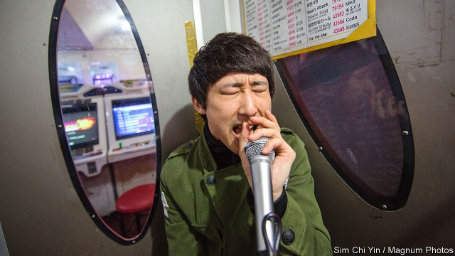

###### Social crooning

# Karaoke with colleagues is no longer compulsory in South Korea 

 

> print-edition iconPrint edition | Asia | Aug 22nd 2019 

AFTER-WORK gatherings in South Korea used to follow a pattern. After a boozy dinner and several rounds of beer and soju, a local spirit, the party would decamp to a dingy basement and squeeze onto faded upholstery in an airless room with a karaoke machine. There, employees would be pressed into accompanying the boss on the tambourine as he howled his favourite ballads and forced to offer their own renditions, before being allowed to stumble home in the early hours. Karaoke parlours, imported from Japan in the early 1990s and originally intended as entertainment for teenagers and families, did brisk business with drunk office workers. 

No more. Changing work patterns and social tastes are pushing noraebang (“singing rooms”, as they are known in South Korea) out of business. The government recently restricted the working week to 52 hours, cutting the scope for late-night gallivanting. Growing awareness among employers of sexual harassment and other bad behaviour in the dark basements means that more and more dinners wrap up early, or conversation is continued over non-alcoholic drinks at late-night coffee shops. It is slowly becoming more acceptable for employees to say no to group activities after work and spend their spare time alone or with friends. 

Industry analysts expect the decline in the number of noraebang, which has been accelerating for a couple of years, to speed up. Nearly 33,000 of them survive (down from a peak of more than 35,000 in 2011). But more than 1,400 shut in 2018, and 650 went during the first quarter of this year alone. Similar trends are afoot in Japan, the home of karaoke, where desperate owners have reportedly resorted to renting out their unused parlours as temporary offices during the daytime. 

Karaoke is not dying. South Koreans are relieved that their careers no longer hinge on jangling a tambourine for their tone-deaf bosses. But many still like to use their newly won spare time for singing. Places aimed at groups are shutting down, but “coin noraebang” for individuals and couples are becoming popular with teenagers, students in their 20s and older single professionals. Unlike old-school karaoke parlours, they tend to be above ground, well lit and colourfully decorated. Rather than pay hourly rates of between 15,000 and 20,000 won ($12-17), users can sing individual songs for as little as 500 won. Kim, a 24-year-old conscript from Seoul, says it is a good way to kill time on his own. “I love singing but I’m not very good at it, so practising alone also makes it less embarrassing when I’m with my friends.” 

The move towards belting out tunes on one’s lonesome does not seem to have affected musical preferences. Apart from current hits, the noraebang charts are dominated by old-school ballads and cheesy Western pop staples. Even as Seoul’s basements are refitted for other purposes, South Koreans and their guests will continue to come up with off-key renditions of Queen.■ 
<<<<<<< HEAD

-- 

 单词注释:

1.croon[kru:n]:v. 低声歌唱, 低唱, 低吟 n. 低唱, 低吟, 轻哼 

2.karaoke['kærә.әuki. kærә'әuki]:n. 卡拉OK；卡拉OK录音, 自动伴奏录音 

3.Korea[kә'riә]:n. 朝鲜, 韩国 

4.Aug[]:abbr. 八月（August） 

5.gathering['gæðәriŋ]:n. 聚集, 集中, 采集 [化] 富集 

6.boozy['bu:zi]:a. 酩酊的, 嗜酒的 

7.soju[]:n. 烧酒（源于韩国的酒精饮料） 

8.decamp[di'kæmp]:vi. 撤营, 逃走, 逃亡 [法] 撤退, 逃走, 逃亡 

9.dingy['diŋdʒi]:a. 暗淡的, 昏暗的, 邋遢的 

10.upholstery[ʌp'hәulstәri]:n. 家具被覆材料, 家具装饰用品业 

11.airless['єәlis]:a. 无空气的, 不通风的 [机] 无气, 无气式 

12.karaoke['kærә.әuki. kærә'әuki]:n. 卡拉OK；卡拉OK录音, 自动伴奏录音 

13.tambourine[.tæmbә'ri:n]:n. 小手鼓 

14.ballad['bælәd]:n. 歌谣 

15.rendition[ren'diʃәn]:n. 译文, 施舍, 表演 [经] 生产量 

16.parlour['pɑ:lә]:n. 客厅, 会客室, 雅座 a. 客厅的 

17.originally[ә'ridʒәnli]:adv. 本来, 原来, 最初, 就起源而论, 独创地 

18.gallivant[.gæli'vænt]:vi. 与异性闲荡, 闲逛 

19.awareness[ә'weәnis]:n. 意识, 认识 [计] 识别, 议定, 明白 

20.harassment['hærәsmәnt]:n. 困扰, 烦扰, 烦恼 [法] 折磨, 骚扰, 侵扰 

21.analyst['ænәlist]:n. 分析者, 精神分析学家 [化] 分析员; 化验员 

22.afoot[ә'fut]:a. 徒步的, 在进行中的, 活动中的 adv. 徒步, 在进行中 

23.reportedly[ri'pɒ:tidli]:adv. 根据传说, 根据传闻, 据报道 

24.unused[.ʌn'ju:zd]:a. 不用的, 不在使用的, 从未用过的 

25.daytime['deitaim]:n. 白天, 日间 

26.Korean[kә'riәn]:n. 朝鲜人, 朝鲜语 a. 朝鲜人的, 朝鲜语的 

27.hinge[hindʒ]:n. 铰链, 关键, 枢纽 vt. 装铰链 vi. 靠铰链移动, 依...而转移 

28.jangle['dʒæŋgl]:v. 吵架, (使)发出刺耳声 n. 吵嚷, 刺耳声, 空谈 

29.colourfully[]:色彩斑斓地 丰富多彩地 

30.hourly['auәli]:a. 每小时的, 以小时计的, 频繁的 adv. 每小时地, 频繁地, 不绝地 

31.kim[]:n. 金姆（人名） 

32.conscript['kɒnskript]:a. 被征入伍的, 被征召的 n. 征兵 vt. 征召 

33.Seoul[sәul]:n. 汉城 

34.les[lei]:abbr. 发射脱离系统（Launch Escape System） 

35.lonesome['lәunsәm]:a. 寂寞的 

36.cheesy['tʃi:zi]:a. 干酪质的, 俊俏的, 优秀的 [医] 干酪样的 

37.staple['steipl]:n. 主要产物, 常用品, 主要要素, 原料, 订书钉, 钩环 a. 主要的, 重要的 vt. 分级, 钉住 

38.refit[.ri:'fit]:v. 整修, 改装 n. 整修, 改装 
=======
>>>>>>> 50f1fbac684ef65c788c2c3b1cb359dd2a904378

