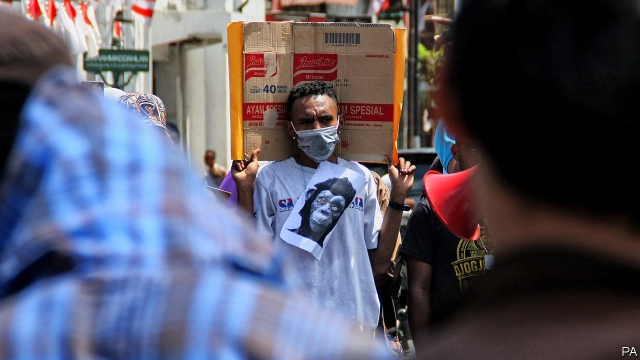

###### Independence day

# Violent protests rack the Indonesian provinces of Papua and West Papua 

 

> print-edition iconPrint edition | Asia | Aug 24th 2019 

WHITE AND RED were the colours of the day. It was August 17th, the anniversary of Indonesia’s liberation from the Dutch, and TV screens showed the national flag, with its red and white stripes, billowing across the country. But in Surabaya, a city in eastern Java, one flag lay in the gutter. Responding to allegations that someone had torn down an Indonesian flag the day before and then retreated to a dormitory housing university students from Papua (the Indonesian part of New Guinea), police fired tear gas into the building before barging in and arresting 43 residents. As they were rounded up, a jeering mob is said to have called the Papuans, who tend to have darker skin than most other Indonesians, “monkeys”. 

The next day, thousands of people took to the streets in cities across Papua, blocking roads and burning tyres. In Sorong they vandalised the airport and set fire to a prison (258 prisoners escaped). In Manokwari, the capital of West Papua province, they burned shops and the provincial parliament. In addition to holding banners reading “We’re Papuans, not monkeys”, protesters waved the Morning Star flag, a symbol of Papuan nationalism, and chanted: “We are not white and red, we are Morning Star”. As The Economist went to press on August 22nd, the protests had not abated. 

In a statement about the protests Benny Wenda, a Papuan separatist, linked the struggle against racism to the fight for independence. Papua remained a Dutch colony after the rest of Indonesia became independent in 1945. It was only in 1969 that it voted to join Indonesia in a referendum. But the vote was a sham: out of a population of some 800,000, the Indonesian army selected just 1,026 people to take part. Indonesian security forces have tried to suppress a tiny separatist movement, often with brutal tactics. Widespread unrest has been rare—up to now. 

Veronica Koman, a human-rights lawyer, believes these protests mark a new chapter in the liberation movement. She cites the sheer intensity of the protesters’ anger, and the power of videos of the protests on social media to convince Indonesians of Papuans’ commitment to their cause. A few politicians are showing some sensitivity: the governor of East Java province apologised for the racism in Surabaya, and President Joko Widodo announced plans to visit Papua. But the communications minister shut down the internet in certain parts of Papua, ostensibly to prevent false rumours fanning unrest, while the minister for security blamed the protests on “negative news”. On August 20th extra troops were deployed to Papua. Morning Star flags were there to greet them. ■ 

-- 

 单词注释:

1.Indonesian[.indәu'ni:ʒәn]:a. 印尼的 n. 印尼人, 印尼语群 

2.Papua['pæpjuә]:n. 巴布亚岛 

3.Aug[]:abbr. 八月（August） 

4.Dutch[dʌtʃ]:n. 荷兰人, 荷兰语 a. 荷兰的 

5.billow['bilәu]:n. 巨浪 vi. 象巨浪般汹涌, 象巨浪般波动 vt. 使翻腾 

6.Surabaya[,suərə'bɑ:jə; ,su:rɑ:'bɑ:jɑ:]:n. 泗水（印尼城市名）；苏腊巴亚 

7.Java['dʒɑ:vә]:n. 爪哇, 爪哇咖啡 [计] Java 程序设计语言 

8.gutter['gʌtә]:n. 排水沟, 槽, 贫民区 vt. 开沟于 vi. 流 [计] 装订线 

9.allegation[.æli'geiʃәn]:n. 断言, 主张, 申辩 [法] 声明, 事实陈述, 断言 

10.guinea['gini]:n. 几内亚 

11.barge[bɑ:dʒ]:n. 驳船 vt. 用船运输 vi. 蹒跚, 闯入 

12.jeer[dʒiә]:n. 嘲笑, 讥讽, 戏弄 v. 嘲弄, 揶揄, 戏弄 

13.mob[mɒb]:n. 暴民, 民众, 暴徒 vt. 大举包围, 蜂拥进入, 围攻 vi. 聚众生事 

14.Papuan['pæpjuәn]:a. 巴布亚岛的 n. 巴布亚人, 巴布亚语 

15.Indonesian[.indәu'ni:ʒәn]:a. 印尼的 n. 印尼人, 印尼语群 

16.Sorong[]:[地名] 索龙 ( 印尼 ) 

17.vandalise['vændәlaiz]:vt. 摧残(文化), 破坏(公共财产), 故意破坏 

18.Manokwari[]:[地名] 马诺夸里 ( 印尼 ) 

19.provincial[prә'vinʃәl]:n. 外地人, 粗野的人 a. 省的, 外地的, 偏狭的 

20.protester[]:n. 抗议者, 持异议者, 拒付者 [经] 反对者 

21.Papuan['pæpjuәn]:a. 巴布亚岛的 n. 巴布亚人, 巴布亚语 

22.nationalism['næʃәnәlizm]:n. 民族主义, 民族特性 

23.economist[i:'kɒnәmist]:n. 经济学者, 经济家 [经] 经济学家 

24.abate[ә'beit]:vt. 减少, 减轻, 减弱, 废除, 打折扣 vi. 减轻, 减弱, 减少, 失效, 被废除 

25.benny['beni]:n. 安非他明(药片) 

26.wenda[]:[网络] 天涯问答；搜狐问答；搜狗问答 

27.separatist['sepәreitist]:n. 分离主义者, 独立派 

28.racism['reisizm]:n. 种族主义, 种族偏见 [法] 种族主义, 种族歧视, 种族歧视主张 

29.Indonesia[.indәu'ni:ʒә]:n. 印尼 

30.referendum[.refә'rendәm]:n. （就重大政治或社会问题进行的）全民公决，全民投票 

31.suppress[sә'pres]:vt. 镇压, 使止住, 禁止, 抑制, 查禁 [法] 镇压, 平定, 禁止出版 

32.brutal['bru:tәl]:a. 残忍的, 野蛮的, 不讲理的 

33.tactic['tæktik]:n. 一项战术, 一条策略 a. 战术的, 顺序的, 排列的 

34.Veronica[vә'rɔnikә]:[计] Veronica查找程序 

35.cite[sait]:vt. 引用, 引证, 表彰 [建] 引证, 指引 

36.sheer[ʃiә]:a. 绝对的, 全然的, 纯粹的, 透明的, 峻峭的 vi. 偏转, 偏航 vt. 使急转向, 使偏航 adv. 完全, 全然, 峻峭 n. 偏航 

37.apologise[ә'pɔlәdʒaiz]:vi. 道歉（等于apologize） 

38.Joko[]:[网络] 佐戈；上甲；彩绘阿祥 

39.widodo[]:[网络] 阿斯 

40.ostensibly[]:adv. 可公开, 显然, 表面, 外表, 诡称, 假装 

41.deploy[di'plɒi]:v. 展开, 配置 

