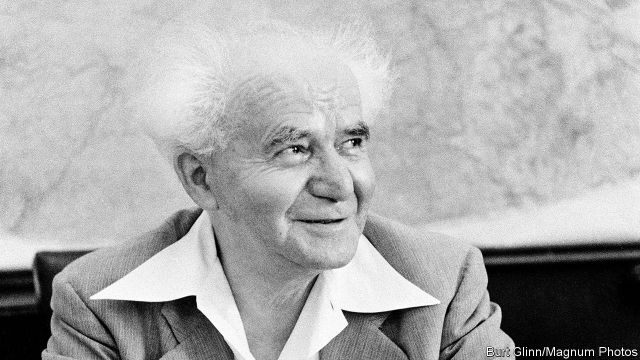

###### The price of power

# A life of David Ben-Gurion, Israel’s founding father 

 

> print-edition iconPrint edition | Books and arts | Aug 22nd 2019 

A State at Any Cost: The Life of David Ben-Gurion. By Tom Segev. Translated by Haim Watzman.Farrar, Straus and Giroux; 816 pages; $40. Head of Zeus; £30. 

HE CUT AN unprepossessing figure: short, with a large head and a squeaky voice. Self-centred and humourless, he used people, including women, then discarded them. He was dogged by self-doubt. 

How David Ben-Gurion, a flawed and in many ways unattractive man, created the state of Israel is the theme of Tom Segev’s fascinating biography. Ben-Gurion’s career began unpromisingly. Born in 1886, he grew up in a Yiddish-speaking family in tsarist Poland; his mother died when he was 11, leaving him introverted and aimless. Zionism, then in its infancy, rescued him, giving him a purpose—and an escape from a stiflingly dull provincial town. 

The story takes off when, not yet 20, Ben-Gurion arrives in Palestine in 1906. Life for the early Zionist settlers was hard, and he was not cut out for it. His route to power was as a brilliant labour leader. The trade-union federation that he helped establish, the Histadrut, became an essential building-block of the future Jewish state. 

Mr Segev is one of Israel’s “new historians”, who have stripped away the mythology around its birth. One legend that he skewers is that Ben-Gurion believed in the possibility of peace with the Arabs. “There is no solution,” he declared as early as 1919; the Arabs wanted Palestine as their state, the Zionists wanted it as theirs. The answer to Arab hostility lay not in compromise but military strength. Though he paid lip-service to peace initiatives, he never changed his mind. When war came in 1948, he hoped for a state containing as few Arabs as possible. If they fled, fine; if they had to be expelled, so be it. In public he sought to justify Israel’s actions (and his own) during the fighting. Privately, says Mr Segev, the Arab exodus haunted him: it was the moral ambiguity at the heart of Israel’s existence. 

Ben-Gurion dominated the new country’s politics into old age; his two stints as prime minister amounted to over 13 years. Mr Segev describes the fierce opposition to two of his most important policies—securing German reparations for the Holocaust and launching a nuclear-weapons programme. His achievements and energy were undeniable—but so were his failings. He had an authoritarian streak, wanting, in Mr Segev’s words, to be a “Zionist Lenin”. Politics took precedence over everything. He treated Paula, his wife, shabbily; so distant was he from his family that he repeatedly asked his son how old he was. He had a chip on his shoulder because, unlike the rest of the Zionist elite, he lacked a university degree. A restless autodidact, he collected diverse books in several languages. 

The dilemma of every biographer is what to put in and what to leave out. Mr Segev’s focus is on Zionism and its politics; the Arabs are mostly present as a problem, the British hardly at all. (His earlier book, “One Palestine, Complete”, superbly evokes the years of British rule.) Even at more than 800 pages, the author has evidently found it hard to squeeze everything that matters into “A State at Any Cost”. The result, though, is a masterly portrait of a titanic yet unfulfilled man. If others paid a price for Zionism’s success—the Arabs, his family, the rivals he crushed—Ben-Gurion did, too. This is a gripping study of power, and the loneliness of power. ■ 

