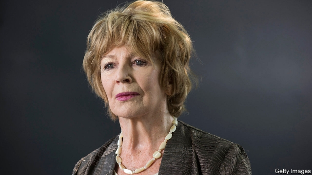

###### Nobody’s child

# Edna O’Brien’s new heroine is abducted by Boko Haram 

 

> print-edition iconPrint edition | Books and arts | Aug 22nd 2019 

Girl. By Edna O’Brien.Farrar, Straus and Giroux; 240 pages; $26. Faber & Faber; £16.99. 

EDNA O’BRIEN launched her illustrious career in 1960 with “The Country Girls”, an incendiary, trailblazing novel that charted the fortunes and sexual awakening of two young women in the Ireland of the 1950s. Two equally controversial follow-ups, “The Lonely Girl” (1962) and “Girls in their Married Bliss” (1964), again depicted female desires and aspirations with compassionate candour. Almost 60 years after her debut, Ms O’Brien’s new book, “Girl”, evinces an enduring interest in girlhood. Despite the stark title’s suggestion of anonymity, the protagonist has a name. But she loses everything else when she is abducted and brutalised by Boko Haram. 

“I was a girl once, but not any more.” So begins Maryam’s harrowing tale. Seized from her school, she is brought to a terrorist camp and inducted into “the Sect”. She and her friends are made to wear hijabs and worship a different God. She witnesses extreme violence and experiences it, during ordeals designed to send men away “sated and battle-maddened”. One militant chooses her to be his trophy wife and she is no longer “plundered” nightly. But she loses her status when her husband falls from grace and she gives birth—not to a future fighter but to a daughter. 

Maryam’s luck turns after an aerial assault on the camp. She flees with her baby but faces further hardship and danger in the forests of north-eastern Nigeria, then hostility and prejudice in the country’s capital. Strangers view her with fear and suspicion; some relatives treat this “bush wife” and her “tainted” child with disdain. She seeks salvation elsewhere. 

In “Terrorist” (2006), his novel about a radicalised teenager, John Updike, another venerable writer, fell short of his high standards. Ms O’Brien, now 88, took a risk in giving voice to a Nigerian girl who suffers horrific cruelty, especially in an age when “cultural appropriation” is often frowned upon. But like her previous novel “The Little Red Chairs” (2015), which dealt with Balkan war crimes, “Girl” is a product of rigorous research and great artistry. Maryam and her plight are tragically authentic. 

At times, darkness almost overwhelms the reader. Yet it is hard to turn away, just as it is impossible not to back a heroine who, though bowed, refuses to be broken. “Girl” is Ms O’Brien’s most ambitious novel—and among her most powerful. ■ 

-- 

 单词注释:

1.EDNA['ednә]:[化] 二硝基乙胺 

2.abduct[æb'dʌkt]:vt. 诱拐, 绑架, 使外展 [医] 外展, 展 

3.boko['bәukәu]:n. <英俚>鼻子 

4.haram['heәrәm]:n. (=harem)(伊斯兰教徒)女眷居住的内室,闺房, (伊斯兰教徒的)女眷,共配一雄的一群雌性动物 

5.Aug[]:abbr. 八月（August） 

6.Straus[straus]:施特劳斯(①姓氏 ②Oskar, 1870-1954, 生于奥地利的法国作曲家) 

7.giroux[]: [人名] 吉鲁 

8.Faber[]:n. 法伯尔 

9.EDNA['ednә]:[化] 二硝基乙胺 

10.illustrious[i'lʌstriәs]:a. 著名的, 辉煌的, 明亮的 

11.incendiary[in'sendjәri]:a. 放火的, 煽动的, 燃烧的 n. 纵火犯人, 煽动者, 燃烧弹 

12.trailblazing['treil,bleiziŋ]:领导性的, 带头的 

13.awaken[ә'weikәn]:vt. 唤醒, 唤起, 使意识到 vi. 觉醒, 意识到 

14.equally['i:kwәli]:adv. 相等地, 同样地, 平等地 

15.bliss[blis]:n. 福佑, 天赐的福 [计] 实现系统软件的基本语言 

16.depict[di'pikt]:vt. 描述, 描写 

17.aspiration[.æspә'reiʃәn]:n. 热望, 志向, 渴望 [医] 吸入; 吸[引], 吸引术 

18.compassionate[kәm'pæʃәnit]:a. 慈悲的, 富于同情心的, 照顾性的 vt. 怜悯, 同情 

19.candour['kændә]:n. 坦率, 正直, 公正, 爽直, 白色, 光明 

20.debut['deibju:]:n. 初次登台, 开张 v. 初次登台 

21.evince[i'vins]:vt. 表明(感情等), 表示出(特性等) 

22.girlhood['gә:lhud]:n. 少女时代, 少女们 

23.stark[stɑ:k]:a. 僵硬的, 完全的, 刻板的, 明显的, 荒凉的, 结实的 adv. 突出地, 简直, 全然 

24.anonymity[.ænә'nimiti]:n. 匿名, 姓氏不明 [计] 匿名信件 

25.protagonist[prәu'tægәnist]:n. 主人公, 主角, 领导者 

26.brutalise[b'ru:təli:z]:vt. 使丧失人类情感, 使变残忍; 残酷对待 vi. 变残忍, 变粗暴 

27.harrow['hærәu]:n. 哈罗公学, 耙 vt. 耙掘, 伤害, 使苦恼 vi. 被耙松 

28.terrorist['terәrist]:n. 恐怖分子 [法] 恐怖份子, 恐怖主义 

29.induct[in'dʌkt]:vt. 引导, 使入门, 引入, 使就职 

30.sect[sekt]:n. 宗派, 教派 

31.hijab[hɪˈdʒɑ:b]:n. 穆斯林妇女戴的面纱或头巾 

32.ordeal[ɒ:'di:l]:n. 严酷考验, 痛苦经历, 煎熬 [法] 神裁判法, 严酷的考验, 痛苦的经验 

33.sate[seit]:vt. 充分满足, 过分满意, 使厌腻 

34.militant['militәnt]:a. 好战的 

35.trophy['trәufi]:n. 战利品, 奖品 vt. 用战利品装饰 

36.plunder['plʌndә]:n. 抢夺, 掠夺品, 战利品 v. 掠夺, 抢劫, 抢夺 

37.nightly['naitli]:a. 每夜的, 夜间的 adv. 每夜 

38.statu[]:[网络] 状态查看；雕像；特级雪花白 

39.aerial['єәriәl]:a. 空中的, 航空的, 空气的, 空想的 n. 天线 

40.assault[ә'sɒ:t]:n. 攻击, 袭击 vt. 袭击, 攻击 vi. 发动攻击 

41.Nigeria[nai'dʒiriә]:n. 尼日利亚 

42.hostility[hɒs'tiliti]:n. 敌意, 敌对, 反对 

43.taint[teint]:n. 污点, 耻辱, 感染 vt. 污染, 使腐败, 沾染, 腐蚀 

44.disdain[dis'dein]:n. 蔑视 vt. 蔑视, 鄙弃 

45.salvation[sæl'veiʃә]:n. 拯救, 救助, 救世 

46.terrorist['terәrist]:n. 恐怖分子 [法] 恐怖份子, 恐怖主义 

47.radicalise['rædikəlaiz]:vt. 使激进（等于radicalize） vi. 变得激进（等于radicalize） 

48.john[dʒɔn]:n. 盥洗室, 厕所, 嫖客 

49.Updike[]:n. (Updike)人名；(英)厄普代克 厄普代克 

50.venerable['venәrәbl]:a. 庄严的, 值得尊敬的 

51.Nigerian[nai'dʒiriәn]:n. 尼日利亚人 

52.horrific[hɒ'rifik]:a. 令人毛骨悚然的, 感到恐惧的 

53.cruelty['kru:әlti]:n. 残酷, 野蛮, 残酷行为 [法] 残酷, 残忍, 虐待 

54.cultural['kʌltʃәrәl]:a. 文化的, 教养的, 修养的 [医] 培养的 

55.appropriation[әprәupri'eiʃәn]:n. 拨用, 挪用, 拨款 [经] 拨款, 挪用 

56.Balkan['bɒ:lkәn]:a. 巴尔干的 

57.rigorous['rigәrәs]:a. 严厉的, 严酷的, 严格的, 苛刻的, 严密的, 精确的 

58.artistry['ɑ:tistri]:n. 艺术性 

59.maryam[]:n. (Maryam)人名；(阿塞、哈萨、吉尔、塔吉、土库、乌兹、伊朗)马里亚姆, 玛丽亚姆(女名) 

60.plight[plait]:n. 困境, 窘境 vt. 宣誓, 保证 

61.tragically['trædʒɪklɪ]:adv. 悲剧地, 悲惨地 

62.overwhelm[.әuvә'hwelm]:vt. 淹没, 受打击, 制服, 压倒, 使不知所措 [法] 打翻, 倾覆, 覆盖 

63.ambitious[æm'biʃәs]:a. 有野心的, 抱负不凡的, 雄心勃勃的 

