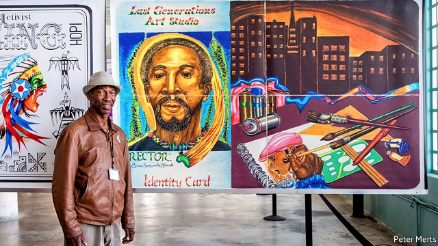

###### The Rock and a hard place

# In America, art is helping prisoners adapt to life outside 

 

> print-edition iconPrint edition | Books and arts | Aug 22nd 2019 

ALCATRAZ, KNOWN as the Rock, was once among America’s most fearsome prisons, cut off from the free world on a windswept island in San Francisco Bay. Today it is a national park, visited by 1.4m tourists a year, who amble around the famous cellblocks and take selfies against the bars. Until October, if they venture to a derelict building on the island’s north side, they will also encounter giant images of serving and former prisoners. They are not the faces of notorious criminals such as the “Birdman”, “Machine Gun” Kelly or Al Capone; rather they are current and released inmates of Californian institutions who aspire to something more than infamy. 

At a recent gala for the unusual exhibition in this gritty space, several contributors stood before self-portraits, each framed as an oversize identity card and depicting a new self they have imagined—a “Future ID” to replace their prison incarnation. Guss Lumumba Edwards, aged 61 and softly spoken, sketched a golden trail around his head, left by a shooting star that has the shape of the African continent (pictured). Alongside he has rendered his tools—paintbrushes and spray cans—and a city skyline. After serving 40 years for murder, Mr Edwards was released six months ago from San Quentin state prison. The painting, he says, “brings me back to where I came from,” and also points in a new direction: “trying to heal and stop the violence in the community.” 

In Lily Gonzalez’s card, she thrusts a red rose toward the viewer. “It’s about shifting how I view my relationship to the world,” says the 36-year-old, who served two and a half years for lesser crimes she would rather not discuss. She sees her future not just in terms of employment, “but a way of being, flowers and colours and healing.” The rose is “a nod to [the rapper] Tupac’s poem about the rose growing from the concrete.” 

The show is the result of a five-year effort led by Gregory Sale, an artist based in Arizona who focuses on prison in America. Mr Sale works in the growing field of “social-practice” art, in which artists collaborate with citizens on aesthetic responses to problems. In this case, the goal was to build a bridge between prison and life outside. Working initially with the Anti-Recidivism Coalition, a support network in Los Angeles, Mr Sale and his other partners honed the idea for “Future IDs at Alcatraz”. 

Those leaving prison face daunting obstacles, from barriers to employment to stigma and isolation. It became evident, Mr Sale says, that achieving acceptance in society is “a cultural problem. So the question became, how can we find cultural solutions to that?” With his help, more than 100 people have done so by illustrating their own transformations—and their determination to make the most of their second chance. 

Art “makes you come to your own realisation,” observes Kirn Kim. “It’s not about someone telling you what to think. It opens up different parts of your brain.” As a juvenile, he was convicted for aiding and abetting a murder and served 20 years. He took part in the workshop two years after he got out, while “really struggling” in an Asian-American culture in which he felt shamed. Deciding what to draw helped him see that he no longer had to hide, he says. The image on his new ID shows him holding a microphone and addressing a prison yard—a version of the community organiser that, at 43, he has now become. 

Using art to rehabilitate prisoners is not new. But the way policymakers think about the transition to life beyond bars is changing, as is the number of people making that leap. America’s penal system is at a turning point. Across the country, reforms have begun to halt and reverse the effects of decades of mass incarceration. As sentencing and bail laws become less draconian, more people are being released; the disproportionate punishment of ethnic minorities is now widely recognised. California has been in the vanguard of these reforms, after the federal Supreme Court ordered it to reduce prison overcrowding. A quarter of the state’s prison population has been transferred to local jails or parole over the past decade. 

Arts organisations are responding to this shift. Players from the Street Symphony in Los Angeles help set former inmates’ poetry to music. In the nearby San Fernando Valley, the Tia Chucha Centro Cultural includes them in its open-mic and theatre performances. Across the country in Chicago, meanwhile, in a programme called Changing Voices, young people who have left the justice system are recasting their experiences as musical theatre for students, judges and legislators. 

Many of these projects are supported by the Art for Justice Fund, a philanthropic effort which itself illustrates the power of art. In 2016 Agnes Gund, a New York art collector, was shocked by “13th”, a documentary by Ava DuVernay that traced the links between mass incarceration and the history of racism in America. She sold one of her prized works and put $100m into the new fund. It has since collaborated with scores of artists and groups advocating criminal-justice reform. “There’s an urgency to begin to see incarcerated people as they really are, as human beings, as husbands and fathers and mothers and daughters,” reckons Helena Huang, the fund’s project director. “At the most fundamental level, art gives people a voice.” 

Individuals who have discharged their debt to society are not the only ones using the arts for transformation. Alcatraz, too, is reconsidering its mission. It is now part of an international coalition of “sites of conscience”, which includes the Nuremberg trials memorial and aims to use difficult memories to inspire action. Art exhibitions—such as “Future IDs” and a show by Ai Weiwei in 2014 that focused on the Chinese artist’s own prison experience—have helped turn this grim facility into a place to think as well as gawk. 

“We have a giant prison system, the largest in the world, and we are in a unique position to have conversations around incarceration,” says Emily Levine, a park ranger. The habit of asking hard questions has spread across the Rock. Visitors disembarking from the ferry were recently confronted with some unusual messages from the rangers. One whiteboard reads: “2,300,000 US adults are currently incarcerated. What do you know about the prison, jail or immigration centre nearest to your home?” Another simply asked, “Do prisons make you feel safer?” ■ 
<<<<<<< HEAD

-- 

 单词注释:

1.Aug[]:abbr. 八月（August） 

2.Alcatraz['ælkə,træz]:n. 恶魔岛（等于阿尔卡特拉兹岛, 是美国旧金山的头号景点, 曾是联邦监狱所在地, 也是一个野生动物的庇护所） 

3.fearsome['fiәsәm]:a. 吓人的, 可怕的, 害怕的 

4.windswept['windswept]:a. 风刮的, 被风吹扫的, 暴露在风中的 

5.san[sɑ:n]:abbr. 存储区域网（Storage Area Networking） 

6.francisco[fræn'siskәu]:n. 弗朗西斯科（男子名, 等于Francis） 

7.amble['æmbl]:n. 马的缓行步态, 缓行漫步 vi. 马缓行, 从容漫步 

8.cellblock['selblɔk]:n. 监狱中一组囚犯室 

9.selfies[]:[网络] 自拍照 

10.derelict['derilikt]:a. 被抛弃了的, 无主的, 玩忽职守的 n. 遗弃物, 被遗弃的人, 玩忽职守者 

11.notorious[nәu'tɒ:riәs]:a. 声名狼藉的, 臭名昭著的, 众人皆知的 

12.birdman['bә:dmәn]:n. 捕鸟者, 鸟类学家, 飞行家 

13.Kelly['keli]:n. 凯利（男子名）；[古]战士 

14.AL[]:[计] 算法语言, 字母, 汇编语言 [医] 铝(13号元素) 

15.Capone[]:n. 卡波尼（歌手）；卡蓬（美国黑手党老大） 

16.inmate['inmeit]:n. 同住者, 被收容者 [法] 内部的, 接近中心的, 内在的 

17.Californian[.kæli'fɒ:njәn]:n. 加利福尼亚州人 a. 加利福尼亚的 

18.aspire[ә'spaiә]:vi. 渴望, 立志于 

19.infamy['infәmi]:n. 声名狼藉, 丑恶 [法] 丧失公权, 剥夺, 臭名昭著 

20.gala['geilә]:n. 节日, 祝贺 

21.gritty['griti]:a. 有砂砾的, 坚韧不拔的 

22.contributor[kәn'tribjutә]:n. 贡献者, 捐助者, 赠送者, 投稿者 [法] 捐助人, 捐赠人, 投搞人 

23.oversize['әuvә'saiz]:a. 太大的, 超大型的 n. 特大型 

24.depict[di'pikt]:vt. 描述, 描写 

25.id[id]:n. 遗传素质, 本能冲动 [计] 识别, 标识符, 项目说明 

26.incarnation[.inkɑ:'neiʃәn]:n. 典型, 特殊阶段, 化身, 体现 

27.guss[]:abbr. general utility simulation system 通用模拟系统 

28.Lumumba[]:n. (Lumumba)人名；(刚(金))卢蒙巴 

29.edward['edwәd]:n. 爱德华（男子名） 

30.skyline['skailain]:n. 天涯, 地平线, 空中轮廓线 

31.Quentin['kwentin]:n. 昆廷（男子名） 

32.lily['lili]:n. 百合, 百合花 a. 洁白的, 纯白色的, 纯洁的 

33.lesser['lesә]:a. 较少的, 较小的, 次要的 

34.healing['hi:liŋ]:a. 治愈的, 恢复健康的 [计] 修复, 恢复 

35.gregory['^re^әri]:n. 格雷戈里（男子名, 古代罗马教皇之名） 

36.Arizona[æri'zәunә]:n. 亚利桑那州 

37.aesthetic[i:s'θetik]:a. 美学的, 审美的, 有美感的 

38.initially[i'niʃәli]:adv. 最初, 开头 

39.coalition[.kәuә'liʃәn]:n. 结合体, 结合, 联合 [经] 联合, 联盟 

40.los[lɔ:s]:abbr. 月球轨道航天器（Lunar Orbiter Spacecraft）；视线（Line of Sight） 

41.angeles[]:n. 安杰利斯（姓氏）；天使城（菲律宾地名） 

42.hone[hәun]:n. 磨刀石, 抱怨, 想念 vt. 用磨刀石磨, 磨练 

43.id[id]:n. 遗传素质, 本能冲动 [计] 识别, 标识符, 项目说明 

44.Alcatraz['ælkə,træz]:n. 恶魔岛（等于阿尔卡特拉兹岛, 是美国旧金山的头号景点, 曾是联邦监狱所在地, 也是一个野生动物的庇护所） 

45.daunt[dɒ:nt]:vt. 威吓, 难倒, 使气馁 

46.stigma['stigmә]:n. 耻辱, 污名, 烙印 [医] 柱头; 小孔, 眼点; 气孔; 小斑; 特征 

47.isolation[.aisә'leiʃәn]:n. 隔绝, 孤立, 隔离 [化] 分离; 生物分离 

48.cultural['kʌltʃәrәl]:a. 文化的, 教养的, 修养的 [医] 培养的 

49.realisation[.riәlai'zeiʃәn. ri:-. -li'z-]:n. 实现, 完成（等于realization） 

50.kirn[kә:n, kiәn]:n. (庆祝收割完成的)收获节 

51.kim[]:n. 金姆（人名） 

52.juvenile['dʒu:vinail]:n. 少年, 少年读物 a. 少年的, 不成熟的, 适于少年的 

53.convict[kәn'vikt]:n. 囚犯, 罪犯 vt. 宣告有罪, 使知罪 

54.abet[ә'bet]:vt. 教唆, 煽动, 怂恿, 帮助, 支持 

55.rehabilitate[.ri:hә'biliteit]:vt. 恢复原状, 修复, 使康复 [法] 恢复, 使恢复心理健康, 修复 

56.policymaker['pɔlisi.meikә]:n. 政策制定者；决策人 

57.transition[træn'ziʃәn]:n. 转变, 转换, 变迁, 过渡时期, 临时转调 [化] 跃迁 

58.penal['pi:nl]:a. 有关处罚的, 刑的, 刑罚的, 刑法上的, (课税)繁重的 [法] 刑事的, 刑法的, 受刑罚的 

59.incarceration[in.kɑ:sә'reiʃәn]:n. 下狱, 监禁, 禁闭 [医] 箝闭 

60.bail[beil]:n. 保释, 拎环, 杓, 栅栏 vt. 保释, 舀水 

61.les[lei]:abbr. 发射脱离系统（Launch Escape System） 

62.draconian[drә'kәjniәn]:a. 严厉的, 残酷的 

63.disproportionate[.disprә'pɒ:ʃәnit]:a. 不成比例的 

64.ethnic['eθnik]:a. 人种的, 种族的 [医] 人种的 

65.California[.kæli'fɒ:njә]:n. 加利福尼亚 

66.vanguard['vængɑ:d]:n. 前锋, 先锋, 先驱 

67.overcrowd[.әuvә'kraud]:vt. 容纳过多的人, 使过度拥挤 

68.parole[pә'rәul]:n. 假释, 誓言, 释放宣言 vt. 宣誓后释放, 使假释出狱 

69.organisation[,ɔ: ^әnaizeiʃən; - ni'z-]:n. 组织, 团体, 体制, 编制 

70.Fernando[]:n. 费尔南多（男子名） 

71.tia[]:abbr. 先谢了（Thanks In Advance） 

72.Chucha[]:[网络] 出差；舒沙 

73.centro['sentrəʊ]: 毛靴刺藤 

74.cultural['kʌltʃәrәl]:a. 文化的, 教养的, 修养的 [医] 培养的 

75.Chicago[ʃi'kɑ:gәu]:n. 芝加哥 

76.recast[.ri:'kɑ:st]:vt. 重铸, 重作, 改造 n. 重铸, 改换角色 

77.legislator['ledʒisleitә]:n. 立法者, 立法官, 立法委员 [法] 立法者, 立法机关成员, 立法委员 

78.philanthropic[fi'lænθrәpic]:a. 慈善(事业)的, 博爱的, 乐善好施的 [法] 博爱的, 仁慈的, 慈善事业的 

79.agnes['æ^nis]:n. 艾格尼丝（女子名） 

80.gund[]: [人名] 冈德 

81.york[jɔ:k]:n. 约克郡；约克王朝 

82.collector[kә'lektә]:n. 收集家, 收取款项的人 [化] 集电极; 捕收剂 

83.documentary[.dɒkju'mentәri]:n. 记录片 a. 文件的 

84.ava[]:[医] 卡法根, 麻醉椒(根及根茎) 

85.duvernay[]:[网络] 维纳；迪韦尔奈；迪韦奈 

86.racism['reisizm]:n. 种族主义, 种族偏见 [法] 种族主义, 种族歧视, 种族歧视主张 

87.urgency['ә:dʒәnsi]:n. 紧急, 催促 [法] 紧急, 迫切, 紧急之事 

88.incarcerate[in'kɑ:sәreit]:vt. 下狱, 监禁, 禁闭 [法] 监禁, 使下狱, 禁闭 

89.reckon['rekәn]:vt. 计算, 总计, 估计, 认为, 猜想 vi. 数, 计算, 估计, 依赖, 料想 

90.helena['helinә, he'li:nә]:n. 海伦娜（女子名） 

91.huang[]:n. 黄（姓氏） 

92.reconsider[.ri:kәn'sidә]:v. 再考虑, 重新考虑 

93.coalition[.kәuә'liʃәn]:n. 结合体, 结合, 联合 [经] 联合, 联盟 

94.Nuremberg['njurәmbә:g]:n. 纽伦堡 

95.AI[ai]:[计] 附加信息, 人工智能 [化] 人工智能 

96.weiwei[]: [地名] [肯尼亚] 韦韦 

97.grim[grim]:a. 冷酷的, 坚强的, 残忍的, 可怕的, 讨厌的 

98.gawk[gɒ:k]:n. 笨人, 呆子, 笨拙的人 vi. 痴呆着看 

99.emily['emәli]:n. 埃米莉（女子名） 

100.levine[]:n. 莱文（姓氏） 

101.ranger['reinʒә]:n. 王室守林人, 骑警, 漫游者 

102.disembark[.disim'bɑ:k]:v. (使)上岸, (使)登陆 

103.confront[kәn'frʌnt]:vt. 使面对, 对抗, 遭遇, 使对质, 比较 [法] 对证, 使对质, 比较 

104.whiteboard['hwaitbɔ:d]:n. 白色书写板 

105.currently['kʌrәntli]:adv. 现在, 当前, 一般, 普通 [计] 当前 
=======
>>>>>>> 50f1fbac684ef65c788c2c3b1cb359dd2a904378

