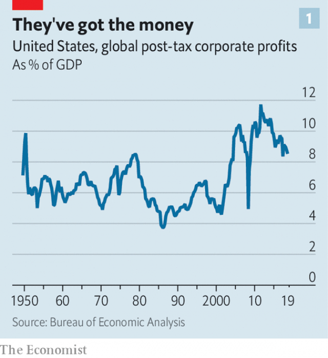

###### What are companies for?

# Big business is beginning to accept broader social responsibilities 

 

> print-edition iconPrint edition | Briefing | Aug 22nd 2019 

AT A RECENT dinner in London, a chief executive promised that his airline would soon offer electric flights. A credit provider enthused about increasing financial inclusion in the developing world; a luxury-car executive promised to replace the leather in her vehicles’ opulent interiors with pineapple matting and mushroom-based faux leather. They seemed to think such things made the companies they run sound more attractive. They probably felt that they were doing good. 

Businesspeople, being people, like to feel they are doing good. Until the financial crisis, though, for a generation or so most had been happy to think that they did good simply by doing well. They subscribed to the view that treating their shareholders’ need for profit as paramount represented their highest purpose. Economists, business gurus and blue-chip CEOs like those who make up America’s Business Roundtable confirmed them in their view. In a free market, pursuing shareholder value would in and of itself deliver the best goods and services to the public, optimise employment and create the most wealth—wealth which could then be put to all sorts of good uses. It is a view of the world at the same time bracing in its simple rigour and comforting in the lack of social burdens it places on corporate backs. 

It is also one which has faced increasing pressure over the past decade. Environmental, social and governance (ESG) criteria have come to play a role in more and more decisions about how to allocate financial investment. The assets managed under such criteria in Europe, America, Canada, Japan, Australia and New Zealand rose from $22.9trn in 2016 to $30.7trn at the start of 2018, according to the Global Sustainable Investment Alliance. According to Colin Mayer at the University of Oxford, whose recent book “Prosperity” is an attack on the concept of shareholder primacy, ESG has shot yet further up investors’ agendas since. Some of the world’s biggest asset managers, such as BlackRock, an indexation giant, are strongly in favour of this turn in events. The firm’s boss, Larry Fink, has repeatedly backed the notion that corporations should pursue a purpose as well as, or beyond, simple profits. 

The discontent does not end with investors. Bright young workers of the sort businesses most desire expect to work in a place that reflects their values much more than their parents’ generation did. And the public at large sees a world with daunting problems—most notably climate change and economic inequality—that governments aren’t solving. It also sees companies which it holds partially responsible for these dire straits using their ever greater profits (see chart 1) to funnel cash to stockholders, rather than investing them in ways that make everyone’s life better. The lollygaggers should be pulling their weight. 

 

If they won’t do so willingly, perhaps they should be forced. Senator Elizabeth Warren, one of the leading contenders for the Democratic presidential nomination, says that being a big company is a privilege, not a right. She wants big American companies to apply for charters that would oblige them to look after stakeholders, especially local ones. Those who let the side down would have their charters revoked. Ms Warren talks of herself as a defender of capitalism; many see her plans as bordering on the socialist. But that may not matter. Among young Americans, socialism is ever less of a boo word (see chart 2). 

 

In the face of this rising tide, the Business Roundtable has either seen the light or caved in, depending on whom you ask. On August 19th the great and good of CEO-land announced a change of heart about what public companies are for. They now believe that firms should indeed serve stakeholders as well as shareholders. They should offer good value to customers; support their workers with training; be inclusive in matters of gender and race; deal fairly and ethically with all their suppliers; support the communities in which they work; and protect the environment. 

There was an immediate backlash. The Council of Institutional Investors, a non-profit group of asset managers, swiftly denounced it. Others railed against it as “appeasement” of politicians like Ms Warren, and a decisive step towards the death of capitalism. This might seem extreme: at first glance, the roundtable’s recommendations border on the anodyne. But if the purpose of the company slips its shareholder-value moorings, who knows where it might end up? 

The most quoted assertion of the primacy of shareholder value comes from Milton Friedman, an economist. In 1962 he wrote that “there is one and only one social responsibility of business—to use its resources and engage in activities designed to increase its profits so long as it stays within the rules of the game, which is to say, engages in open and free competition without deception or fraud.” 

At a time when governments expected companies to be patriotic and communities saw some of them as vital resources his forthrightness shocked many. But though subsequently traduced as extreme, Friedman’s position had a fair amount of give in it. He called on companies not just to stay within the law but to honour society’s more general ethical standards, too; he did not equate shareholder interests with short-term profitability. 

But that was not how it felt. The way that business schools and management consultants in America, Britain and continental Europe proselytised for shareholder value in the 1980s and 1990s offered little by way of nuance. The biggest corporate-governance concern was the agency problem: how to align managers with the interests of the value-seeking shareholders. “Any chief executive who went against [that] orthodoxy was regarded as soft and told to get back on the pitch,” recalls Rick Haythornthwaite, the chairman of Mastercard. 

Such heretics can now hold their heads up again. This is not simply because of the political climate or the public mood. Some economists argue that Friedman’s position belongs to a simpler time. Oliver Hart of Harvard University and Luigi Zingales of the University of Chicago see his argument as principally motivated by a form of the agency problem; he didn’t like managers being charitable with shareholders’ money, even if it was ostensibly in the firm’s interests. The shareholders could, after all, lavish their profits on such good causes themselves. 

True, perhaps, back then, say Mr Hart and Mr Zingales. Now, they argue, the externalities that businesses impose on society are sometimes impossible for shareholders to mitigate as individuals, particularly if the political and legal system is a barrier to change. Individual shareholders cannot do much in law to prohibit weapons in America, for example. But they can exercise their rights as owners to influence the firms that sell guns. Thus companies can have purposes—but owners must provide them, not managers. 

Others argue that the idea of shareholder value, while still central, needs some modifications. Raghuram Rajan, an economist at the University of Chicago and former head of India’s central bank, advocates taking note of the non-financial investments workers and suppliers make in a company with a new measure of “firm value” which explicitly takes note of a specified set of such stakeholdings. 

Some companies have taken on board the idea that their increased power puts new demands on them. Satya Nadella, chief executive of Microsoft, says that a sense of purpose—together with a mission that is “aligned with what the world needs”—is a powerful way for his company to earn public trust. And because trust matters, this puts purpose at the core of Microsoft’s business model. “As technology becomes so pervasive in our lives and society, we as platform companies have more responsibility, whether it’s ethics around artificial intelligence, cyber-security or privacy,” he says. “There is a moral obligation.” 

Firms in other industries are having similar thoughts. In each business, says Mr Haythornthwaite of MasterCard, a wave of digitisation is likely to lead to one company pulling ahead. Because of that concentration of power, he says, the winning platform will need to forge a close link with society to maintain trust. 

Climate change is perhaps the most obvious example of companies doing more than they have to in a good cause. Twenty-five big American companies, including four tech giants, campaigned against America’s withdrawal from the Paris agreement in 2017. Globally, 232 firms that are collectively worth over $6trn have committed to cut their carbon emissions in line with the accord’s goal of limiting global warming to less than 2ºC. 

Some 1,400 companies around the world either already use internal carbon prices or soon will. Many big firms now aim for carbon neutrality in their operations. Some have made big investments to that end. Apple has a renewable energy capacity equivalent to its total energy use. 

Laudable as some of this is, it is hardly a response commensurate to the climate crisis. Companies going carbon-neutral are mostly consumer-facing ones, rather than intensive emitters. Money for coal may now be scarce, at least in the rich world, but big institutional investors own a sizeable chunk of the world’s major oil companies—many of which apply a theoretical price of carbon to investment analysis but still keep pumping fossil fuel. And net-zero pledges may reinforce the misapprehension that the best way of fighting climate change is through the choices of individual companies and consumers, rather than a thoroughgoing economy-wide transition. 

Companies are also backing liberal social causes. In 2015 Marc Benioff of Salesforce, a software firm, led other bosses, including Apple’s Tim Cook, into opposing a bill in Indiana that would have allowed discrimination against gay people. After President Donald Trump’s election in November 2016, bosses mounted the barricades over his ban on travel to America from Muslim-majority countries. In 2018 Nike created an advertisement featuring Colin Kaepernick, a quarterback fired after kneeling during America’s national anthem in protest against police racism. PayPal has blocked some groups, including white nationalists, from using its services. 

The firm’s boss, Dan Schulman, says PayPal’s aim is to broadcast its broader purpose. Others might deride it as “virtue signalling”. But that modish phrase does not quite capture what is going on. In economics and evolutionary biology, where the idea of signalling grew up, a valid signal needs to be costly—otherwise it can be easily faked. These corporate positions do not look costly; indeed they may well be profitable. A stand in favour of Colin Kaepernick fits Nike’s brand, which celebrates the goal-oriented individual and has keen black fans. Nike’s stock dipped a tad when the controversy hit: but its sales rose immediately and its shares soon recovered. 

There are risks to such strategies. Nike had little to fear from red-staters calling for boycotts. Others may be more susceptible. Backlash can come from the other side, too; corporate sponsorship of Pride marches in London and New York has led some LGBTQ activists to organise alternative events from which business is excluded. 

There is also the problem of setting yourself up for a fall. Salesforce stumbled last year when its software turned out to be being used by US Border Patrol to deal with illegal immigration. Ben & Jerry’s, which sprinkles its ice cream with a do-the-right-thing anti-capitalist vibe, found itself scolded by Britain’s advertising regulator this summer for plastering ads for fatty frozen calories around schools in London. 

The politics of the consumer are not the only ones that firms need to consider; in tech, particularly, the politics of the workforce matter. It was the company’s employees who complained about Salesforce’s links to immigration control. Last year, employees at Google forced the firm to stop providing the Pentagon with AI technology for drone strikes and to drop out of the procurement process for JEDI, a cloud-computing facility for the armed forces. Google depends, perhaps more than any of its peers, on a smallish number of cutting-edge data scientists and software engineers; their views carry weight. Microsoft, despite similar misgivings from its employees, is still in the running for the JEDI contract. Amazon, for its part, is facing employee pressure over contracts with oil and gas companies. 

If corporate political stances can be justified in terms of keeping workers or consumers happy it does not mean that they are insincere—simply that they may be overdetermined. This can be irksome for the right. Companies rarely make a stand for the rights of the unborn, or for border security. But this is the market at work. Companies tend to have a preference for both consumers and employees who are young, educated and affluent—which is to say, who can be expected to embrace socially liberal politics. 

What the world has not yet seen is a situation where ESG issues come into material, systemic conflict with profits. Purpose is flavour of the month, says Stephen Bainbridge, professor of law at the University of California, Los Angeles, “but are companies really going to give shareholders a 10% haircut for the sake of stakeholders?” 

Such issues become particularly clear when it comes to increasing spending on the poorer parts of the workforce. Relentless downsizing makes little sense. “There are diminishing returns from firing people over and over again,” says Jeff Ubben of ValueAct Capital, a hedge fund. “It is not the right strategy for the future”. Some firms have lifted minimum wages and are spending more on retraining workers to cope with future automation. But profits are very sensitive to labour costs. According to Darren Walker, president of the Ford Foundation, one of America’s biggest charitable endowments, plenty of chief executives are having conversations about how to spend more on workers and benefits, but feel they cannot do so alone. “They will need cover,” he says; a broader shift towards corporate purpose could provide it. 

 

Many influential investors and bosses imagine a return to something like the “managerial capitalism” of earlier times, when some CEOs, their interests presumably insufficiently aligned with those of shareholders, paid more attention to stakeholders and local communities. Not all are enthusiastic. Paul Singer, founder of Elliott Management, the world’s biggest activist hedge fund, says that the current debate over corporate purpose “risks obscuring the fact that earning a rate of return for pension plans, retirement accounts, universities, hospitals, charitable endowments and so on is itself a social good—a very high one”. What is more, he notes, this social good is one that no entity other than the corporation can sustainably provide. 

There is also a problem of accountability. “Once the corporation decides that earning returns is no longer its primary purpose, to whom will it be accountable?” says Mr Singer. The answer, he thinks, is “the loudest and most passionate political activists”—though others might hope the settled convictions of the shareholders would come into play. 

One answer to these criticisms could be to devise a framework that would allow companies and bosses to state clearly that they want to do more besides make a profit. Almost 3,000 companies worldwide have been certified “B corporations” in the past decade, which means that their ethical, social and environmental practices have been certified by independent monitors to meet the standards laid down by B Lab, a non-profit group in Pennsylvania. But not many big companies have applied. Those which have are mostly consumer brands. 

An alternative to this approach would be to have companies say what purpose they had beyond shareholder value and then hold them to it. This is the approach Mr Mayer of Oxford recommends for Britain: a legal requirement for companies to have a purpose in their articles of association and provide measures to prove it is being fulfilled. Stating the purpose in such a way as to make it open to such measurement, though, would prove hard. 

As capitalism takes flak from all sides, it is hard for those in the business and investing class to object to firms voluntarily doing their bit to tweak the system. But when reliable returns are put at risk, things can change. Last year Jason Perez, a police sergeant in Corona, California, had enough. His state could no longer afford wage increases for police and other public servants partly because CalPERS, one of the world’s biggest pension funds, was underfunded. It had also been an early standard bearer for ESG investing. In 2001 it dumped tobacco stocks—which then outperformed. 

By 2017, CalPERS was underfunded to the tune of $139bn. Its ESG strategy had cost only about $2bn. But Mr Perez took the reasonable view that a couple of billion was real money. “Eleven people in my family are in law enforcement and I had to make sure their pensions were protected,” he says. To that end he campaigned for a board seat at CalPERS on the basis of letting the fund invest in law-abiding, profit-maximising companies purely on the basis of potential returns. Pitted against the fund’s chief ESG guru, Priya Mathur, he won. However companies reset and refine their purposes in the years to come, they will still need to perform for people like Mr Perez.■ 

