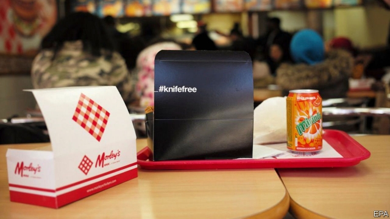

###### On a wing and a prayer

# A British anti-knife drive comes home to roost 

 

> print-edition iconPrint edition | Britain | Aug 22nd 2019 

IF YOU LOOK up from your two-piece and chips, you can set your watch to the rhythm of the fried-chicken shop. Noon brings school kids wolfing down a few wings. At 3pm come the pram-pushers, searching for an affordable dinner. Then it’s the end-of-school crush, commuters home from work and finally the drunk, craving stodge to soak up the booze. 

None are so devoted as the young. In his teenage years, Yinka Ibrahim would spend “unreasonable amounts of time” in his local branch of Morley’s, a south London chain, chewing the fat with his mates. Three or four times a week he would go straight after school, always ordering four wings and chips, for no more than £2 ($2.40). If you ran out of money, you could always try petitioning the owner. Bossman would look after you. 

Such loyalty explains the Home Office’s decision to target chicken shops in its latest campaign to curb knife crime, which has risen sharply since 2014. On August 14th it announced a plan to distribute 321,000 take-away boxes to chicken shops, emblazoned with anti-knife-crime messages and case studies of young people who have handed in their blades. 

The launch went down about as well as a dodgy drumstick. David Lammy, a Labour MP, accused the government of perpetuating a racist stereotype that black people—who are disproportionately likely to be victims of knife crime—love fried chicken. Mr Ibrahim had the same reaction when his friends shared the story. Some sent chicken boxes to the Home Office, with scrawled suggestions of how else to tackle crime. Elijah Quashie, a YouTuber known as the Chicken Connoisseur for his reviews of shops, was unimpressed. 

Yet focusing on chicken shops is not completely bird-brained. The Home Office insists that its marketing campaign—which launched last year and has also run at music festivals and in community centres—is aimed at ten- to 21-year-olds of any ethnicity. If so, it is not hard to see why such joints were picked. Shift, a charity, found fried chicken was the most popular fast food for young people in Newham, a London borough. All City Media Solutions, which worked with the Home Office on the campaign, built its business on teenagers’ love of wings, selling advertising on screens in the shops. It says two-thirds of chicken-shop customers are aged 16-24. 

The shops score highly on two other elements of a marketer’s wish-list: “dwell time” and positive association, since customers feel loyal to their branch. More than a third of customers Shift monitored spent over five minutes in a shop after receiving their food, and one in eight stuck around for more than 20. Mr Ibrahim, now 21, still goes about once a week to the shop he frequented as a child. He feels guilty if he orders chicken elsewhere, because he thinks of it as the “hub of the community”. And a lifetime’s experience tells him he can trust the food: “I know they don’t sell pigeon.” 

Chicken shops are also in the right places. They are concentrated in deprived areas, which are also home to gangs, says Simon Harding of the University of West London. When the Home Office trialled the idea in March, it picked 15 branches in knife-crime hotspots. Shan Selvendran, boss of Morley’s, was keen on the campaign because a 15-year-old boy was stabbed to death outside one of his branches last year. And gangs sometimes groom new recruits by buying them fried chicken and then making them repay the debt, for example by running drugs. “There is a logic there,” says Mr Harding. “It’s just the execution has been pretty clunky.” 

Even so, the campaign seems unlikely to work. Research suggests people who carry knives do so to protect themselves in areas they perceive to be unsafe, points out James Densley, an expert on British gangs. Inspirational stories alone are unlikely to alter that perception. The boxes will be split between 210 shops, or about 1,500 per branch. Since a branch can go through 1,000 in a day, it is all rather small fry. ■ 

