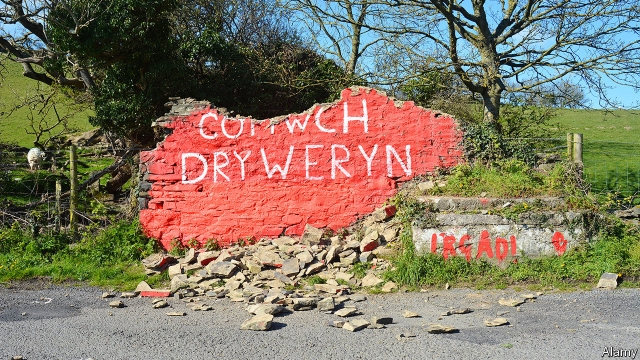

###### Wales watching

# An act of vandalism sparks more talk of independence in Wales 

 

> print-edition iconPrint edition | Britain | Aug 22nd 2019 

THE WALL is not a big one, nor a beautiful one, nor does it keep anything in, nor out. But it is a sacred one. Situated in a lay-by on the A487, just north of Llanrhystud, about half-way up the west coast of Wales, its importance derives from two words graffitied on it by Meic Stephens, a journalist and activist, in the 1960s: Cofiwch Dryweryn. Remember Tryweryn. 

In 1965 Liverpool City Council flooded the Tryweryn valley to provide water for the English city. Welsh authorities were not consulted. “The fact that the hamlet of Capel Celyn stood in the middle of the site did not deter them: nor did the fact that it was one of the very Welshest parts of all Wales,” writes Jan Morris in her book about what she describes as “the oldest of the English colonies”. Some credit the creation of the reservoir with instilling a stronger sense of Welshness in the Welsh. Demands for bilingual signs, a television channel and a Welsh assembly all started to gain support after the flooding. 

Which is why, when the graffiti was painted over with the word “ELVIS” in February, locals were outraged. Two months later someone tried to demolish the wall, taking a chunk off the top, which inflamed things further. Dyfed-Powys police labelled the incident a hate crime. Since then, Cofiwch Dryweryn graffiti has popped up across the country. S4C, a Welsh-language broadcaster, commissioned a documentary about the wall, its imitators and its meaning. The original graffiti has been repainted, and a charity set up to protect it. At the National Eisteddfod, an annual festival of Welsh culture that took place outside Llanrwst earlier this month, canny businesses sold mugs, bumper stickers and cushions emblazoned with the slogan. 

The result has been a swelling of Welsh pride—and some anti-English sentiment—as a new generation learns about the flooding of Tryweryn. Coupled with growing frustration at Westminster’s handling of Brexit, it has got a small but noisy minority talking louder about independence, something that Wales has historically been far less interested in than other members of the United Kingdom are. 

At the Eisteddfod, a sign at a pavilion run by the Welsh Assembly asked visitors to jot down their hopes for Wales over the next 20 years. Most responses said annibyniaeth, or independence. In May more than 1,000 people joined a pro-independence rally in Cardiff, organised by All Under One Banner, a campaign group modelled on its Scottish namesake. A second rally in July attracted 5,000-8,000. A third will take place in September. More than a dozen town councils, mostly in north Wales, have come out in favour of independence this year. The share of the Welsh public that agrees is still very small: a YouGov poll in May put it at 11%. But it has grown from just 6% in September 2017. A further 26% want more powers for the Welsh Assembly, which is a feeble thing compared with its Scottish or Northern Irish counterparts. 

“We used to talk about independence being a long-term goal, which has a certain elasticity to it. That’s gone, certainly in the language we use,” says Adam Price, leader of the nationalist Plaid Cymru, which holds ten seats in the 60-member Assembly. Brexit, he says, was the “booster rocket”. Unlike Scotland and Northern Ireland, Wales voted to leave the European Union (by 53% to 47%). But the vote expressed a feeling of neglect, says Mr Price: it was the “wrong answer to the right question” of how to deal with Wales’s economic stagnation. Suzy Davies, a Tory assemblywoman who backs the union, says there is a “genuine political conversation” around independence in the political bubble. “But I don’t believe it’s on the doorstep. I’m not hearing it in my social media.” 

Independence is most popular among Europhiles. Some 16% of Remainers in Wales support it, compared with only 6% of Leavers. Yet there are echoes of the Brexit campaign in their arguments. A handbook produced by YesCymru, a pro-independence group, reads like a Brexit manifesto, arguing that the constitutional set-up of the union is undemocratic and that a Wales unshackled would be richer and able to do its own trade deals. An independent Wales, insists Mr Price, would be open, diverse, international and inclusive. It would work closely with England, but in a partnership of equals rather than as a rule-taker. It is a way of “taking back control”, says one participant at the Eisteddfod. 

Sion Jobbins of YesCymru says it is important to lay the groundwork now, “so that we are ready when Scotland leaves and Northern Ireland reunites. The alternative is incorporation.” He worries that Westminster would dissolve the Welsh Assembly and absorb Wales into a unitary state. “They sent troops for rocks in the Falklands. They will never give up Wales,” he says. Such excitable talk is not uncommon among campaigners. 

That gets to the heart of the incipient independence movement. Like Brexit and the nationalist campaigns in Scotland and Northern Ireland, the argument is less about economics or politics than identity. And that is what makes it worth watching. Recent years have shown how quickly identity movements can take off. The Cofiwch Dryweryn wall went from neglected graffiti to national treasure in six months. 

Yet the risk with identity movements is that it can be hard to know when to stop. At the Eisteddfod, across the way from YesCymru’s stall, a group of artists had set up a “passport office” issuing travel documents for the nation of Llanrwst, a town of about 3,300, which in 1276 was declared independent by the then (Welsh) Prince of Wales. It was a bit of fun, and elicited no more than good-natured chuckles. Until recently, so did the notion of Welsh independence. ■ 

-- 

 单词注释:

1.wale[weil]:n. 隆起的伤痕, 鞭痕, 凸条纹, 精华, 选择 vt. 在...上留下鞭痕, 织成棱纹, 挑选, 撑住 vi. 挑选 

2.vandalism['vændәlizm]:n. 故意毁坏文物的行为, 破坏他人财产的行为 

3.Aug[]:abbr. 八月（August） 

4.situate['sitjueit]:vt. 使位于, 使处于 

5.Llanrhystud[]:[地名] 兰拉斯蒂德 ( 英 ) 

6.graffity[]:[网络] 装饰布；格菲提 

7.stephen['sti:vn]:n. 斯蒂芬（男子名） 

8.activist['æktivist]:n. 激进主义分子 

9.Liverpool['livәpu:l]:n. 利物浦 

10.Welsh[welʃ]:a. 威尔士的 n. 威尔士人 vi. 赖赌帐, 逃避责任 

11.hamlet['hæmlit]:n. 小村, 部落 

12.Capel['kæpәl]:套环, 嵌环, 鸡心环 

13.deter[di'tә:]:vt. 制止, 吓住, 威慑 

14.welshest[welʃ]:adj. 威尔士的；威尔士人的 n. 威尔士语 

15.morris['mɒ:ris]:n. 莫里斯舞 

16.creation[kri:'eiʃәn]:n. 创造, 创作物, 发明 [化] 产生 

17.reservoir['rezәvwɑ:]:n. 贮水池, 贮藏处, 贮备, 水库 vt. 储藏 

18.instil[in'stil]:vt. 滴注, 逐渐灌输, 不断灌输 [医] 滴注 

19.Welshness[]:[网络] 威尔士主义；威尔斯意识 

20.bilingual[bai'liŋgwәl]:a. 双语的 

21.graffiti[]:n. 墙上乱写乱画的东西 

22.elvis[]:n. 埃尔维斯（男子名） 

23.outrage['autreidʒ]:n. 暴行, 侮辱, 愤怒 vt. 凌辱, 虐待, 触犯 

24.demolish[di'mɒliʃ]:vt. 毁坏, 破坏, 粉碎 

25.chunk[tʃʌŋk]:n. 大块, 矮胖的人(或物) [经] 定样 

26.inflame[in'fleim]:vt. 激怒, 点火, 激起 vi. 着火, 激动, 发炎 

27.broadcaster['brɒ:dkæstә]:n. 播送者, 广播装置, 播种机 

28.documentary[.dɒkju'mentәri]:n. 记录片 a. 文件的 

29.imitator['imi,teitә]:n. 模仿者, 临摹者, 仿造者, 伪造者 [计] 模拟, 模拟程序, 模拟器 

30.repaint[ri:'peint]:v. 重漆, 重画 [计] 重新绘制 

31.eisteddfod[ais'teðvɒd]:n. 诗人, 音乐家大会 

32.Llanrwst[]:[地名] 兰鲁斯特 ( 英 ) 

33.canny['kæni]:a. 精明的, 谨慎的, 节约的 

34.bumper['bʌmpә]:n. 缓冲器, 满杯 a. 大胜利的 

35.sticker['stikә]:n. 屠夫, 尖刀, 刺, 芒, 尖物, 携带尖刀者, 张贴物, 滞销品, (非正式)难题 [经] 呆滞商品 

36.emblazon[im'bleizn]:vt. 用纹章装饰, 盛饰, 颂扬 

37.frustration[frʌs'treiʃәn]:n. 挫折, 顿挫 [医] 挫折 

38.Brexit[]:[网络] 英国退出欧盟 

39.historically[his'tɔrikәli]:adv. 历史上地；从历史观点上说 

40.les[lei]:abbr. 发射脱离系统（Launch Escape System） 

41.pavilion[pә'viljәn]:n. 楼阁, 亭子, 大帐篷, 观众席 vt. 置...于亭中, 搭帐篷, 笼罩 

42.jot[dʒɒt]:n. 少量, 稍许 vt. 略记, 摘要记载下来 

43.rally['ræli]:n. 重振旗鼓, 集合, 群众集会, 跌停回升 v. 重整旗鼓, 集合, 恢复精神, 团结, 挖苦, 嘲笑 

44.cardiff['kɑ:dif]:n. 加的夫（英国港市） 

45.namesake['neimseik]:n. 同名人, 同名物 

46.YouGov[]:[网络] 民治调查公司；尤格夫；民治公司 

47.counterpart['kauntәpɑ:t]:n. 副本, 复本, 配对物, 相应物 [经] 副本, 正副二份中之一 

48.elasticity[i.læs'tisiti]:n. 弹力, 弹性 [化] 弹性 

49.Adam['ædәm]:n. 亚当 [计] 自动直接存取管理 

50.nationalist['næʃәnәlist]:n. 国家主义者, 民族主义者 

51.plaid[plæd]:n. 格子花呢披风, 格子花呢, 格子图案 

52.cymru[]: （威尔士语）威尔士 

53.booster['bu:stә]:n. 向前推的人, 支持者, 后援者, 升压器 [化] 爆管; 扩爆药; 传爆药; 升压机; 增压装置; 升压器; 助促进剂 

54.stagnation[stæg'neiʃәn]:n. 淤塞, 停滞 [医] 停滞, 滞留, 郁积 

55.suzy[]:n. 苏西（女子名） 

56.davy['deivi]:n. 宣誓书 

57.Tory['tɒ:ri]:n. 托利党党员, 保守党员, 亲英分子 a. 保守分子的 

58.assemblywoman[ә'sembli,wjmәn]:n. 女议员 

59.doorstep['dɒ:step]:n. 门阶 

60.europhiles[]:[网络] 欧洲支持者；欧盟者 

61.remainers[]:[网络] 剩余物 

62.leaver['li:vә]:n. 离开者（常指学校毕业生） 

63.handbook['hænd,buk]:n. 手册 [计] 手册 

64.manifesto[.mæni'festәu]:n. 宣言, 声明 

65.constitutional[.kɒnsti'tju:ʃәnl]:a. 宪法的, 立宪的, 体质的 [医] 全身的; 体质的 

66.undemocratic['ʌndemә'krætik]:a. 非民主的, 不民主的 

67.unshackled['ʌn'ʃækld]:a. 不受束缚的 

68.inclusive[in'klu:siv]:a. 包含的, 包括的 

69.partnership['pɑ:tnәʃip]:n. 合伙, 合股, 合作关系 [经] 合伙(合作)关系, 全体合伙人 

70.participant[pɑ:'tisipәnt]:n. 参加者, 参与者 a. 有份的, 参加的, 参与的 

71.sion['saiәn]:n. 锡安；以色列人 

72.jobbins[]: [人名] 乔宾斯 

73.groundwork['graundwә:k]:n. 地基, 基础, 根据 

74.reunite[.ri:ju:'nait]:v. (使)再联合 

75.incorporation[in.kɒ:pә'reiʃәn]:n. 包含, 结合, 编入, 团体组织 [医] 惨合, 混合, 合并 

76.Westminster['westminstә]:n. 威斯敏斯特 

77.unitary['ju:nitәri]:a. 单位的, 单一的, 归一的, 整体的 [化] 幺正; 幺正的 

78.Falklands[]:福克兰群岛 

79.excitable[ik'saitәbl]:a. 能被激动的, 易兴奋的, 易怒的 [医] 应激的, [可]兴奋的 

80.uncommon[.ʌn'kɒmәn]:a. 不寻常的, 非凡的, 罕有的 adv. 不平常地 

81.campaigner[kæm'peinә]:n. 从军者, 老兵, 竞选者 

82.incipient[in'sipiәnt]:a. 起初的, 发端的, 初期的 [医] 初发的, 初期的 

83.politic['pɒlitik]:a. 精明的, 明智的, 策略的 

84.quickly['kwikli]:adv. 很快地 

85.stall[stɒ:l]:n. 厩, 停车处, 牧师职位, 货摊, 托辞, 拖延 vt. 关入厩, 停顿, 推托, 支吾, 使陷于泥中 vi. 被关在厩内, 陷于泥中, 停止, 支吾 

86.elicit[i'lisit]:vt. 引出, 推导出, 引起 

87.chuckle['tʃʌkl]:n. 咯咯的笑声, 轻笑 vi. 咯咯的笑, 咕咕叫 

