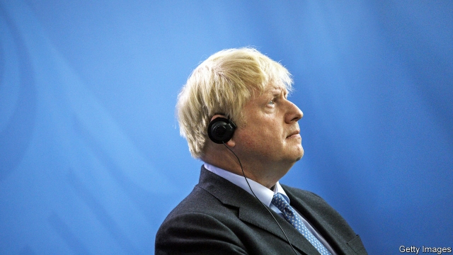

###### In one ear, out the other

# Boris Johnson’s awkward first meetings with European leaders 

 

> print-edition iconPrint edition | Britain | Aug 24th 2019 

IN HIS FIRST weeks in office, Boris Johnson said he would not negotiate with the EU unless it removed the Irish backstop from the Brexit deal. This week he wrote to Donald Tusk, the European Council president, with the same demand, before going to Berlin and Paris to see Angela Merkel and Emmanuel Macron ahead of the G7 summit in Biarritz. EU leaders said Mr Johnson had no realistic alternative for averting a hard Irish border. Mrs Merkel seemed to suggest he should find a solution within 30 days. Yet some think Mr Johnson’s true goal is a no-deal Brexit on October 31st which he can blame on the EU.■ 
<<<<<<< HEAD

-- 

 单词注释:

1.boris['bɔris]:n. 鲍里斯（男子名） 

2.Aug[]:abbr. 八月（August） 

3.johnson['dʒɔnsn]:n. 约翰逊（姓氏） 

4.EU[]:[化] 富集铀; 浓缩铀 [医] 铕(63号元素) 

5.backstop['bækstɒp]:n. 挡球网, 接球手 [电] 背向停止 

6.Brexit[]:[网络] 英国退出欧盟 

7.tusk[tʌsk]:n. 长牙, 獠牙, 尖物 vt. 以长牙刺戳, 以长牙掘 

8.Berlin[bә:'lin]:n. 柏林, (软质)柏林毛线 

9.angela['ændʒilә]:n. 安吉拉（女子名） 

10.merkel[]: [人名] 默克尔; [地名] [美国] 默克尔 

11.emmanuel[i'mænjuәl]:n. 以马内利（耶稣基督的别称）；伊曼纽尔（男子名, 等于Immanuel） 

12.macron['mækrәn]:n. 长音符号 

13.Biarritz[biә'rits]:宽袖中长手套, 双面纬向棱纹毛呢 

14.realistic[riә'listik]:a. 现实的, 逼真的, 现实主义的, 实在论的 

15.avert[ә'vә:t]:vt. 转开, 避免, 防止 

16.Mr['mistә(r)]:先生 [计] 存储器回收程序, 多重请求 
=======
>>>>>>> 50f1fbac684ef65c788c2c3b1cb359dd2a904378

