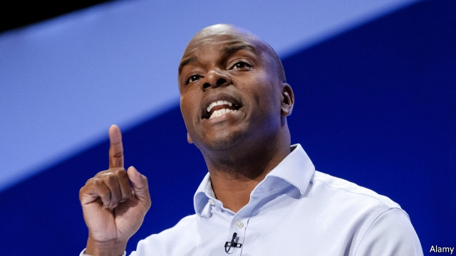
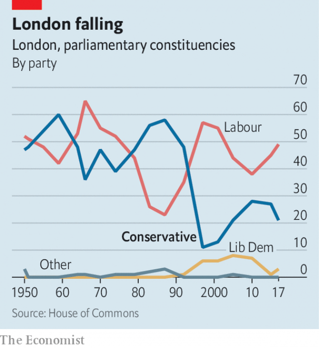

###### Capital fright

# London’s mayoral race shows Tory disregard for the capital 

 

> print-edition iconPrint edition | Britain | Aug 22nd 2019 

“IT’S BEEN an uphill struggle,” admits Shaun Bailey, the Conservative candidate for mayor of London. A poll in May put Mr Bailey 20 points behind the Labour incumbent, Sadiq Khan, who is up for re-election next May. Mr Bailey, a 48-year-old member of the London Assembly who could pass for two decades younger, has the task of turning the contest around. If the polls are right, by the end of the campaign he may start to look his age. 

Although Mr Khan enjoys an imposing lead, he is beatable. Londoners like his punchy opposition to Brexit and Donald Trump. But when it comes to policy the mayor’s record is threadbare. Mr Khan has won lots of funding for house-building, but this will take years to have an effect. Big transport projects such as Crossrail have fallen behind on his watch. Crime is unignorable, following a rise in stabbings. In July Mr Khan’s approval rating fell to -3, its lowest-ever level. A Tory candidate could have had a puncher’s chance. 

Yet big hitters from the party sat the race out. Former cabinet ministers such as Justine Greening declined to stand. Instead, a few local politicians battled it out. Mr Bailey, a born-and-bred Londoner whose electoral experience extends largely to two general-election defeats, won. The mayoralty was once a jewel in the Tory crown, when Boris Johnson served two terms in 2008-16. Today it is an afterthought. 

Unlike cities such as Liverpool and Manchester, which have long been Tory-free zones, London has historically been fairly balanced (see chart). Election results in the capital used to tally with the rest of the country, says Tony Travers of the London School of Economics. That changed under Tony Blair’s government as Labour started to cement control, snatching inner-London seats from the Conservatives and colouring the capital red from the inside out. In 1987 the Tories had 58 MPs in London. In 2017 they won just 21. 

 

An attitude that London is lost permeates the Conservatives. The dominant idea is that the party’s future lurks in places such as Bishop Auckland, a market town in County Durham, rather than Battersea, a London suburb stuffed with well-off young parents. London does not loom large in Mr Johnson’s strategy of trying to scoop up votes from disaffected Labour voters in towns that supported Brexit. 

This creates a strong headwind for Mr Bailey. Building an independent London-Conservative brand that appeals to the capital’s liberal population will not be easy—particularly given some of his past comments, including that multiculturalism could turn Britain into a “crime-riddled cesspool”. Scottish Tories have managed to distinguish themselves from the Westminster lot under their star leader, Ruth Davidson. Mr Bailey’s lower profile makes that harder. The Greens and Liberal Democrats, the latter of whom came top in the recent European elections in London, are better placed to woo liberals fed up with Mr Khan. 

There is another way of looking at London. Four in ten people there voted Leave, like Mr Bailey. The city backed a Tory mayor as recently as 2012. And there are plenty of voters in the capital for whom Mr Khan’s “London is open” message grates. Whether they are enough for an election-winning coalition is another matter. ■ 

-- 

 单词注释:

1.mayoral['mєәrәl]:a. 市长的 

2.Tory['tɒ:ri]:n. 托利党党员, 保守党员, 亲英分子 a. 保守分子的 

3.disregard[.disri'gɑ:d]:n. 忽视, 漠视 vt. 忽视, 不顾 

4.Aug[]:abbr. 八月（August） 

5.uphill['ʌp'hil]:a. 上坡的, 向上的 adv. 往上坡, 向上地 

6.shaun[]:n. 肖恩（男子名） 

7.bailey['beili]:n. 城郭, 外栅 

8.incumbent[in'kʌmbәnt]:a. 现任的, 依靠的, 负有义务的 n. 领圣俸者, 在职者 

9.Sadiq[]:n. (Sadiq)人名；(阿拉伯、印)萨迪克 

10.khan[kɑ:n]:n. 可汗, 商队宿店 

11.beatable['bi:təbl]:a. 可打的；可击的；经打的（beat的变形） 

12.Londoner['lʌndәnә]:n. 伦敦人 

13.punchy[]:a. 有力的, 生气勃勃的 

14.opposition[.ɒpә'ziʃәn]:n. 反对, 敌对, 相反, 在野党 [医] 对生, 对向, 反抗, 反对症 

15.Brexit[]:[网络] 英国退出欧盟 

16.threadbare['θredbeә]:a. 衣服磨薄了的, 穿旧了的, 衣着褴褛的, 俗套的, 乏味的 

17.crossrail['krɔsreil]:n. 横木 

18.unignorable[]: 不可动摇的，不屈不挠的; 无情的，铁面无私的; 不可阻挡的，不能变更的 

19.stabbing['stæbiŋ]:a. (疼痛)剧烈而突然的 

20.hitter['hitә]:n. 打手, 打击的人 

21.justine[dʒә'sti:n]:n. 贾丝廷（女子名, 等于Justina） 

22.greening['gri:niŋ]:n. 绿皮苹果, 恢复活力 

23.Londoner['lʌndәnә]:n. 伦敦人 

24.electoral[i'lektәrәl]:a. 选举人的, 选举的, (有关)选举的 [法] 选举的, 选举人的, 由选举人组成的 

25.mayoralty['mєәrәlti]:n. 市长职位 [法] 市长职位, 市长任期 

26.boris['bɔris]:n. 鲍里斯（男子名） 

27.johnson['dʒɔnsn]:n. 约翰逊（姓氏） 

28.afterthought['ɑ:ftәθɒ:t]:n. 事后的想法 

29.Liverpool['livәpu:l]:n. 利物浦 

30.Manchester['mæntʃestә]:n. 曼彻斯特 

31.historically[his'tɔrikәli]:adv. 历史上地；从历史观点上说 

32.tally['tæli]:n. 符木, 记账, 得分, 比分, 计数器, 标签, 符合, 对应物 vt. 记录, 点数, 计算, 加标签于, 使符合 vi. 记帐, 符合, 吻合, 记分 [计] 计数 

33.tony['tәuni]:a. 高贵的, 时髦的 

34.traver[]:n. 特拉弗（姓氏） 

35.Tory['tɒ:ri]:n. 托利党党员, 保守党员, 亲英分子 a. 保守分子的 

36.MP[]:国会议员, 下院议员 [计] 宏处理程序, 维护程序, 线性规划, 微程序, 多处理器 

37.permeate['pә:mieit]:vt. 弥漫, 渗透, 充满, 影响, 感染 vi. 透入, 散布 

38.dominant['dɒminәnt]:a. 占优势的, 支配的 [医] 优性的, 显性的 

39.lurk[lә:k]:n. 潜伏, 潜行 vi. 暗藏, 潜伏, 埋伏 [计] 隐匿阅读 

40.Auckland[ɒ:klәnd]:n. 奥克兰(新西兰港口) 

41.Durham['dә:rәm]:n. 达勒姆郡(英格兰郡名), 短角肉牛 

42.Battersea['bætəsi]:n. 巴特西（伦敦西北区） 

43.loom[lu:m]:n. 织布机, 若隐若现的景象 vi. 朦胧地出现, 隐约可见, 可怕地出现 

44.scoop[sku:p]:n. 铲子, 勺子, 穴, 口, 独家新闻 vt. 汲取, 舀取, 挖空, 抢先报道 

45.disaffect[.disә'fekt]:vt. 使疏远, 使不忠, 使不满意 

46.voter['vәutә]:n. 选民, 投票人 [法] 选民, 选举人, 投票人 

47.headwind[]:n. 逆风, 顶风 

48.multiculturalism[ˌmʌltiˈkʌltʃərəlɪzəm]:n. 多元文化 

49.cesspool['sespu:l]:n. 污水坑, 化粪池 [医] 污水坑, 粪坑 

50.Westminster['westminstә]:n. 威斯敏斯特 

51.ruth[ru:θ]:n. 怜悯, 悲哀 

52.davidson['deividsn]:n. 戴维森（姓氏） 

53.profile['prәufail]:n. 侧面, 轮廓, 传略 vt. 描绘...轮廓, 写...的传略 [计] 提问档; 剖面图法; 剖面法 

54.democrat['demәkræt]:n. 民主人士, 民主主义者, 民主党党员 [经] 民主党 

55.grate[^reit]:n. 炉格, 炉篦, 炉栅, 火炉, 壁炉, 格栅 vt. 装格栅于, 磨擦, 轧碎, 磨碎, 使焦急, 触怒, 使人烦躁, 刺激, 激怒 vt.vi. 擦响, 发出刺耳的尖厉声 

56.coalition[.kәuә'liʃәn]:n. 结合体, 结合, 联合 [经] 联合, 联盟 

