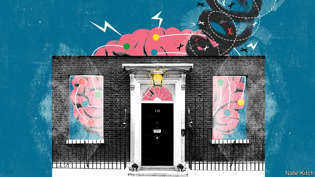

###### Bagehot

# The Downing Street Policy Unit, Boris Johnson’s brain 

 

> print-edition iconPrint edition | Britain | Aug 22nd 2019 

AT ITS BEST, the Downing Street Policy Unit can be one of the great engines of British government—a generator of new ideas and a recruiter of bright outsiders. Under Margaret Thatcher it championed privatisation and deregulation. Under Tony Blair it powered public-sector reform. But under Theresa May it withered into insignificance. In Mrs May’s glory days—they did exist!—Nick Timothy tried to do all the thinking and after her disastrous election the lights in the Policy Unit went out completely. 

They are blazing once again. The Policy Unit is now more than 20-strong, with impressive new recruits such as Liam Booth-Smith, a think-tanker, and John Bew, a professor at King’s College London and author of an excellent biography of Clement Attlee. So far the atmosphere is all energy and camaraderie. The unit’s members feel like commandos who have been given a momentous mission (taking Britain through Brexit) and have survived a hazing by a tough sergeant (Dominic Cummings). The day starts with a meeting at 8am and ends with another one at 7pm. 

Boris Johnson has a journalist’s interest in ideas—the bigger and brighter the better. He also has a Churchillian taste for mavericks. During the second world war Churchill surrounded himself with oddballs like Frederick Lindemann (“the Prof”), reasoning that unconventional times required unconventional solutions. Mr Johnson has concluded from the past two years of paralysis that the safest option may be the riskiest, and the riskiest the safest. 

The maverick-in-chief is Mr Cummings, who sits above the Policy Unit rather than in it but whose influence is omnipresent. Mr Cummings is nothing if not an ideas man and frequently sets his underlings weekend homework such as finding areas of British comparative advantage that will strike fear into the European Union. The head of the Policy Unit, Munira Mirza, is a former member of the Revolutionary Communist Party, a Trotskyite groupuscule, and enthusiastic contributor to its house organ, Living Marxism. Many of her former comrades-in-arms such as Claire Fox, a member of the European Parliament for the Brexit Party, are prominent in Conservative Eurosceptic circles. 

Will the Policy Unit be able to preserve its place at the heart of government? It is one thing to work yourself up into a frenzy of enthusiasm when Parliament is in recess and you’ve been in your job for a month. It is another to keep going when Parliament is in turmoil and hundreds of thousands of protesters are on the streets. Mr Johnson’s government could easily end up being one of the shortest-lived in history. Yet if it survives—and particularly if it survives with an enhanced majority after an autumn election—there is a good chance that the Policy Unit will remain at the heart of Boris-world. Mr Johnson has a close relationship with Ms Mirza, forged when she was one of his deputies as mayor of London and reinforced when she defended ill-judged comments he had made about burqas. During Mr Johnson’s first few weeks he has demonstrated the value of energy in the executive, setting a clear agenda for government, issuing a flurry of domestic-policy initiatives and centralising power in Downing Street. 

Which all raises an intriguing question: what policies will the Policy Unit produce if Mr Johnson gets to stay in office for the longer term? The easiest way to answer this question is to study Policy Exchange, a centre-right think-tank whose alumni, including Ms Mirza and Messrs Booth-Smith and Bew, dominate the Policy Unit and are scattered throughout government. The think-tank has a library of papers on everything from the Irish backstop to social care. At the moment it is particularly interested in using infrastructure spending to bind the United Kingdom together. It is a measure of Policy Exchange’s influence that Mr Johnson referred to its recent paper on creating a British space programme in his first speech on the steps of Downing Street. 

A second way is to study Mr Cummings’s voluminous blog postings. Mr Cummings is an inveterate champion of reforming Whitehall and taking on vested interests (which he calls “the blob”). But perhaps his most interesting recent musings focus on how Britain is falling behind in the race to apply science and technology to solving practical problems—for example, using big data to tackle crime and agri-tech to boost productivity on farms. 

A third way is to study Mr Johnson himself. This is harder than you think. Though he has basked in the public eye for decades, Mr Johnson is a consummate shape-shifter. But a couple of things strike Bagehot about the prime minister in his current incarnation. One is that he sees himself as a liberal Tory who is fulfilling the party’s historical function of adjusting to the arrival of a new force in British life—in this case nationalist populism. Mr Johnson is likely to embrace a peculiar mixture of liberal causes (such as environmentalism) and populist ones (such as stiffer prison sentences). The second is that Mr Johnson sees politics through the prism of City Hall, his former base as mayor, just as Mrs May saw it through the prism of the Home Office, which she ran before Downing Street. His main focus other than Brexit is on basic public services such as policing and transport. He has a (sometimes fatal) fascination with big infrastructure projects. Leaving aside Europe—admittedly a big aside—Mr Johnson is intellectually closer to Michael Heseltine, with his enthusiasm for fixing the problems of the left-behind with state activism, than he is to Thatcher. 

All this suggests that, if Mr Johnson survives the next few months, Britain will be bombarded with a strange mix of policies. A bit of liberalism here and a bit of populism there, a flurry of initiatives for left-behind Britain one moment and a flurry for high-tech Britain the next. The challenge for the Policy Unit will not be remaining at the heart of government. It will be trying to produce some coherence out of this mish-mash—and trying to turn hot air into concrete policies that have some impact on the real world. ■ 

