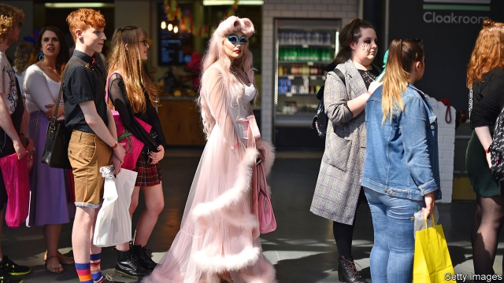

###### Lip-stick it to the man

# The drag queens of England are booming, thanks to unexpected new fans 

 

> print-edition iconPrint edition | Britain | Aug 22nd 2019 

IF TO BE British is to cherish understatement, DragWorld is the most treasonous gathering since the Gunpowder Plot. Tread the pink carpet at London’s Olympia convention hall and your eyes are drawn to either a 10ft-tall silver stiletto or a well-chiselled man in nothing but multicoloured pants and striped socks. Donna Trump, Poppycock and Rococo Chanel work the crowd. Punters hunt for gold among stalls hawking fake eyelashes, fishnet tights and wigs in outrageous shades of yellow, purple and pink. 

There is, of course, nothing new about men in tights. In his book “Queer City: Gay London from the Romans to the present day”, Peter Ackroyd likens 18th-century “mollies” to present-day drag queens. For much of the 20th century, drag acts were a mainstay of gay bars and clubs. But the crowds flocking to DragWorld demonstrate how an underground pastime has broken into the cultural mainstream. This year more than 10,000 people showed up to the two-day event, now in its third year. The BBC will broadcast a British version of “RuPaul’s Drag Race”, an American talent contest, in October. And a judge from the American show will compete in the latest series of “Strictly Come Dancing”, one of the corporation’s biggest hits. 

Many of the new fans are straight women. Nathan Stone of the MJR Group, which organises the event as well as tours for drag acts, reckons a little under two-thirds of audiences are women aged 16-21. “It is not just for old gay queens anymore,” says a stallholder, who says he flogs as many of his glittery dresses to women as men. “We’ve just had someone buy one as a wedding dress.” 

Perhaps surprisingly, women seem keen to take make-up tips from the queens. One such fan, queuing for a £17 ($21) meet-and-greet session, confesses to copying some of their looks, albeit in a toned-down way. The beauty industry was quick to spot the market’s potential. Pretty Polly, a tights brand, and Lush, a cosmetics firm, have stands at the show. “If you look at the queens, we could learn something from them,” says Joanne Etherson of Sally Beauty, which sells hair products and sponsors the show. “The hair colour, the flamboyance. It’s the extreme of everything we celebrate.” 

Others are attracted by the broad array of body sizes and fashion styles on show. The convention presents a less restrictive idea of what it means to be a woman than do glossy fashion magazines, argues Mr Stone. A barrister’s clerk, who has donned silver sequined trousers and a bright pink top for the day, says she appreciates the freedom to wear whatever she likes without judgment. 

Gay men largely welcome drag’s newfound popularity. One, who is collecting queens’ autographs in a notepad that booms “OMG u ok hun?”, reckons it shows society has moved from tolerating gay culture to embracing it. Brad Williams, who sells fake eyelashes with his business and romantic partner, agrees. “Before it was: ‘Here’s a cookie cutter. Fit in’,” he says. “Now to fit in you almost have to be different.”■ 

-- 

 单词注释:

1.unexpect[]:[网络] 意想不到；使意外 

2.Aug[]:abbr. 八月（August） 

3.cherish['tʃeriʃ]:vt. 珍爱, 怀有, 爱护 

4.understatement[ʌndә'steitmәnt]:n. 软弱无力的陈述, 克制的说法 [经] 少报 

5.treasonous[]:a. 叛逆的, 谋反的, 犯叛国罪的, 涉及叛国罪的 

6.tread[tred]:n. 踏, 步态, 梯级, 交尾, 鞋底 vi. 踏, 行走, 交尾 vt. 踩, 踏, 践踏, 跳(舞) 

7.Olympia[әu'limpiә]:n. 奥林匹亚 

8.stiletto[sti'letәu]:n. 短剑, 钻孔锥 [电] 机载探测地面雷达电子系统 

9.multicoloured[.mʌlti'kʌlәd]:a. 多色彩的, 五彩缤纷的 

10.donna['dɔnә]:n. （意）女士（置于女士名字前的尊称, 相当于Madam）；堂娜（女子名） 

11.poppycock['pɒpikɒk]:n. 胡说, 废话 

12.rococo[rә'kәukәu]:n. 洛可可式, 洛可可风格 a. 洛可可式的, 旧式的, 俗丽的 

13.Chanel[ʃɑ:'nel]:n. 香奈儿（服装、香水品牌） 

14.punter['pʌntә]:n. 用篙撑船的人, 船夫, 赌博者 

15.stall[stɒ:l]:n. 厩, 停车处, 牧师职位, 货摊, 托辞, 拖延 vt. 关入厩, 停顿, 推托, 支吾, 使陷于泥中 vi. 被关在厩内, 陷于泥中, 停止, 支吾 

16.fake[feik]:n. 假货, 欺骗, 诡计 a. 假的 vt. 假造, 仿造 vi. 伪装 

17.eyelash['ailæʃ]:n. 睫毛 [医] 睫[毛] 

18.fishnet[]:n. 鱼网, 伪装网 

19.wig[wig]:n. 假发, 斥责 vt. 给...戴假发, 激怒, 使发狂 vi. 激动, 发狂 

20.outrageous[aut'reidʒәs]:a. 暴虐的, 极无礼的, 可恶的 

21.peter['pi:tә]:vi. 逐渐消失, 逐渐减少 

22.Ackroyd[]:n. (Ackroyd)人名；(英)阿克罗伊德 

23.liken['laikәn]:vt. 比喻, 比拟 

24.molly['mɔli]:n. [俚]懦夫；娘娘腔的男人 

25.mainstay['meinstei]:n. 主桅支索, 支柱, 中流砥柱 

26.cultural['kʌltʃәrәl]:a. 文化的, 教养的, 修养的 [医] 培养的 

27.mainstream['meinstri:m]:n. 主流 

28.BBC[]:英国广播公司 

29.sery[]:n. (Sery)人名；(俄)谢雷；(科特)塞里 

30.nathan['neiθәn]:n. 南森（男子名） 

31.reckon['rekәn]:vt. 计算, 总计, 估计, 认为, 猜想 vi. 数, 计算, 估计, 依赖, 料想 

32.anymore['eni'mɔ:]:adv. 再也不, 不再 

33.stallholder[ˈstɔ:lhəʊldə(r)]:n. 摊贩 

34.flog[flɒg]:vt. 鞭打, 鞭策, 严厉的批评, 迫使 

35.glittery['glitәri]:a. 闪光的, 闪烁的 

36.albeit[ɔ:l'bi:it]:conj. 尽管, 虽然 

37.polly['pɔli]:n. 波莉（女子名, 等于Mary）；鹦哥（鹦鹉的通称, 等于poll parrot） 

38.lush[lʌʃ]:a. 苍翠繁茂的, 多青草的, 丰富的 n. 酒, 酒鬼 v. 饮 

39.cosmetic[kɒz'metik]:n. 化妆品 a. 化妆用的 

40.joanne[dʒәj'æn]:n. 乔安妮（女子名） 

41.sally['sæli]:n. 突击, 出击, 远足 vi. 突击, 出击, 出发 

42.flamboyance[flæm'bɒiәns]:n. 华丽, 火焰 

43.array[ә'rei]:n. 排列, 衣服, 大批, 军队 vt. 布署, 打扮, 排列 [计] 数组; 阵列 

44.les[lei]:abbr. 发射脱离系统（Launch Escape System） 

45.restrictive[ri'striktiv]:a. 限制的, 约束的, 限定的 n. 限制词 

46.glossy['glɒ:si]:a. 平滑的, 有光泽的 

47.don[dɒn]:n. 西班牙贵族(或绅士), 先生, 阁下 vt. 穿上 

48.trouser['trauzә]:a. 裤子的 

49.judgment['dʒʌdʒmәnt]:n. 裁判, 宣告, 判决书 [医] 判断 

50.newfound['nju:fajnd]:a. 新发现的 

51.popularity[.pɒpju'læriti]:n. 名声, 受大众欢迎, 流行 

52.autograph['ɒ:tәugrɑ:f]:n. 亲笔, 亲笔签名, 手稿 vt. 亲笔签名于, 亲笔写 

53.notepad[]:n. 记事本 [计] 记事本 

54.OMG[]:[计] 对象管理集团 

55.U[ju:]:a. 适于各种年龄观众的 n. 适合各种年龄的人观看的影片 [计] 装置, 部件, 单元, 更新, 用户 

56.brad[bræd]:n. 角钉, 曲头钉 

57.williams['wiljәmz]:n. 威廉姆斯（男子名） 

58.cutter['kʌtә]:n. 裁剪者, 切割者, 切割器 [化] 刀具; 剪切机; 切刀; 切胶机 

