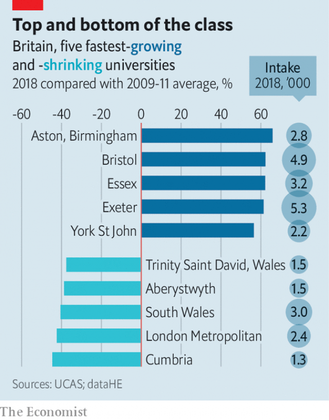

###### Searching for students

# The winners and losers of England’s great university free-for-all 

 

> print-edition iconPrint edition | Britain | Aug 22nd 2019 

IT IS A-LEVEL results day and the phones are ringing at the University of Exeter. The university is much bigger than it was half a decade ago, so there is lots to do. Some 120 staff and students advise applicants making a late bid, as well as ones who have missed the grades they need to get in. Scribbled posters count the remaining spots, and remind those on the phones to check for an English-language qualification. Most important, one concludes, is to “have fun…we are making (some) dreams come true! :)” 

At Exeter, the mood is calm. But at other universities, it will be closer to panic. Each institution’s future depends on securing enough students. This reflects a change in government policy. Admissions used to be managed, with limits set on the number of students each university could take. But beginning in 2012 restrictions began to be lifted, before disappearing entirely in 2015, since when universities have been free to take as many as they want. The result, says Sir Steve Smith, vice-chancellor at Exeter, is “the market, red in tooth and claw”. 

There is lots of variation, but in general elite institutions have been the biggest growers. Some, including Oxford and Cambridge, have chosen not to expand. But most prestigious universities have sucked up students, grateful for their fees, which subsidise research. The intake of British students at members of the Russell Group of older, research-focused universities has grown by 16% since restrictions were lifted. Some have ballooned. Bristol’s intake has shot up by 62%, Exeter’s by 61% and Newcastle’s by 43%. 

 

Universities lower down the pecking order have fared less well. The intake of British students at institutions in the post-1992 group of universities, former polytechnics which offered vocational qualifications, is flat. London Metropolitan’s intake is down by 42%, Kingston’s by 33% and Southampton Solent’s by 28%. Some have diversified by offering more qualifications sponsored by companies, postgraduate degrees or apprenticeships. Others are getting into financial difficulty. 

Universities are keenly aware that they are mostly competing with a handful of rivals for students, and that geography plays a big role in determining who those rivals are. Exeter, in south-west England, has commissioned research which shows it attracts students who live near the M5 motorway that runs into town, and struggles to recruit from anywhere north of Birmingham, in the Midlands. The university therefore keeps a close eye on Bath and Bristol, nearby institutions held in similar regard. Mark Corver of dataHE, a consultancy, notes that many larger London universities, which take students with weaker grades, have struggled as the capital’s secondary schools have got better, providing youngsters with the qualifications to aim higher. So too have universities in remote parts of the country, including Cumbria and Aberystwyth. 

Students seem to prefer close-knit, campus universities. Exeter is one example. Others include Aston, which takes 66% more British students than it did before the cap was lifted; East Anglia, which takes 34% more; and Bath, which takes 24% more. It tends to be easier to build on a campus than in a city centre, says Mike Nicholson, head of admissions at Bath. And for a generation of students who party less, study more and are often influenced by cautious parents, campus universities are a nice half-way point between school and adulthood. 

Universities not attracting enough students have to adapt. Since the new system was introduced, almost all have charged the maximum allowed—now £9,250 ($11,250) a year. Since students are entitled to government loans, which they don’t have to repay until they earn more than £25,725 a year, they are relatively unfussed by upfront costs. But price competition has begun to emerge in the form of hefty scholarships. A more common way to appeal to students is to lower the grades for entry. At its most devious, this takes the form of offers which do not require the applicant to achieve any grades at all, provided they make the university their first choice. Recruiting students will at least get easier as the number of 18-year-olds rises in 2021. 

Improving a university’s appeal through more reputable means is hard, but not impossible. Coventry has shot up the rankings, and has a 50% bigger intake than a decade ago. In 2010 a “shocking” low score in its student-satisfaction survey prompted a rethink, says Ian Dunn, the university’s provost. Now feedback is requested midway through a course and students are informed of changes made as a result within five days. The university has set up a college which offers degrees from £6,350. It has also cut back joint courses, like accounting and finance, which students enjoyed less. Before the rules changed, Exeter had gone further still, getting rid of weak departments, including chemistry. But nationwide, student satisfaction is yet to rise, indicating these universities are in a minority (the measure is, though, a lagging indicator, as students fill in forms only after finishing their degree). 

Growth is no guarantee of financial stability, as can be seen at Cardiff and Surrey, which have taken in lots more students but not enough to match their spending. That is little consolation for the small number of universities, struggling to attract applicants, which are said to be near bankruptcy. Changes in policy have caused a great deal of flux in higher education. But the growing number of students at elite universities would probably regard the flux as a price worth paying. ■ 
<<<<<<< HEAD

-- 

 单词注释:

1.loser['lu:zә]:n. 失败者, 遗失者 [法] 失败者, 失物者, 遗失者 

2.Aug[]:abbr. 八月（August） 

3.exeter['eksәtә]:n. 埃克塞特（英国英格兰西南部城市） 

4.scribble['skribl]:n. 潦草的写法, 潦草写成的东西, 拙劣的作品 v. 潦草地书写, 乱写, 滥写 

5.entirely[in'taiәli]:adv. 完全, 全然, 一概 

6.steve[]:n. 史蒂夫（男子名） 

7.smith[smiθ]:n. 铁匠, 金属品工匠 [机] 锻造工, 上手 

8.elite[ei'li:t]:n. 精华, 精锐, 中坚分子 

9.grower['grәuә]:n. 栽培者, 生长物 

10.Oxford['ɒksfәd]:n. 牛津, 牛津大学 

11.Cambridge['keimbridʒ]:n. 剑桥 

12.prestigious[pre'stidʒiәs]:a. 享有声望的 

13.subsidise[]:vt. 给...补助金, 津贴, 资助 

14.intake['inteik]:n. 入口, 吸入, 吸入量 [医] 摄取量 

15.russell['rʌsәl]:n. 拉塞尔（英国工程师, 整流器发明人） 

16.peck[pek]:n. 配克(英美干量单位), 啄痕, 啄食, 许多 vt. 啄, 啄食, 琢, 凿成, 扔 vi. 啄, 吹毛求疵, 啄食, 勉强吃 [计] 取数 

17.les[lei]:abbr. 发射脱离系统（Launch Escape System） 

18.polytechnic[.pɒli'teknik]:a. 各种工艺的, 工艺教育的 n. 工艺专科学校, 理工专科学校 

19.vocational[vәu'keiʃәnl]:a. 职业的 [法] 职业上的, 天职的 

20.southampton[sauθ'æmptәn]:n. 南安普敦（英国港市） 

21.diversify[dai'vә:sifai]:vt. 使多样化, 使变化 

22.postgraduate['pәust'^rædjuit, 'pәust'^rædʒuit]:a. 大学毕业后的, 大学研究院的 n. 研究生 

23.apprenticeship[ә'prentisʃip]:n. 学徒身分, 见习(期) [经] 学徒制, 学徒期 

24.keenly['ki:nli]:adv. 锐利地, 敏捷地, 激烈地 

25.motorway['mәutәwei]:n. 高速公路 

26.Birmingham['bә:miŋәm]:n. 伯明翰 

27.midland['midlәnd]:n. 中部地方, 内地 

28.Bristol['bristәl]:n. 布里斯托尔(英国西部港口) 

29.corver[]:[网络] 可薇尔 

30.consultancy[]:n. 商量, 协商, 磋商, 会诊, 与...商量, 咨询, 请教, 找(医生)看病, 查阅, 考虑 [经] 咨询业务, 咨询服务 

31.Cumbria['kʌmbriә]:坎布里亚郡 [英国英格兰郡名] 

32.Aberystwyth[,æbə'ristwiθ]:n. 阿伯里斯特威斯（英国威尔士西部自治市） 

33.aston['æstәn]:n. 阿斯顿（姓氏） 

34.Anglia['æŋgliә]:n. 英格兰的拉丁名称 

35.mike[maik]:vi. 偷懒, 游手好闲 n. 休息, 游手好闲, 扩音器, 话筒 

36.Nicholson['nikәlsn]:尼科尔森(姓氏) 

37.adulthood[ә'dʌlthud]:n. 成年 [医] 成人期 

38.repay[ri'pei]:v. 偿还, 报答, 报复 

39.unfussed[]:[网络] 不高兴 

40.upfront[ˌʌpˈfrʌnt]:a. 正直的, 坦率的; 最前面的, 首要的; 在前面的; 预先的 adv. 在最前面; 提前支付（工资） 

41.hefty['hefti]:a. 重的, 肌肉发达的 

42.devious['di:viәs]:a. 偏僻的, 迂回的 

43.reputable['repjutәbl]:a. 受好评的, 有声望的, 规范的 [法] 声誉好的, 可尊敬的 

44.Coventry['kɔvәntri]:n. 考文垂 

45.ranking['ræŋkiŋ]:n. 等级, 地位 a. 上级的, 头等的, 超群的 

46.rethink[ri:'θiŋk]:v. 再想, 重想 

47.ian[iәn]:n. 伊恩（男子名） 

48.Dunn[]:[计] 邓恩 

49.provost['prɒvәst]:n. 教务长, 监督员, 牧师 [法] 监督者, 负责官员, 监狱看守 

50.midway['mid'wei]:n. 中途, 中间, 娱乐场 a. 中途的, 中间的 adv. 中途 

51.indicator['indikeitә]:n. 指示器, 指示剂, 指标 [计] 指示器 

52.cardiff['kɑ:dif]:n. 加的夫（英国港市） 

53.surrey['sʌri]:n. 四轮双座轻便游览马车 

54.consolation[.kɒnsә'leiʃәn]:n. 安慰, 令人安慰的事物 [法] 安慰, 慰问 

55.bankruptcy['bæŋkrәptsi]:n. 破产者 [经] 破产, 倒闭 

56.flux[flʌks]:n. 流出, 涨潮, 变迁 vi. 熔化, 流出 vt. 使熔融 [计] 助焊剂 
=======
>>>>>>> 50f1fbac684ef65c788c2c3b1cb359dd2a904378

