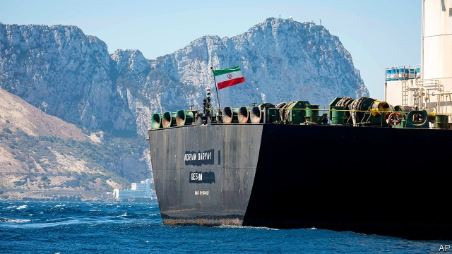

###### Tanker geopolitics

# What Britain’s release of an Iranian tanker says about its post-Brexit foreign policy 

 

> print-edition iconPrint edition | Britain | Aug 22nd 2019 

A  SUPERTANKER LOADED with oil headed east from the Strait of Gibraltar into the Mediterranean, bound for Greece, just before midnight on August 18th. Nothing unusual in that—120,000 vessels navigate the strait each year, carrying a third of the world’s oil and gas. But the Iranian-flagged Adrian Darya 1 was no ordinary tanker. 

Days earlier she had been renamed and reflagged, with fresh paint covering her old identity, Grace 1. That accompanied her release from over a month of detention in Gibraltar, a British overseas territory. The episode not only marked the latest chapter in a bitter struggle between Iran and America. It also highlights Britain’s strained effort to balance its Iran policy between American belligerence and European emollience. 

The backdrop is President Donald Trump’s withdrawal last year from a multinational nuclear agreement that his predecessor, Barack Obama, reached with Iran in 2015. This deal had limited Iran’s nuclear programme in exchange for relaxing sanctions. But American sanctions were tightened sharply in April under Mr Trump’s policy of “maximum pressure”. Iran has hit back, apparently attacking ships in the Gulf of Oman in May and shooting down an American spy drone on June 20th. The latter caused Mr Trump to order—and then cancel—air strikes on Iran. 

That was the febrile atmosphere on July 4th, when British marines abseiled onto the deck of the Grace 1 in Gibraltarian waters. They did so on the basis of American intelligence suggesting the tanker’s oil was bound for Syria, whose main refinery is under EU sanctions. On July 19th Iran procured a bargaining chip by grabbing a British tanker, the Stena Impero, in the Strait of Hormuz. That may have strengthened Iran’s hand. But it was not until it promised that the Grace 1 would not be sent to Syria, or any other forbidden destination, that Gibraltar agreed to release the vessel. 

That was a relief to Britain. The threat of further ship-grabs would diminish, and Iran would probably release Britain’s tanker in turn. But with the Adrian Darya 1’s paint barely dry, a court in Washington, DC, issued a warrant for its re-seizure, on the basis that the ship was secretly controlled by Iran’s Islamic Revolutionary Guard Corps, which America considers a terrorist organisation. That cut no ice with Gibraltar. It pointed out that the EU’s sanctions laws differ from America’s, and that Europe—like the rest of the world—does not deem the Revolutionary Guards terrorists. 

The diplomatic tussle has put Britain in a tight spot. Like its European allies, it wants Iran to stick to the nuclear agreement. In January Britain spearheaded, with France and Germany, the creation of Instex, a barter mechanism to enable certain Europe-Iran transactions, particularly for humanitarian supplies. British diplomats are eager to soothe Iran with trade. The seizure of the Grace 1 threw a spanner in the works, not least because Britain was prodded into action by American intelligence. 

Boris Johnson, who succeeded Theresa May as prime minister midway through the tanker crisis, has adopted a confrontational position towards the EU regarding Brexit. He has also courted Mr Trump, who is holding out the prospect of a post-Brexit trade deal to help cushion the British economy. 

That leaves Britain’s Iran policy in a parlous position. Should Mr Johnson keep siding with the Europeans, he may anger America, risking the promise of a trade deal. But if he backs Mr Trump and heaps pressure on Iran, he could cause the collapse of the nuclear deal and a spat with Europe. “You can’t maintain that post-Brexit you’ll be a loyal ally of European nations in matters of security and ditch 20 years of Iran policy by moving over to the American side,” says Sir Richard Dalton, Britain’s ambassador to Iran in 2003-06. 

So far Mr Johnson has sought a balance. Whereas Mrs May tried to organise a European security mission for the Gulf, Mr Johnson signed up to an American-led scheme. John Bolton, Mr Trump’s national security adviser, noted with pleasure that the choice “reflects a change from the prior government”. But the Adrian Darya 1’s release shows that even Mr Johnson is unwilling to break with Europe and join Mr Trump in throttling Iran. At least not yet. ■ 

-- 

 单词注释:

1.geopolitic[,dʒi:әjpә'litik]:a. 地理政治学的 

2.Iranian[i'reiniәn]:a. 伊朗的, 伊朗语系的 n. 伊朗人, 伊朗语 

3.Aug[]:abbr. 八月（August） 

4.supertanker['sju:pәtæŋkә]:n. 超级油轮, 巨大油轮 

5.Gibraltar[dʒi'brɒltә]:n. 直布罗陀 

6.navigate['nævigeit]:vi. 航行 vt. 航行于, 驾驶, 操纵, 使通过 

7.adrian['eidriәn]:n. 艾德里安（男子名）；艾德里安市（美国密歇根州东南部城市） 

8.darya[]: [地名] 河、海（突厥语） 

9.rename[.ri:'neim]:vt. 重新命名, 再命名, 给...改名 [计] 重命名; DOS内部命令:更改文件名 

10.reflagged[]:[网络] 重新加入 

11.detention[di'tenʃәn]:n. 阻止, 监禁, 拘留 [医] 隔离, 拘留, 滞留, 停滞 

12.oversea['әuvә'si:]:adv. 海外, 向国外, 向海外, 国外 a. 外国的, 在国外的, 在海外的, 舶来的 

13.Iran[i'rɑ:n]:n. 伊朗 

14.belligerence[bi'lidʒәrәns]:n. 交战, 好战性, 斗争性 

15.emollience[i'mɔljәns]:软化作用[性质] 

16.backdrop['bækdrɒp]:n. 背景幕, 背景 

17.withdrawal[wið'drɒ:l]:n. 提款, 撤退, 退回, 撤消, 退隐, 戒毒过程 [医] 戒除, 脱瘾 

18.multinational[.mʌlti'næʃәnl]:a. 多国的, 跨国公司的 n. 跨国公司 

19.predecessor[.predi'sesә]:n. 前任, 先辈, 前身 [医] 初牙, 前辈, 祖先 

20.barack[bɑ:'ræk]:n. 巴拉克（男子名） 

21.obama[]:n. 奥巴马(姓) 

22.sanction['sæŋkʃәn]:n. 核准, 制裁, 处罚, 约束力 vt. 制定制裁规则, 认可, 核准, 同意 

23.tighten['taitn]:vt. 勒紧, 使变紧 vi. 变紧, 绷紧 

24.apparently[ә'pærәntli]:adv. 表面上, 清楚地, 显然地 

25.Oman[әu'mɑ:n]:n. 阿曼 

26.drone[drәun]:n. 雄蜂, 懒惰者, 嗡嗡的声音, 无人驾驶飞机(或船) vi. 嗡嗡作声, 混日子 vt. 低沉地说 

27.febrile['fi:brail]:a. 发热的, 热病的, 热性的 [医] 热性的, 发热的 

28.abseil['ɑ:bzail]:n. (登山运动中的)沿绳滑下法 

29.GIbraltarian[dʒi,brɔ:l'teәriәn]:n. 直布罗陀人 

30.Syria['siriә]:n. 叙利亚 [经] 叙利亚 

31.refinery[ri'fainәri]:n. 精炼厂 [化] 精炼厂炼糖厂 

32.EU[]:[化] 富集铀; 浓缩铀 [医] 铕(63号元素) 

33.procure[prәu'kjuә]:vt. 获得, 取得, 导致 vi. 拉皮条 

34.chip[tʃip]:n. 屑片, 薄片, 碎片 vt. 削, 切, 削成碎片, 使摔倒, 凿 vi. 削下屑片 [计] 孔屑; 组件; 晶片; 芯片 

35.grab[græb]:n. 抓握, 掠夺, 强占, 东方沿岸帆船 vi. 抓取, 抢去 vt. 攫取, 捕获, 霸占 

36.stena[]:[网络] 瑞典史丹纳；史丹纳航运公司；轩琪 

37.impero[]:[网络] 帝国酒店；因佩罗号；因佩罗 

38.Hormuz['hɔ:mәz,hɔ:'mu:z]:霍尔木兹海峡(在伊朗和阿拉伯半岛之间,连接波斯湾[即阿拉伯湾]和阿曼湾) 

39.diminish[di'miniʃ]:v. (使)减少, (使)变小 

40.Washington['wɒʃiŋtn]:n. 华盛顿 

41.DC[]:直流电 [计] 数据单元, 数据中心, 数据代码, 数据通信, 数据控制, 数字控制, 直流 

42.warrant['wɒ:rәnt]:n. 授权, 正当理由, 根据, 证明, 批准, 凭证, 令状, 委任状 vt. 授权给, 保证, 担保, 批准, 使有正当理由 

43.secretly['si:kritli]:adv. 秘密地, 背地里 

44.Islamic[iz'læmik]:a. 伊斯兰教的, 穆斯林的 

45.corp[]:[经] 公司 

46.terrorist['terәrist]:n. 恐怖分子 [法] 恐怖份子, 恐怖主义 

47.organisation[,ɔ: ^әnaizeiʃən; - ni'z-]:n. 组织, 团体, 体制, 编制 

48.deem[di:m]:v. 认为, 相信 

49.diplomatic[.diplә'mætik]:a. 外交的, 老练的 [法] 外交的, 外交上的, 文献上的 

50.tussle['tʌsl]:n. 扭打, 争斗, 论争 vi. 扭打, 打斗 

51.ally['ælai. ә'lai]:n. 同盟者, 同盟国, 助手 vt. 使联盟, 使联合, 使有关系 vi. 结盟 

52.spearhead['spiәhed]:n. 矛尖, 先锋队, 先头部队 vt. 做先锋, 带头 

53.creation[kri:'eiʃәn]:n. 创造, 创作物, 发明 [化] 产生 

54.barter['bɑ:tә]:n. 物物交换, 实物交易 v. 物物交换, 交换 

55.mechanism['mekәnizm]:n. 机械, 机构, 结构, 机理, 技巧 [化] 机理; 历程; 机构 

56.transaction[træn'sækʃәn]:n. 交易, 办理, 学报, 和解协议 [计] 事务处理 

57.humanitarian[hju:.mæni'tєәriәn]:n. 人道主义者, 博爱者, 基督凡人论者 a. 人道主义的, 博爱的, 凡人论的 

58.diplomat['diplәmæt]:n. 外交官, 有外交手腕的人 [法] 外交家, 外交官, 有权谋的人 

59.soothe[su:ð]:vt. 缓和, 使安静, 安慰, 奉承 vi. 起安慰作用 

60.seizure['si:ʒә]:n. 捕获, 夺取, 占领, 捕获物, 没收, 充公 [医] 发作; 癫痫发作 

61.spanner['spænә]:n. 扳手 [化] 扳手; 紧固扳手; 紧固器 

62.prod[prɒd]:n. 刺针, 刺棒, 激励话, 提醒物 vt. 戳, 刺, 刺激 vi. 戳, 刺 

63.boris['bɔris]:n. 鲍里斯（男子名） 

64.johnson['dʒɔnsn]:n. 约翰逊（姓氏） 

65.theresa[ti'ri:zә]:n. 特丽萨（女子名） 

66.midway['mid'wei]:n. 中途, 中间, 娱乐场 a. 中途的, 中间的 adv. 中途 

67.confrontational[ˌkɒnfrʌnˈteɪʃnl]:a. 挑衅的; 对抗的 

68.Brexit[]:[网络] 英国退出欧盟 

69.parlous['pɑ:lәs]:a. 危险的, 不易对付的, 精明的, 麻烦的 adv. 非常地, 极度地 

70.siding['saidiŋ]:n. 侧线, 旁轨, 边宽 

71.richard['ritʃәd]:n. 理查德（男子名） 

72.dalton['dɔ:ltәn]:[化] 道尔顿(质量单位,等于一氧原子的1/16) [医] 道尔顿(质量单位) 

73.Mr['mistә(r)]:先生 [计] 存储器回收程序, 多重请求 

74.john[dʒɔn]:n. 盥洗室, 厕所, 嫖客 

75.bolton['bәultәn]:a. 可用螺栓固定的 

76.adviser[әd'vaizә]:n. 顾问, 劝告者, 指导教师 [法] 顾问, 劝告者 

77.throttle['θrɒtl]:n. 节流阀, 节气阀, 喉咙 vt. 扼喉咙, 使窒息, 压制, 使节流 vi. 窒息, 节流, 减速 

