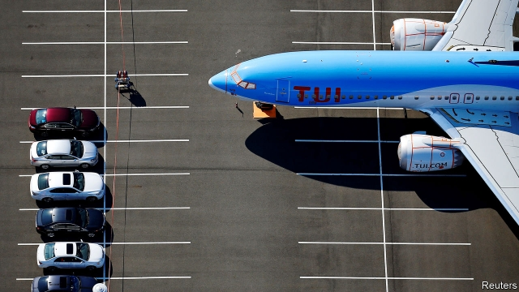
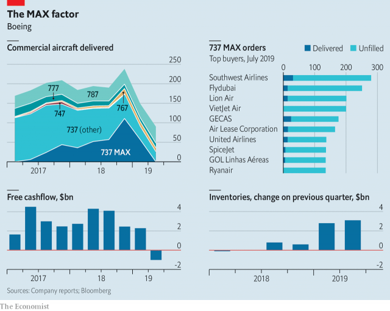

###### Tick tock

# Boeing’s troubles cost the aerospace industry $4bn a quarter 

 

> print-edition iconPrint edition | Business | Aug 22nd 2019 

BOEING HAS long been a central cog of America’s industrial machine. Each year it sells $100bn-worth of aerospace equipment and services around the world and pays $45bn to other American firms. It is the world’s largest aircraft-maker and America’s largest manufacturing exporter. Its commercial jets, which account for 60% of revenues, ferry millions of passengers. One in 100 American workers toils either directly for Boeing, whose workforce numbers 137,000 in its home country, or one of its 13,600 domestic suppliers, which employ a further 1.3m people in mostly well-paid jobs. In short, what is good for Boeing is good for corporate America. 

The flipside is also true, as has become obvious in the wake of two crashes of Boeing’s 737 MAX aircraft, in October and March, which have been linked to a malfunctioning flight-software system, and which killed 346 people. The human cost is immeasurable. The financial blow to Boeing itself, its suppliers and its airline customers is more tangible—and mounting. 

The company has continued to churn out the troubled aircraft since its grounding by regulators in March. But it has not been able to deliver them to customers. As a result Boeing’s inventories have grown by $6bn so far this year. The flightless planes fill all free space at its facilities, including car parks. Add the knock-on cost for airlines and for the supply chain and a rough estimate is that every quarter that the best-selling airliner remains on the ground costs $4bn. As the bill spirals an entire industry is now willing the plane to be back in the air by the end of the year. 

Start with the airlines. Pressure on carriers to cut costs made the fuel-efficient MAX Boeing’s fastest-selling model ever. Around 5,000 have been ordered since its launch in 2011 and nearly 390 delivered. Southwest, an American carrier with 34 such planes, has cancelled thousands of flights. In July it revealed a $175m hit to pre-tax profits in the second quarter. American Airlines, which has scrapped 115 or so flights a day, reckons that full-year profits will be $350m lower as a result. OAG, an airline-data firm, estimates that, globally, the grounding will cost airlines $4bn in sales by November. Many airline bosses would agree with Michael O’Leary, chief executive of Ryanair, Europe’s second-biggest carrier with 135 MAXes on order, who has told Boeing to “get their shit together”. 

Some airlines have put the plane back in their schedules for November, on the assumption that once Boeing submits fixes to the faulty software in September, America’s Federal Aviation Administration (FAA) and its counterparts in other countries will allow a return to service before the end of the year. This looks optimistic. Even if regulators approved the new software, it would take six to eight weeks to get planes out of storage and in the air. And as Jose Caiado of Credit Suisse, a bank, points out, it is unclear if pilots require retraining in flight simulators, adding more delays. Southwest, which aims to get the MAX in the air by January, seems to admit as much. 

In the meantime, airlines are plugging gaps with other planes. Southwest is retiring seven fewer older, thirstier 737s from its fleet this year than it originally planned. United Airlines is pressing into service wide-bodied jets, which are costlier to run than single-aisle jets like the 737 and so generally reserved for long-haul routes. 

Affected airlines can expect compensation in kind from Boeing, in the form of bigger discounts and better deals on other services. The same cannot be said of Boeing’s suppliers. It has relentlessly squeezed their profit margins in recent years in search of efficiency. Many have invested in extra capacity to supply parts for 57 MAX planes a month, Boeing’s original production target for this year. Instead, Boeing cut monthly output back from 52 to 42. 

Spirit AeroSystems, which gets around half its revenues from supplying fuselages for the 737 MAX, saw margins slip and is cutting overtime and putting workers on unpaid leave to cut costs after “disruption in a complex production system”, says its boss, Tom Gentile. It has lost 28% of its market capitalisation, or around $3bn, since March. Allegheny Technologies, which makes composite materials used in the aircraft, has been similarly clobbered. General Electric, America’s troubled engineering giant which supplies MAX engines in a joint venture with Safran, a French aerospace company, faces a bigger bill. It is paid only when planes are delivered. It estimates that its cashflow could be reduced by as much $1.4bn in 2019, adding to its woes (see article). Safran’s results for the first half of 2019, due on September 5th, will be pored over for signs of trouble. 

 

Most aerospace firms do not live by Boeing alone. That, and Boeing’s decision to maintain production, has insulated them from a bigger fallout. UTC, an American conglomerate which makes electronics, seats, wheels and brakes for the MAX, reckons the delays will have only a small impact on profits. The situation for suppliers is summed up neatly by David Squires, boss of Senior, a British firm that makes high-tech components not only for Boeing but also for GE and Spirit. The grounding has not been devastating, he insists. That said, his firm will now be where it hoped to be in April 2019 only by the start of 2021. 

Then there is Boeing itself. The 737, the first of which took to the air half a century ago, has been a huge seller for the company—the 10,000th rolled off the production line in 2018. In March Goldman Sachs, a bank, estimated that the MAX may account for a third of Boeing’s overall revenues (including its defence business) in the next five years. Although no MAX orders have been cancelled so far, Boeing has not booked any new ones either. Further delays, Boeing has admitted, may force it to cut production further—or even shut it down altogether. 

The fiasco has already led the planemaker to postpone plans to develop a new twin-aisle plane to replace the ageing 757. Its share price has dropped by 25% in the past five months, wiping $62bn from its stockmarket value. It reported a record quarterly loss of $2.9bn in the three months to June, after it set aside $4.9bn for compensation for angry airlines. It may need to allocate more towards other contingencies. Southwest’s pilots have already sued Boeing for lost wages resulting from cancelled flights. Crash victims’ families are also preparing lawsuits. 

Boeing can endure the financial pain for a while longer. Its duopoly with Airbus means that, in the short run, airlines and suppliers have little choice but to bear the costs stoically. Boeing’s chief executive, Dennis Muilenburg, appears confident that the MAX will be flying again before its commercial partners and investors run out of patience. 

Many in the industry seem to share this conviction—regulators will not, the thinking goes, jeopardise Boeing’s future because the company is too big to fail. Perhaps. But the FAA, roundly criticised for being slower than other regulators to ground the plane, and earlier granting Boeing wide-ranging powers of self-certification, is in no mood to prove them right. ■ 

-- 

 单词注释:

1.Tock[tɔk]:托科鸟 

2.aerospace['єәrәuspeis]:n. 航天空间, 航天技术 

3.Aug[]:abbr. 八月（August） 

4.boe[bəu]:abbr. back outlet eccentric 后偏心（轮）出口 

5.cog[kɒg]:n. 嵌齿, 小船 vt. 给...装配齿轮, 欺骗 

6.manufacturing[.mænju'fæktʃәriŋ]:n. 制造业 a. 制造业的 

7.exporter[ik'spɒ:tә]:n. 出口商, 输出者, 出口公司 [经] 出口商, 输出者 

8.toil[tɒil]:n. 辛苦, 苦工, 网, 罗网, 圈套 vi. 苦干, 跋涉 

9.supplier[sә'plaiә]:n. 供应者, 供给国, 供应商 [化] 承制厂; 供应厂商 

10.corporate['kɒ:pәrit]:a. 社团的, 合伙的, 公司的 [经] 团体的, 法人的, 社团的 

11.flipside[]:n. 另一面；反面 

12.MAX[mæks]:[计] 最大 

13.malfunction[.mæl'fʌŋʃәn]:n. 故障, 失灵, 疾病 vi. 发生故障, 不起作用 [计] 故障 

14.immeasurable[i'meʒәrәbl]:a. 不可测量的, 无限的, 广大无边的 

15.churn[tʃә:n]:n. 搅乳器 v. 搅拌, 搅动 

16.grounding['graundiŋ]:n. 基础教学, 基础训练 [经] 搁浅 

17.regulator['regjuleitә]:n. 调整者, 校准者, 校准器, 调整器, 标准钟 [化] 调节剂; 调节器 

18.inventory['invәntәri]:n. 详细目录, 存货清单 vt. 列入详细目录, 清点存货 [计] 存货清单 

19.flightless['flaitlis]:a. 不能飞的 

20.airliner['єәlainә]:n. 班机, 大型客机 

21.spiral['spairәl]:n. 螺旋形之物, 螺线 a. 螺旋形的, 盘旋的 vi. 螺旋形下降, 螺旋形上升, 螺旋形行进 vt. 使螺旋形行进 

22.scrap[skræp]:n. 碎片, 残余物, 些微, 片断, 铁屑, 吵架 vt. 扔弃, 敲碎, 拆毁 vi. 互相殴打 a. 零碎拼凑成的, 废弃的 

23.reckon['rekәn]:vt. 计算, 总计, 估计, 认为, 猜想 vi. 数, 计算, 估计, 依赖, 料想 

24.oag[]: 眼动脉造影[术] 

25.globally[]:[计] 全局地 

26.michael['maikl]:n. 迈克尔（男子名） 

27.Ryanair[]:n. 瑞安航空公司（欧洲最大的廉价航空公司, 总部位于爱尔兰） 

28.MAX[mæks]:[计] 最大 

29.shit[ʃit]:vi. 拉屎 vt. 欺骗, 在...拉屎 n. 粪, 屎 interj. 狗屁 

30.FAA[]:一切海损均不赔偿 

31.counterpart['kauntәpɑ:t]:n. 副本, 复本, 配对物, 相应物 [经] 副本, 正副二份中之一 

32.jose[]:n. 约瑟（人名） 

33.Suisse[swi:s]:<法> = Switzerland 

34.unclear[.ʌn'kliә]:a. 不易了解的, 不清楚的, 含混的 

35.retrain[ri:'trein]:vt. 重新训练, 再训练 

36.simulator['simjuleitә]:n. 模拟器, 假装者 [计] 模拟器 

37.originally[ә'ridʒәnli]:adv. 本来, 原来, 最初, 就起源而论, 独创地 

38.compensation[.kɒmpen'seiʃәn]:n. 补偿, 赔偿金, 工资 [医] 代偿(机能), 补偿 

39.cannot['kænɒt]:aux. 无法, 不能 

40.relentlessly[]:adv. 不仁慈, 严酷, 无情, 坚韧, 不懈, 不屈不挠 

41.fuselage['fju:zilɑ:dʒ]:n. 机身 

42.unpaid[.ʌn'peid]:a. 未付款的, 不支薪水的 [经] 未付的, 未缴纳的 

43.disruption[dis'rʌpʃәn]:n. 分裂, 崩溃, 瓦解 

44.tom[tɒm]:n. 雄性动物, 雄猫 

45.gentile['dʒentail]:n. 非犹太人, 异邦人, 非伊斯兰教徒 a. 非犹太人的, 异教徒的, 非摩门教徒的 

46.capitalisation[,kæpitәlai'zeiʃən;-li'z-]:n. <主英>=capitalization 

47.Allegheny[,æli'^eini]:spurge[植]平铺富贵草 

48.composite[kәm'pɒzit]:a. 合成的, 混合成的, 菊科的 n. 合成物, 复合材料, 菊科 

49.clobber['klɒbә]:n. 衣服, (鞋匠用来掩饰皮革缝的)软膏 vt. 痛打, 击倒, 拉垮 

50.safran[]:[网络] 赛峰；赛峰集团；法国赛峰集团 

51.cashflow['kæʃfləʊ]:vi. 现金流转 

52.woe[wәu]:n. 悲哀, 悲痛, 苦痛 

53.pore[pɒ:]:n. 毛孔, 小孔, 气孔 vi. 专心阅读, 细想, 钻研, 沉思, 注视 vt. 使注视得 

54.insulate['insjuleit]:vt. 使绝缘, 隔离 [医] 绝缘 

55.fallout['fɒ:laut]:n. 原子尘的降下, 辐射性微尘, 原子尘, 附带结果 [医] [放射尘]回降 

56.utc[]:abbr. 美国联合技术公司（United Technology Corporation）；世界时间代码（Univer-sal Time Code）；世界调整时间（Universal Time Coordinated）；城市交通管制（Urban Traffic Control） 

57.conglomerate[kәn'glɒmәrit]:a. 聚成球形的, 砾岩性的 n. 集成物, 混合体, 砾岩 v. (使)凝聚成团 

58.neatly['ni:tli]:adv. 整洁地, 干净地, 匀称地 

59.david['deivid]:n. 大卫；戴维（男子名） 

60.squire[skwaiә]:n. 乡绅, 大地主, 治安官 vt. 随侍, 护卫 vi. 当乡绅 

61.devastate['devәsteit]:vt. 毁坏 [法] 使荒废, 毁灭, 掠夺 

62.goldman[]:n. 高曼（姓氏） 

63.Sachs[zaks]:n. 萨克斯（汽车零配件生产厂商） 

64.fiasco[fi'æskәu]:n. 惨败, 大失败 

65.planemaker['plein,meikә(r)]:n. <美>飞机制造商 

66.stockmarket[s'tɒkmɑ:kɪt]: 证券市场; 证券交易所; 证券行情 

67.contingency[kәn'tindʒәnsi]:n. 偶然性, 可能性, 意外事故 [经] 意外事故, 意外开支, 偶然事故 

68.sue[su:]:vt. 控告, 起诉, 请求 vi. 提出诉讼, 提出请求 

69.lawsuit['lɒ:sju:t]:n. 诉讼 [法] 诉讼, 诉讼案件 

70.duopoly[dju'ɔpәli]:[经] 双头垄断的生产者 

71.airbus['eәbʌs]:空中客车 

72.stoically['stəuikli]:adv. 坚忍地；恬淡寡欲地 

73.dennis['denis]:n. 丹尼斯（男子名） 

74.muilenburg[]: [人名] 米伦伯格 

75.investor[in'vestә]:n. 投资者 [经] 投资者 

76.jeopardise[]:vt. 使受危险, 危及, 危害 [法] 使受危害, 使陷入危险, 危及 

77.roundly['raundli]:adv. 圆圆地, 直率地, 严厉地, 全面地 

78.criticise['kritisaiz]:v. 批评, 吹毛求疵, 非难 

