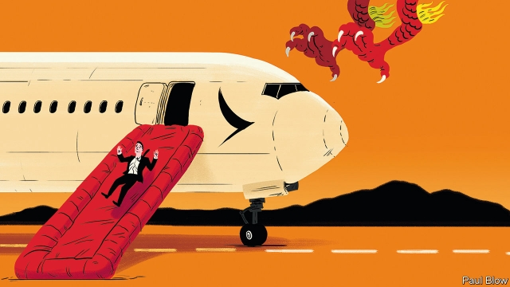

###### Wings clipped

# Cathay Pacific’s fate rattles multinationals in Hong Kong 

 

> print-edition iconPrint edition | Business | Aug 22nd 2019 

MULTINATIONAL COMPANIES in Hong Kong operated under the convenient illusion, nurtured by China’s Communist Party, that the mainland would not meddle (too much) in the territory’s business affairs. That faith, already shaken during weeks of political protests against the entrepot’s pro-Beijing government, is in tatters following China’s treatment of Cathay Pacific, an airline based in Hong Kong. Earlier this month China’s aviation regulator barred cabin crew found to have participated in or supported the demonstrations, which many Cathay staff openly had, from flying over the mainland. The carrier yielded to the pressure and even fired four staff, including two pilots. On August 16th it announced the departure of Rupert Hogg, chief executive since 2017. Though Mr Hogg said he was taking responsibility for what had been “challenging weeks” for the airline, China left little doubt as to the circumstances of his exit. 

Businesses have a right to be rattled. The assault on Cathay is unprecedented in its speed and scope. Chinese state media shrilly denounced the company, and social media brimmed with indignant calls to boycott it. CCTV, China’s state broadcaster, reported Mr Hogg’s departure half an hour before Hong Kong’s bourse, where Cathay is listed. CCTV paired it with a Chinese internet meme that roughly translates to “You would not be in trouble if you had not asked for it.” Even after the firings, Global Times, a party mouthpiece, accused Cathay of a “lukewarm attitude” in disciplining “radical employees”. 

More troubling than the jingoistic outbursts was the concerted economic pressure piled on the company. ICBC, a big state-run bank, put a “strong sell” recommendation on its stock. Other state-owned enterprises, including CITIC Bank International and China Resources, have instructed workers not to take Cathay flights. 

Cathay’s ordeal has sharpened the conflicting pressures on multinationals in Hong Kong with business in the mainland: pleasing both authoritarian China and their democracy-loving staff in Hong Kong. Merlin Swire, the chairman of Swire Pacific, Cathay’s parent company, whose interests on the mainland range from bottling to property, travelled to Beijing on August 12th. A foreign private-equity manager in Hong Kong says that companies are “walking on eggshells”. A former employee at a big Western law firm says that protests are not to be discussed at work for fear of irking mainland colleagues and clients. Last week Finnair’s local recruiter warned the Finnish airline’s crew that they could be barred from flights if they linked the company’s name with the protests on social media. The mainland bosses of a large state-owned enterprise recently told colleagues in their Hong Kong subsidiary that it wanted to hire more staff there—but that all would have to be vetted to ensure none had participated in the demonstrations. 

Many in Hong Kong balk at such subservience. David Webb, a respected activist investor, called Cathay’s concessions “the most appalling kowtow to Peking” and said that its “shameful appeasement” had done great damage to its brand. On August 20th Jeremy Tam, a Cathay pilot who is also a pro-democracy lawmaker, said he had quit the airline. Days earlier a crowdfunded newspaper ad by local employees of the Big Four accounting firms—Deloitte, Ernst & Young, KPMG and PwC—blamed their Hong Kong branches for turning a deaf ear to the protests. Global Times duly demanded that the firms investigate who was behind the ad and sack them. (So far the Chinese authorities have not made such demands.) 

Some business types believe things may go back to normal. Hong Kong remains a gateway to China’s gargantuan market. Few know this better than Cathay: close to a quarter of its destinations are in the mainland. Cathay was, in the words of one senior Western banker, “the pound of flesh that was necessary, but it was a clean cut”. 

China, for its part, has an interest in returning to the days when businesspeople believed its promise of “one country, two systems”. As for Cathay, Air China holds a 30% stake in the airline. Old rumours of the flag carrier’s intention to buy Cathay outright have resurfaced. Luya You of Bocom International, a broker, says an acquisition would transfer Cathay’s global expertise to Air China and “quell China’s concerns about its foreign background” (ie, Swire). Given all the turbulence, few expect such a high-stakes deal to happen soon. Still, in the meantime, Ms You has a simple message for investors: “Do not underestimate China’s resolve to punish Cathay as a symbol for others.” Many will have heard that disturbing message loud and clear.■ 

