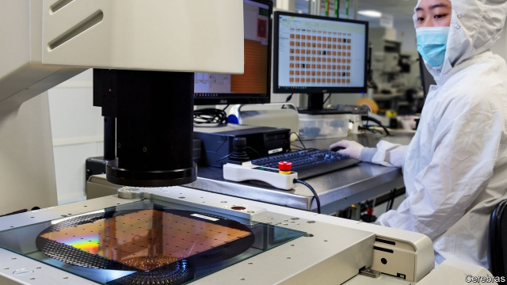

###### Growing smartly

# Cerebras unveils the world’s chunkiest AI chip 

 

> print-edition iconPrint edition | Business | Aug 22nd 2019 

COMPUTER BRAINS are tiny rectangles, becoming tinier with each new generation. Or so it used to be. These days Andrew Feldman, the boss of Cerebras, a startup, pulls a block of Plexiglas out of his backpack. Baked into it is a microprocessor the size of letter paper. “It’s the world’s biggest,” he says proudly, rattling off its technical specs: 400,000 cores (sub-brains), 18 gigabytes of memory and 1.2trn transistors. That is, respectively, about 78, 3,000 and 57 times more than the largest existing processor from Nvidia, a chipmaker. 

Cerebras is leading a shift in semiconductors that was on display at Hot Chips, an industry gathering at Stanford University, where startups like Mr Feldman’s and giants such as Nvidia and Intel showed off their new silicon wares on August 19th. 

Cramming ever more transistors on standard chips—twice as many every 18 months, according to Moore’s Law, which has turned from an empirical observation to an industry benchmark—used to be the way to go. But with transistors now the size of dozens of atoms, improvements have become less predictable. And with the spread of artificial intelligence (AI), demand for computing power has grown by more than 300,000 times for certain applications between 2012 and 2018, according to some estimates, much faster than the 16 times or so ordained by Moore’s Law. 

As a result, chipmakers are now dialling up performance by, among other things, increasing the size of processors that inhale data to train AI services, from facial recognition to drug discovery. Cerebras has pushed this approach to the limit: its chip is the biggest that can be cut from the largest available wafers, the round sheets of silicon onto which transistors are etched. 

To get there, the firm had to overcome more than one technical hurdle. One is defects: every wafer has some, so Mr Feldman’s team had to find a way to bypass faulty cores. Another is cooling: water pumped through tiny pipes carries away the great heat that cores generate. Cerebras has also built a specialised computer for its new chip which it claims will deliver 150 times more number-crunching power than the best server based on graphics-processing units, today’s AI workhorses. 

Those attending Hot Chips were passably impressed when Cerebras presented its new processor. But the biggest hurdle for Cerebras may be economic, not technical, says Linley Gwennap of Microprocessor Report, an industry newsletter. 

One question is whether other firms that have a huge demand for computing power, including banks and oil giants, will buy such AI supercomputers, instead of having their data crunched in a cloud. And Mr Feldman has yet to convince big providers of cloud computing, such as Amazon Web Services, Microsoft Azure and Google Cloud, that Cerebras’s superior performance relative to machines packed with Nvidia chips outweighs the extra costs, for instance in higher power consumption. 

Though the name Cerebras is meant to echo cerebrum, the largest part of the human brain, it also bears a resemblance to Cerberus, the giant three-headed dog guarding the entrance to Hades. The industry’s more fearsome beasts, whether chipmakers or computer manufacturers, may need little convincing to gobble it up while it is still a puppy, as they have done with other AI-chip pioneers before it.■ 

Correction (August 22nd 2019): In an earlier version of this article we said that Cerebras's chip had 57m as many transistors as Nvidia's biggest chip. We were off by six orders of magnitude. The correct figure is 57. Sorry. 

-- 

 单词注释:

1.smartly['smɑ:ti]:adv. 潇洒地, 火辣辣地, 刺痛地 

2.unveil[.ʌn'veil]:vt. 揭开, 揭幕, 除去...的面纱 vi. 显露, 除去面纱 

3.chunky['tʃʌŋki]:a. 矮矮胖胖的 

4.AI[ai]:[计] 附加信息, 人工智能 [化] 人工智能 

5.chip[tʃip]:n. 屑片, 薄片, 碎片 vt. 削, 切, 削成碎片, 使摔倒, 凿 vi. 削下屑片 [计] 孔屑; 组件; 晶片; 芯片 

6.Aug[]:abbr. 八月（August） 

7.andrew['ændru:]:n. 安德鲁（男子名） 

8.Feldman[]:n. (Feldman)人名；(英、法、芬、俄、匈、罗、瑞典)费尔德曼 费尔德曼 

9.startup[]:[计] 启动 

10.plexiglas['pleksi^lɑ:s]:n. 树脂玻璃(多用以制造飞机座舱罩、镜片等) 

11.backpack['bækpæk]:n. 远足用的背包；双肩背包, 背包 

12.microprocessor[.maikrәu'prәusesә]:n. 微处理器 [计] 微处理器; 微处理机 

13.proudly['praudli]:adv. 傲慢地, 自大地, 得意洋洋地 

14.rattle['rætl]:vt. 使嘎嘎响, 喋喋不休地说 vi. 格格响, 喋喋不休 n. 格格声, 拨浪鼓, 喋喋不休的话 

15.gigabyte[]:n. 吉字节 [计] 千兆字节 

16.processor[prә'sesә]:n. 信息处理机, 加工者, 处理者 [计] 处理器 

17.nvidia[]:恩威迪亚（芯片厂方） 

18.chipmaker[t'ʃɪpmeɪkə]:n. 芯片制造商 

19.stanford['stænfәd]:n. 斯坦福（姓氏, 男子名）；斯坦福大学（美国一所大学） 

20.intel[]:n. 美国英特尔公司（财富500强公司之一, 以生产CPU芯片著称） 

21.silicon['silikәn]:n. 硅 [化] 硅Si 

22.ware[wєә]:n. 物品, 器具, 货物, 商品, 陶器 vt. 留心, 小心 a. 知道的, 意识到的, 留神的 

23.cram[kræm]:vt. 塞满, 填满, 猛吃 vi. 贪吃 n. 极度拥挤, 死记硬背 

24.empirical[em'pirikәl]:a. 完全跟据经验的, 经验主义的 [医] 经验主义的 

25.les[lei]:abbr. 发射脱离系统（Launch Escape System） 

26.predictable[pri'diktәbl]:a. 可预言的 

27.computing[kәm'pju:tiŋ]:[计] 计算 

28.ordain[ɒ:'dein]:vt. 注定, 规定, 任命 vi. 颁布命令 

29.diall[]:[网络] 迪盎 

30.inhale[in'heil]:vt. 吸入 vi. 吸气 

31.datum['deitәm]:n. 论据, 材料, 资料, 已知数 [医] 材料, 资料, 论据 

32.wafer['weifә]:n. 薄酥饼, 圣饼, 晶片, 圆片, 干胶片 vt. 用干胶片封 [计] 圆片 

33.etch[etʃ]:vt. 蚀刻, 蚀镂 vi. 施行蚀刻法 n. 腐蚀剂 [计] 刻蚀; 侵蚀 

34.hurdle['hә:dl]:n. 障碍, 跳栏, 临时活动篱笆 vt. 用篱笆围, 越过, 克服 

35.bypass['baipɑ:s]:n. 旁路 vt. 省略, 绕过, 忽视, 回避 

36.specialise['speʃә,laiz]:vt. 特加指明, 列举, 使专门化, 限定...的范围 vt.vi. (使)特化, (使)专化 vi. 成为专家, 专务, 专攻, 专门研究, 逐条详述 

37.server['sә:vә]:n. 服伺者, 上菜用具, 发球员 n. 服务器 [计] 服务器, 服务器启动程序, 服务台程序 

38.workhorse['w\\:khɔ:s]:n. 载重马, 做重活的人 

39.passably['pɑ:sәbli;'pæs-]:adv. 可通行地, 还好 

40.linley[]: [人名] [英格兰人姓氏] 林利 Lindley的变体; [地名] [英国] 林利 

41.gwennap[]: [地名] [英国] 格文纳普 

42.microprocessor[.maikrәu'prәusesә]:n. 微处理器 [计] 微处理器; 微处理机 

43.newsletter['nju:z.letә]:n. 时事通讯, 业务通讯, 时事传报 [法] 时事通讯, 时事信札 

44.supercomputer[,sju:pәkәm'pju:tә]:[计] 巨型计算机, 巨型机, 超级计算机 

45.crunch[krʌntʃ]:v. 嘎吱嘎吱的咬嚼, 压碎, 嘎吱嘎吱地踏过 n. 咬碎, 咬碎声 

46.provider[prә'vaidә]:n. 供应者, 供养人, 伙食承办人 [计] 提供器 

47.amazon['æmәzɒn]:n. 亚马孙河 [医] 无乳腺者 

48.Microsoft[]:n. (美国)微软公司 [电] 微软公司 

49.azure['æʒә]:n. 天蓝色, 碧空 a. 蔚蓝的 

50.google[]:谷歌；搜索引擎技术；谷歌公司 

51.outweigh[.aut'wei]:vt. 比...重, 比...重要, 比...有价值 

52.cerebrum['seribrәm]:n. 大脑 [医] 大脑 

53.resemblance[ri'zemblәns]:n. 相似处, 类似, 肖像 

54.Cerberus['sә:bәrәs]:n. 守护冥府入口的三头狗 

55.hade[heid]:n. 伸角, 断层倾角 vi. 倾斜 

56.fearsome['fiәsәm]:a. 吓人的, 可怕的, 害怕的 

57.gobble['gɒbl]:n. 火鸡叫声 vt. 狼吞虎咽 vi. 贪食, 咯咯叫 

58.puppy['pʌpi]:n. 小狗, 小动物, 自负的年轻人 

59.magnitude['mægnitju:d]:n. 巨大, 重大, 重要, 大小, 数量, 星等(指星的亮度) [计] 大小; 值 

