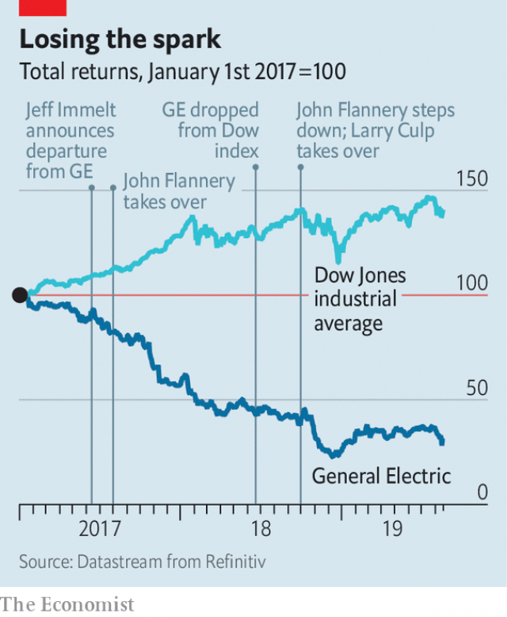

###### Back on the Street

# GE finds friends on Wall Street 

 

> print-edition iconPrint edition | Business | Aug 22nd 2019 

ON AUGUST 20th credit-raters at Fitch warned of insufficient financial reserves against the costs of long-term care for buyers of insurance products at General Electric. Days earlier Harry Markopolos, an accounting investigator, alleged inadequate provisioning of reserves in GE’s insurance division and improper accounting of its Baker Hughes petroleum holdings. This, claimed the corporate sleuth, who shot to fame by uncovering Bernard Madoff’s Ponzi scheme, may dig a $38bn hole in the industrial conglomerate’s books. Its share price fell by 11% in response. 

So far, so familiar. Management missteps and other stumbles have erased 70%, or $200bn, of GE’s market capitalisation since 2016. Nor did the full-throated defence of GE by its executives come as a surprise, though it took a particularly macho form when Larry Culp, its third boss in as many years, bought $3m in GE shares to show his confidence in the company. What was really surprising was the chorus of support for the struggling giant from experts, investors and analysts. 

Harvey Pitt, a former chairman of America’s Securities and Exchange Commission (SEC), criticised Mr Markopolos for going public without giving his target the chance to respond to his concerns. Stanley Druckenmiller, a respected billionaire investor, praised Mr Culp’s efforts to turn around the firm and added to his GE holdings. Goldman Sachs, which does not rate GE’s shares, sent clients a private analysis which concluded that its long-term-care reserve levels “compare favourably to peers”. 

 

Even some short-sellers backed GE—and chastised Mr Markopolos for giving them a bad name by writing his report for an investor in exchange for a cut of any profits made if GE’s share price declined. One prominent short-seller called Mr Markopolos “reckless, dishonest, and most importantly secretive”. 

This sudden flurry of support does not mean that GE is in the clear. Joshua Ronen, an accounting professor at New York University’s Stern School of Business, has reviewed GE’s official filings about its holdings in Baker Hughes and found them “confusing”. The SEC and the Justice Department are investigating it for accounting irregularities at its insurance and power-generation divisions. GE vehemently denies any wrongdoing. As for the risks embedded in its long-term-care portfolio, the diverging opinions from Goldman Sachs and Fitch suggest that reasonable people can disagree about the size of the liabilities. But they are large. 

And Mr Markopolos, too, has his defenders. Carson Block of Muddy Waters, a prominent short-seller, points out the investigator’s fee is not improper as long as he disclosed his economic interest, which he did. “Nobody does research for charity,” Mr Block says. Still, the fact that so many people jumped to GE’s defence betrays a renewed optimism about America Inc’s erstwhile darling. With Mr Culp, recruited after a successful stint running Danaher, a smaller conglomerate, at the helm, GE may at last be finding friends on Wall Street. ■ 

