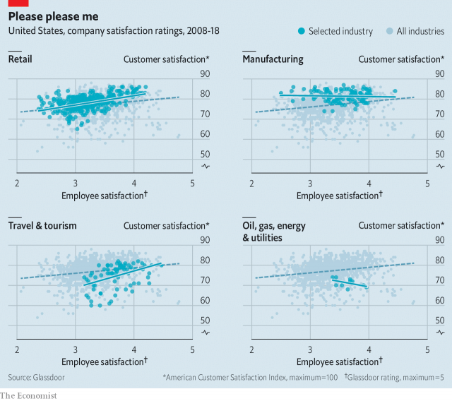

###### Can get some satisfaction

# How to keep your customers happy 

 

> print-edition iconPrint edition | Business | Aug 22nd 2019 

A  HAPPY CUSTOMER is a repeat customer, or so the saying goes. But how can a business keep clients satisfied? The answer, according to a recent study, is to treat employees well. Glassdoor, a website which let workers assess employers, looked back over the records of 293 companies across 13 industries between 2008 and 2018. It then studied the link between employee satisfaction, based on its own ratings, and the American Customer Satisfaction Index, a benchmark gauge of shoppers’ sentiment. 

A one-point improvement in Glassdoor’s rating (on a five-point scale) translated into a statistically significant 1.3-point increase in customer satisfaction (rated from zero to 100). As might be expected, the link was strongest in industries where workers have the most direct contact with customers, such as retail, restaurants and tourism. In such trades, a one-point gain in employee satisfaction rating raised that of customers by 3.2 points (see charts). Companies with high scores for both employee and customer satisfaction include Southwest Airlines, Trader Joe’s, a grocer, and Hilton Hotels. The link is less strong among manufacturing and energy firms. 

More pertinent to bosses, Glassdoor also cites a study showing that higher customer satisfaction leads to higher market value. So here is a tip for chief executives: be nice to the front-line staff and your bonus might be bigger.■ 

-- 

 单词注释:

1.Aug[]:abbr. 八月（August） 

2.client['klaiәnt]:n. 客户, 顾客, 委托人 [计] 客户, 客户机, 客户机程序 

3.glassdoor[]:un. 厚玻璃门 [网络] 玻璃门网站；玻璃门公司；格拉斯多公司 

4.rating['reitiŋ]:n. 等级, 额定功率, 责骂 [经] 等级评定 

5.benchmark[]:[计] 基准程序; 基准 

6.sentiment['sentimәnt]:n. 感情, 感伤, 情操, 情绪, 感想, 意见 [医] 情感, 情操 

7.statistically[]:adv. 用统计的方法, 统计学上 

8.trader['treidә]:n. 商人, 商船 [经] 交易者, 商船 

9.hilton['hiltәn]:n. 希尔顿（姓氏）；希尔顿集团（主营酒店和香烟等） 

10.les[lei]:abbr. 发射脱离系统（Launch Escape System） 

11.manufacturing[.mænju'fæktʃәriŋ]:n. 制造业 a. 制造业的 

12.pertinent['pә:tinәnt]:a. 相关的, 中肯的, 切题的 [法] 恰当的, 有关的 

13.cite[sait]:vt. 引用, 引证, 表彰 [建] 引证, 指引 

