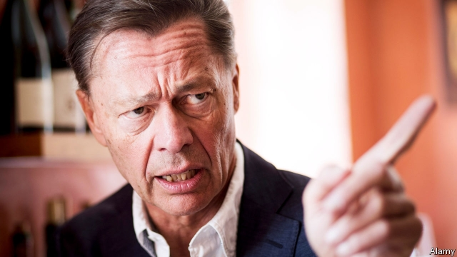

###### Mea culpa

# Thomas Middelhoff reflects on failure in German business 

 

> print-edition iconPrint edition | Business | Aug 22nd 2019 

“GUILTY” IS THE title of a book presented on August 20th by Thomas Middelhoff, the former boss of Bertelsmann, a media conglomerate, once feted from Berlin to Hollywood. It is not an admission of legal guilt, for Mr Middelhoff still feels his three-year prison sentence for tax evasion and breach of trust was overly harsh. But he committed the seven deadly sins in a biblical sense, he says, which is why he feels he deserved time behind bars and the loss of his fortune, reputation, health and marriage. He wants the account of his failures to serve as a cautionary tale for businesspeople in Germany and beyond. 

Mr Middelhoff’s stellar rise was unusual in staid Teutonic business culture. He climbed to the top of Bertelsmann through a combination of hard work, unwavering belief in his instincts, showmanship and an Anglo-Saxon appetite for risk. Perhaps his biggest coup was a partnership with Steve Case, who at the time was the virtually unknown boss of a struggling startup called America Online. Then known as “Big T”, Mr Middelhoff made a fortune for Bertelsmann when he sold its stake in AOL for close to €7bn ($6.7bn) in 2000, just before the dotcom bubble burst. 

His reward—a bonus of €45m—was the start of the undoing of his personal finances. Greed, he says, led him to invest in dodgy real-estate funds and tax-avoidance schemes. In 2002 he was forced out of Bertelsmann after clashing with the Mohn family, who own the company, over his plans to take the firm public. Eager for a second act as a German business tycoon, in 2005 he took the helm of KarstadtQuelle, which later became Arcandor, then Germany’s biggest retailer. His efforts to turn around that ailing company led to his humiliating decline. He sold Arcandor’s property portfolio for €4.5bn but saddled its department stores with high rents. In February 2009 it was the Arcandor board’s turn to force him out. By June the retailer had collapsed. 

That is when prosecutors began investigating Mr Middelhoff’s conduct at the company. They uncovered his use of Arcandor aircraft for private purposes and company cash to part-finance a book honouring his mentor at Bertelsmann. In 2014 a court in Essen found him guilty. He was arrested in the courtroom in front of his family. A year later he declared personal bankruptcy. 

Mr Middelhoff’s tale of hubris resonated beyond the corporate world. He served as the model of the title character in “Johann Holtrop”, a novel by Rainald Goetz. At the end of the novel Holtrop commits suicide. “For Germans there is no rise after the fall,” says Mr Middelhoff. 

The repentant mogul has already published one book in 2017 about his time in the nick and his autoimmune disease. Jarringly, he prefaced several chapters with quotes from Dietrich Bonhoeffer, a pastor imprisoned and executed by the Nazis, seemingly equating their respective fates. He is now working on his third book, a novel about the rise and fall of a business tycoon. Mr Middelhoff may be humbled. But his favourite topic is still Mr Middelhoff. ■ 

-- 

 单词注释:

1.mea[]:abbr. 维修工程分析（Maintenance Engineering Analysis）；β-巯基乙胺（β-Mercaptoethylamine）；沿航线最低高度（Minimum Enroute Altitude） 

2.culpa['kulpә, 'kʌl-]:[法] 过失, 疏忽, 过错 

3.thoma[]:n. (Thoma)人名；(阿尔巴、阿拉伯)索玛；(英、德、罗、匈、捷、塞、瑞典)托马 

4.middelhoff[]:[网络] 米德尔霍夫 

5.Aug[]:abbr. 八月（August） 

6.bertelsmann[]:n. 贝塔斯曼（德国出版公司） 

7.conglomerate[kәn'glɒmәrit]:a. 聚成球形的, 砾岩性的 n. 集成物, 混合体, 砾岩 v. (使)凝聚成团 

8.fete[feit]:n. 庆祝, 祭祀, 节日 vt. 宴请, 招待 

9.Berlin[bә:'lin]:n. 柏林, (软质)柏林毛线 

10.Hollywood['hɔliwud]:n. 好莱坞, 美国电影界, 美国电影工业, 美国式电影 

11.guilt[gilt]:n. 罪行, 内疚 [法] 罪, 犯罪, 罪行 

12.evasion[i'veiʒәn]:n. 逃避, 藉口 [法] 回避, 规避, 逃避 

13.breach[bri:tʃ]:n. 裂口, 违背, 破坏, 违反, 突破, 破裂 vt. 攻破, 突破 vi. 跳出水面 

14.overly['әuvәli]:adv. 过度地, 极度地 

15.biblical['biblikәl]:a. 圣经的 

16.cautionary['kɒ:ʃәnәri]:a. 警告的 

17.businessperson['bɪznəspɜ:sn]:n. 商人 

18.stellar['stelә]:a. 星的, 似星的, 星球的, 主要的 

19.staid[steid]:a. 认真的, 沉着的, 固定的 

20.Teutonic[tju:'tɒnik]:a. 条顿人的, 日耳曼人的 n. 日耳曼语 

21.unwavering[.ʌn'weivәriŋ]:a. 不动摇的, 坚定的 

22.showmanship['ʃәjmәnʃip]:n. 安排演出的窍门, 吸引观众的窍门, 经营术, 招徕生意的手腕 

23.coup['ku:]:n. 砰然的一击, 妙计, 出乎意料的行动, 政变 [医] 发作, 中, 击 

24.partnership['pɑ:tnәʃip]:n. 合伙, 合股, 合作关系 [经] 合伙(合作)关系, 全体合伙人 

25.steve[]:n. 史蒂夫（男子名） 

26.startup[]:[计] 启动 

27.online[]:[计] 联机 

28.'nt[]:abbr. 【化】同“niton” [网络] 新台币；神经降压素(Neurotensin)；中和试验(neutralization test) 

29.aol[]:abbr. 美国境内提供线上加值网络服务的公司（American On Line） 

30.dotcom['dɒtkɒm]:n. 网站 

31.greed[gri:d]:n. 贪欲, 贪婪 

32.dodgy['dɒdʒi]:a. 狡猾的, 逃避的, 难弄的 

33.clash[klæʃ]:n. 冲突, 撞击声, 抵触 vi. 冲突, 抵触 vt. 使发出撞击声 [计] 对撞 

34.mohn[]: [人名] 莫恩 

35.tycoon[tai'ku:n]:n. 企业界大亨, 将军 [经] 企业界巨头, 企业家 

36.helm[helm]:n. 舵, 驾驶盘, 枢机, 头盔 vt. 给...掌舵, 指挥, 给...戴头盔 

37.karstadtquelle[]: 卡尔施泰特公司总部所在地：德国主要业务：零售 

38.retailer['ri:teilә]:n. 零售商人, 传播的人 [经] 零售商 

39.ailing['eiliŋ]:a. 生病的 [医] 患病的, 病痛的 

40.humiliate[hju:'milieit]:vt. 使丢脸, 使蒙羞, 屈辱 

41.portfolio[pɒ:t'fәuliәu]:n. 皮包, 公文包, 部长职务, 有价证券财产目录, 艺术代表作选辑 [法] 公文包, 文件夹, 阁员职务 

42.prosecutor['prɒsikju:tә]:n. 实行者, 告发者, 公诉人 [法] 原告, 起诉人, 检举人 

43.mentor['mentɔ:]:n. 指导者, 良师益友 

44.essen['esn]:n. 埃森市（德意志联邦共和国西部城市） 

45.courtroom['kɒ:trum]:n. 法庭, 审判室 [法] 法庭, 审判室 

46.bankruptcy['bæŋkrәptsi]:n. 破产者 [经] 破产, 倒闭 

47.hubris['hju:bris]:n. 傲慢, 狂妄野心 

48.resonate['rezәneit]:v. (使)共鸣, (使)共振 

49.corporate['kɒ:pәrit]:a. 社团的, 合伙的, 公司的 [经] 团体的, 法人的, 社团的 

50.johann[]:n. 约翰（姓氏）；约翰（男子名） 

51.Holtrop[]:[地名] 霍尔特罗普 ( 德 ) 

52.rainald[]: [人名] 雷纳德 

53.goetz[]: [人名] 戈茨 

54.suicide['sjuisaid]:n. 自杀, 自杀者 v. 自杀 a. 自杀的 

55.repentant[ri'pentәnt]:a. 后悔的, 悔改的 

56.mogul[mәu'^ʌl, 'mәu^ʌl]:n. 大人物, 有权势的人 

57.nick[nik]:n. 刻痕, 缺口, 划痕 vt. 刻痕于, 弄缺, 擦伤 vi. 狙击 

58.autoimmune[]:a. 自体/自身免疫的 

59.jarringly['dʒɑ:riŋli]:adv. jar（刺耳的）的变形 

60.dietrich[]:n. 迪特里希（人名） 

61.Bonhoeffer[]:n. (Bonhoeffer)人名；(德)邦赫费尔 

62.pastor['pæstә]:n. 牧师 

63.Nazi['nɑ:tsi]:n. 纳粹党人 a. 纳粹党的 

64.seemingly['si:miŋli]:adv. 看来似乎, 表面上看来 

65.equate[i'kweit]:vt. 使相等, 视为平等 vi. 等同 

