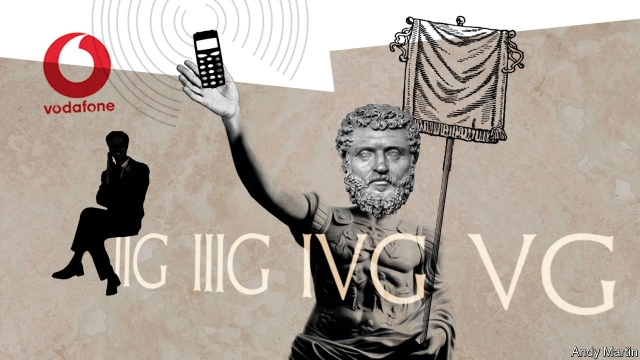

###### Schumpeter

# Vodafone’s search for the G-spot 

 

> print-edition iconPrint edition | Business | Aug 22nd 2019 

THE GLOBAL telecoms boom that reached its zenith almost two decades ago was made for satire. It united two of the most intoxicating technologies of all time, the mobile phone and the internet. It generated the biggest wave of value-destroying takeovers the world had ever seen. Its apex, the £22.5bn ($35bn) sale of third-generation (3G) wireless spectrum in Britain in 2000, was such a humdinger that the boffins who devised it described it, with a Pythonesque flourish, as the most successful auction since the Praetorian Guard sold the Roman Empire to Didius Julianus in 193AD. 

Vodafone, a British mobile operator active across Europe, epitomised the madness of the time. Its £112bn hostile takeover launched in 1999 of Mannesmann, a German rival, was a gripping epic that went on for months—partly against the backdrop of the Savoy Grill, a posh London eatery where both sides mercilessly skewered each other. Vodafone bid almost £6bn over 150 rounds for its British 3G licence, more than any other firm. Then came the telecoms bust of 2001, almost as abrupt as the end of Didius Julianus, whose reign lasted all of nine weeks. It still haunts Vodafone today. The company’s return on assets, in lofty double digits until 2000, has been negligible or negative every year since but one. 

Vodafone’s protracted dark ages stem from a problem common throughout Europe. Telecoms firms have built the networks over which social media, emails, cat videos and other marvels of communication flow, but the sums customers pay to use them has shrunk relentlessly. Understandably, that makes the companies wary of splashing out fortunes on the next mobile lottery, building fifth-generation (5G) wireless networks. Yet they face a prisoner’s dilemma. If none of them takes part, they could all avoid a huge bill. If only one does, it will clean up. If all of them do, they all suffer. Once again Vodafone is in the thick of the action. This time its strategy gives an inkling of how to avoid the worst of the pitfalls. 

To put the promise and perils of 5G into perspective, go back a few generations—to 2G, which turned the world into an interconnected talking shop. That technology generated huge profits for mobile pioneers like Vodafone. It could not, however, support enough data to enable video calls, photo-sharing and other mobile internet use that customers wanted. That gave rise to 3G. 

As Ferry Grijpink of McKinsey, a consultancy, puts it, the telecoms firms were on the right track with their bets on 3G. But they got two things wrong: the timing, and their ability to make money from it. It took Canada’s BlackBerry, and Apple, maker of the iPhone, to bring mobile internet browsing to the masses. Instead of benefiting companies like Vodafone that built the networks, Apple reaped most of the rewards, as did search engines like Google and social networks such as Facebook. During the current decade, 4G (and LTE) have provided enhanced versions of 3G, with much faster data speeds and loading times. But in rich countries fierce competition between telecoms firms has caused them to offer bigger, often unlimited data plans at low cost, hammering profitability. This is especially true in Europe, where Mr Grijpink counts 26 big mobile operators, covering a similar-sized territory as America’s four big providers (soon to become three). Average monthly revenue per customer has fallen from $35 in 2006 to around $20. 

There are patterns in this potted history. In his book, “The 5G Myth”, William Webb, a consultant, writes that a new generation of mobile connectivity has emerged every decade. As a rough guide, he says each one provides a tenfold increase in data speeds, say from two kilobits a second with 2G, to two megabits a second with 3G to 20 megabits a second with early 4G. And telecoms folklore has it that the even numbers (2G and 4G) do better than odd ones. 

The hype is that the arrival of 5G will break the pattern. It is coming less than a decade after 4G was widely adopted. It promises to bring a 50-fold improvement in data speeds (say, one gigabit a second). And the hope is that it will be revolutionary, bringing benefits such as immersive gaming, augmented-reality glasses, factories of the future and even remote surgery. Already, the global industry is spending nearly $160bn a year upgrading towards 5G, and 22 5G networks are up and running. 

Still, scepticism is in order. People are not clamouring for faster data, because 4G gives them enough already. After studying the internet usage of reporters at the Wall Street Journal, academics found that they use only a fraction of their available bandwidth, even while watching several videos at once. Much of the industrial logic of faster connectivity, such as greater use of sensors in factories, can be supplied by 4G networks. No device exists that makes a compelling business case for 5G. Mr Webb invokes the aerospace industry to warn of the perils of betting on ever-faster speeds. “5G could end up being like Concorde—a superb feat of engineering but of limited value to all but a small minority.” 

5G has already come at a cost to Vodafone. This year it slashed its dividend, partly to pay for a pricey spectrum auction in Germany. But like many of its peers, it sees 5G as a way to revitalise revenue growth. It says the new technology will support many more devices at home and at work than 4G does, will lower the cost to Vodafone of handling a lot of data, and improve the reliability of communications in everything from cars to hospitals. Its newish boss, Nick Read, is hoping to form a closer relationship with customers, who increasingly see wireless connectivity as a commodity, by offering tailor-made 5G services. He is also lobbying governments to spur investment (rather than competition) to avoid a 3G-style fiasco. He is cutting his own infrastructure costs by striking network-sharing deals with mobile operators in Britain, Spain and Italy. 

Those are good ideas that may ease the 5G strain. But until the equivalent of a “killer app” comes along to bring the benefits of 5G to billions, it is not clear who will make much money from it. It is up to the telecoms firms to show that they can defy history.■ 

