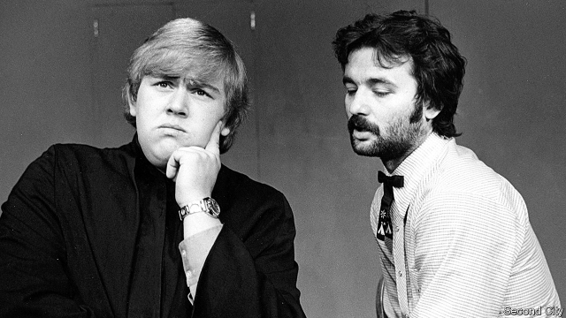

###### Funny business

# What companies can learn from comedians 

 

> print-edition iconPrint edition | Business | Aug 22nd 2019 

THE SECOND CITY is the La Scala of laughs. In its 60-year history the vast comedy club on Chicago’s North Side has, by night, hosted acts by Joan Rivers, John Candy, Bill Murray and other giants of the genre. By day it offers wannabe funny folk workshops on how to make others giggle. Contemporary greats like Steve Carrell and Tina Fey are alumni. So, increasingly, are managers, marketers and a host of other corporate types. 

Firms have used comedy as a way to hone their employees’ soft skills for some time. Their number is growing, reports Kelly Leonard, the club’s boss of “applied improvisation”. Its comics have worked with Twitter, Google and Facebook to find ways for brainy but tongue-tied software engineers to interact more easily with less tech-minded colleagues in sales or strategy. Companies from Motorola and McDonald’s to Nike and Nissan believe that sending executives to comedy classes can help them get better at their day jobs. In response to clients’ complaints about its able but arrogant employees, one management consultancy asked comedians to teach its clever clogs how to be less obnoxious (or at least come across as such). 

Hundreds of corporate customers think jokery can encourage serious lateral thinking among workers, and get them into the habit of welcoming others’ ideas. An improv exercise called “Yes, and” obliges participants to accept—and develop—any suggestion from a colleague, however bizarre. Improv classes are supposed to be safe spaces for frank, even awkward conversations, where people feel fewer inhibitions to say stupid things that may just yield something useful. 

Marketers and advertisers, for their part, are tapping comics for fresh ideas. The Second City’s corporate arm worked on a marketing campaign with Legget & Pratt, a Missouri-based maker of mattress springs. Farmers Insurance, a big underwriter, enlisted the club’s comedians to help produce a training video that staff would willingly watch. At one afternoon workshop various Chicago-based firms met at the club for a sample improv workshop in what amounted to a focus group, where members of the public discussed their brands and products. Not all of this was funny. But frequent laughter helped to loosen tongues. 

Other comedy clubs across America, such as IO in Chicago and the Upright Citizens Brigade theatre in New York, also offer professional services. The Second City says that its corporate activities already make up nearly a third of its revenues, which total over $50m a year. No laughing matter, in other words.■ 
<<<<<<< HEAD

-- 

 单词注释:

1.comedian[kә'mi:djәn]:n. 喜剧演员 

2.Aug[]:abbr. 八月（August） 

3.La[lɔ:, lɑ:]:[医] 镧(57号元素) 

4.scala[]:[医] 阶 [计] Scala 程序设计语言 

5.joan[]:n. 琼（女子名） 

6.john[dʒɔn]:n. 盥洗室, 厕所, 嫖客 

7.murray['mʌri, 'm\\:-]:n. 默里（男子名）；墨累河（澳大利亚东南部一条河流） 

8.genre['ʒɒŋrә]:n. 类型, 流派 

9.wannabe[ˈwɒnəbi]:n. 赶超崇拜者, 赶超崇拜者的人 

10.giggle['gigl]:v. 吃吃地笑, 咯咯地笑 n. 咯咯笑, 傻笑 

11.steve[]:n. 史蒂夫（男子名） 

12.carrell[]:n. (Carrell)人名；(英、芬)卡雷尔 小单间 分隔式单人桌 

13.tina['ti:nә]:n. 蒂娜（女子名） 

14.fey[fei]:a. 注定要死的 

15.alumni[ә'lʌmni]:pl. 男毕业生, 男校友 

16.marketer['mɑ:kitә]:n. 赶集者, 市场商人 [经] 在市场买卖的人, 市场商人 

17.corporate['kɒ:pәrit]:a. 社团的, 合伙的, 公司的 [经] 团体的, 法人的, 社团的 

18.hone[hәun]:n. 磨刀石, 抱怨, 想念 vt. 用磨刀石磨, 磨练 

19.Kelly['keli]:n. 凯利（男子名）；[古]战士 

20.leonard['lenәd]:n. 伦纳德（男子名） 

21.improvisation[.imprәvai'zeiʃәn]:n. 即兴而作, 即席演奏, 即席作品 

22.comic['kɒmik]:n. 连环漫画, 喜剧演员, 滑稽的人 a. 滑稽的, 有趣的, 喜剧的 

23.twitter['twitә]:n. 啁啾, 唧唧喳喳声 vi. 啭, 啁啾, 颤抖 vt. 嘁嘁喳喳地讲, 抖动 

24.google[]:谷歌；搜索引擎技术；谷歌公司 

25.facebook[]:n. 脸谱网 

26.brainy['breini]:a. 脑筋好的, 聪明的 

27.interact[.intәr'ækt]:vi. 互相影响, 交互作用 n. 幕间剧, 幕间休息 

28.les[lei]:abbr. 发射脱离系统（Launch Escape System） 

29.motorola[]:n. 摩托罗拉（美国主营电子的公司） 

30.Nike['naiki:]:n. 胜利女神, 奈克导弹 

31.nissan[]:n. 尼桑（日产汽车名） 

32.arrogant['ærәɡәnt]:a. 自大的, 傲慢的 

33.consultancy[]:n. 商量, 协商, 磋商, 会诊, 与...商量, 咨询, 请教, 找(医生)看病, 查阅, 考虑 [经] 咨询业务, 咨询服务 

34.clog[klɒg]:n. 障碍, 脚坠 v. 障碍, 阻塞 

35.obnoxious[әb'nɒkʃәs]:a. 可憎的, 使人不愉快的, 令人讨厌的 

36.lateral['lætәrәl]:n. 侧部, 支线, 边音 a. 侧面的, 旁边的 

37.improv[ɪmp'ru:v]:n. & adj. <口>即兴表演（的） 

38.participant[pɑ:'tisipәnt]:n. 参加者, 参与者 a. 有份的, 参加的, 参与的 

39.bizarre[bi'zɑ:]:a. 奇异的 

40.improv[ɪmp'ru:v]:n. & adj. <口>即兴表演（的） 

41.inhibition[.inhi'biʃәn]:n. 禁止, 抑制, 压抑 [计] 禁止 

42.advertiser['ædvәtaizә]:n. 做广告者, 广告客户 [经] 广告商, 广告者 

43.marketing['mɑ:kitiŋ]:n. 行销, 买卖 [经] 推销, 在市场买卖, 销售 

44.legget[]: [人名] 莱格特 

45.pratt[præt]:n. 屁股 

46.maker['meikә]:n. 制造者, 上帝 [经] 制造者, 出票人 

47.mattress['mætris]:n. 床垫, 空气垫, 沉床 [医] 褥子, 床垫 

48.underwriter['ʌndә.raitә]:n. 保险业者, 证券包销者 [法] 承保人, 保险人, 保险商 

49.enlist[in'list]:vt. 征募, 参与, 谋取 vi. 从军, 应募, 赞助 

50.IO['aiәu]:[计] 输入输出 

51.Chicago[ʃi'kɑ:gәu]:n. 芝加哥 

52.brigade[bri'geid]:n. 旅, 队 [法] 团体, 队, 组 

53.york[jɔ:k]:n. 约克郡；约克王朝 
=======
>>>>>>> 50f1fbac684ef65c788c2c3b1cb359dd2a904378

