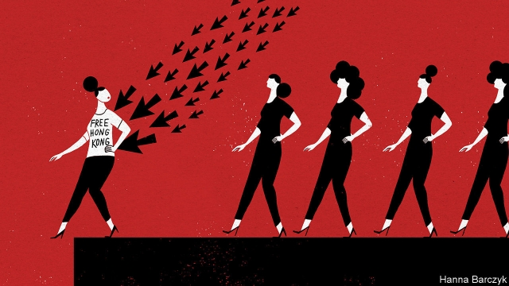

###### Chaguan

# China’s thin-skinned online nationalists want to be both loved and feared by the West 

 

> print-edition iconPrint edition | China | Aug 22nd 2019 

ON AUGUST 10TH a Chinese fashion blogger, “Stylist Zoe”, invited her 7.4m followers to take an online poll, asking whether they would wear freshly cooked shrimp as earrings. A mere 1,300 voted. Two days later, however, Zoe hit the jackpot. Over a million netizens responded to her poll, posted on Weibo, the country’s largest microblog platform, asking what followers think of foreign brands that “insult China”. Her timing was impeccable. Her survey surfed waves of patriotic indignation crashing over the Chinese internet, heightened by puffs of windy outrage in the state media. 

This tempest involves a charge new to the annals of great power competition: that Western brands have been subverting China’s sovereignty by means of overpriced T-shirts. Specifically, Versace, Coach and Givenchy were denounced for selling T-shirts that variously bore the place-names Hong Kong, Macau or Taiwan, without adding wording making it clear that the first two cities are not in fact sovereign states, but Special Administrative Regions of the People’s Republic of China, and without specifying that—at least in the view of the Communist mainland—the democratic, self-governing island of Taiwan is a province of China. 

Not content with going after designer-shirt peddlers, state-run news outlets have denounced Amazon for selling “Free Hong Kong” T-shirts, though the online giant does not operate inside China. Other well-known brands have been taken to task for drop-down location menus on company websites that could be interpreted as suggesting that Hong Kong and Taiwan are countries. 

To outsiders, these alleged offences may seem footling. But luxury brands—whose largest single market is often China—offered grovelling apologies. Expressions of contrition from foreign designers and CEOs were paraded across social-media sites, joined by resignation letters from Chinese celebrities, noisily quitting as envoys for errant brands and stressing their love for the motherland. 

One possible take on this dispiriting saga is that China’s hair-trigger patriots are themselves victims. In this telling, if young Chinese netizens are easily offended, it is because they have spent their formative years cut off from the world behind a Great Firewall of digital censorship, and pounded by a drumbeat of nationalism. 

A closer look at those online nationalists is more troubling. It is true that government propagandists have worked hard to whip up this latest storm. Communist Party social-media accounts have gleefully asserted that foreign firms must work harder to uphold China’s sacred territorial unity, or feel the “cold, cold” wrath of 1.4bn patriotic consumers. 

But a sad truth about nationalist anger is that it can be manipulated and sincere at the same time. No party commissar told Stylist Zoe’s followers to choose the most extreme response in her poll, vowing that they would rather go naked than wear clothes from an anti-China brand, yet 770,000 of them did so. More sobering still, by definition those attacking foreign brands are unusually worldly, whether they hail from the aspiring middle classes or are members of China’s globe-trotting elites. Those advocating boycotts know their Versace from their Valentino. Their ringleaders also clearly have access to the internet beyond the Great Firewall. Brands have been attacked, in recent days, over the precise wording of English-language apologies posted on platforms that are banned in China, such as Twitter, Facebook or Instagram. That means either overseas Chinese are involved, or netizens with access to online tools that allow them to vault the firewall. 

Some unhappy patriots hold plum jobs at the foreign companies under attack. Chaguan spoke this week to a Chinese staffer employed by one of the firms accused of insulting China. The staffer described Chinese colleagues debating their firm’s actions on WeChat, a social media app ubiquitous in China, adding that Western colleagues “either didn’t dare or didn’t want to talk about it with Chinese staff”. The firm did not set out to offend China, the employee believes. But China’s market power deserves more deference: “If you make a profit from us, you also need to respect us.” 

If recent mistakes by luxury brands seem small to foreigners, they are missing the larger causes of Chinese anger, says “FashionModels”, a blogger with 9m followers on Weibo, speaking via social media while on a trip to Japan. America and Europe remain “culturally more powerful” than China and have yet to change “their very condescending attitude”, he says. 

History offers insights into today’s online Chinese nationalism, with its complicated blend of assertiveness and insecurity. Arguably China’s first modern consumer boycott began in 1905, targeting American goods. It was launched by Shanghai merchants in protest at the (very real) mistreatment of Chinese immigrants in America. The first law against Chinese immigration was passed in 1882. But as Wong Sin Kiong of the National University of Singapore has documented, the boycott took off only after American immigration officers began humiliating educated Chinese as well as labourers. America, in effect, provoked a test of national dignity involving many social classes. Newfangled technology also helped. The telegraph, the WeChat of its day, allowed far-flung Chinese to share tales of outrage and to organise. 

One more parallel is important. Patriotic pride back in 1905 was mingled with shame, and soul-searching questions about why the Chinese were too dazzled by foreign goods to resist them for very long. Jump to 2019 and not much has changed. A popular comment on Stylist Zoe’s poll laments that Chinese fashion-lovers are too quick to forgive brands that insult the country. 

A big difference is that the boycott in 1905 had a moral argument at its core, and hurt Chinese merchants as much as American ones. Today’s campaigns often turn on trivialities and are painless or even profitable for their promoters. Propagandists have done their work well. They have made indignation an industry.■ 
<<<<<<< HEAD

-- 

 单词注释:

1.online[]:[计] 联机 

2.nationalist['næʃәnәlist]:n. 国家主义者, 民族主义者 

3.Aug[]:abbr. 八月（August） 

4.blogger[]:n. 写博客的人；博客使用者 

5.stylist['stailist]:n. 文体学家, 时装设计师 

6.zoe['zәui]:n. 生命 

7.follower['fɒlәuә]:n. 从者, 属下, 追补者 [电] 随动机 

8.freshly['freʃli]:adv. 新, 新近, 精神饱满 

9.shrimp[ʃrimp]:n. 虾, 小虾, 矮子 vi. 捕小虾 

10.earring['iәriŋ]:n. 耳环, 耳饰 

11.jackpot['dʒækpɔt]:n. 最大赌注, (彩票的)头奖, 最大成功, 意外的成功/奖赏, 困境 

12.netizens[nə'taɪzənz]:abbr. Internet citizens 网络公民 

13.Weibo[]:[网络] 新浪微博；我的微博；个人微博 

14.microblog[ˈmaɪkroʊˌblɒɡ]: 微博 

15.timing['taimiŋ]:n. 时间选择, 时间测定, 定时, 调速 [计] 定时器时钟 

16.impeccable[im'pekәbl]:a. 无懈可击的, 勿容置疑的, 无瑕疵的, 不会做坏事的 

17.surf[sә:f]:n. 海浪, 拍岸浪 vi. 作冲浪运动 

18.patriotic[.peitri'ɒtik]:a. 爱国的, 有爱国心的 [法] 爱国的, 有爱国心的 

19.indignation[.indig'neiʃәn]:n. 愤怒, 愤慨, 义愤 

20.heighten['haitn]:vt. 增高, 提高, 加强 vi. 升高, 变大 

21.outrage['autreidʒ]:n. 暴行, 侮辱, 愤怒 vt. 凌辱, 虐待, 触犯 

22.tempest['tempist]:n. 暴风雨, 骚动 vt. 使受大风暴影响, 使骚动, 使激动 

23.annal['ænәl]:n. 记录；编年史 

24.subvert[sәb'vә:t]:vt. 推翻, 颠覆, 毁灭 [法] 颠覆, 推翻, 减亡 

25.sovereignty['sɒvrәnti]:n. 主权, 独立国 [法] 主权, 主权国家, 统治权 

26.overprice[,әuvә'prais]:vt. 对...定价过高, 对...估价过高 [经] 对...定价过高 

27.specifically[spi'sifikli]:adv. 特定地, 明确地, 按特性 

28.versace[]:n. 范思哲（世界著名品牌, 及其创始人） 

29.Givenchy[]:n. 纪梵希（品牌名称） 

30.denounce[di'nauns]:vt. 告发, 抨击, 谴责 [法] 谴责, 斥责, 告发 

31.variously['veәriәsli]:adv. 各种各样, 种种, 不同, 多方面, 多才多艺, 许多, 各个, 个别, 杂色, 彩色 

32.hong[hɔŋ]:n. （中国、日本的）行, 商行 

33.kong[kɔŋ]:n. 含锡砾石下的无矿基岩；钢 

34.macau[]:n. 澳门（中国地名） 

35.taiwan['tai'wɑ:n]:n. 台湾 

36.wording['wә:diŋ]:n. 用词, 措词 

37.sovereign['sɒvrin]:n. 元首, 独立国 a. 具有主权的, 至高无上的, 国王的, 完全的 

38.administrative[әd'ministrәtiv]:a. 管理的, 行政的 [法] 行政的, 管理的, 遗产管理的 

39.peddler['pedlә]:n. (毒品)小贩, 传播者, 沿街叫卖的小贩 

40.amazon['æmәzɒn]:n. 亚马孙河 [医] 无乳腺者 

41.outsider[' aut'saidә]:n. 外人, 局外人, 非会员, 外行, 门外汉, 比赛中获胜可能性不大的选手 [经] 外船公司 

42.allege[ә'ledʒ]:vt. 宣称, 主张, 提出, 断言 [法] 断言, 指称, 指证 

43.footle['fu:tl]:n. 废话, 傻话, 愚蠢的做法, 呓语, 呆话 vi. 说呆话, 做笨事 

44.grovel['grɒvl]:vi. 趴, 匍匐, 卑躬屈膝 

45.contrition[kәn'triʃәn]:n. 完全悔悟, 悔改, 悔罪 

46.designer[di'zainә]:n. 设计者, 谋划者, 制图者 [计] 设计员 

47.ceo[]:abbr. 首席执行官；执行总裁（chief executive officer） 

48.celebrity[si'lebrti]:n. 名声, 名人 

49.envoy['envɒi]:n. 外交使节, 特使 [法] 使者, 代表, 使节 

50.errant['erәnt]:a. 周游的, 离开正道的, 不定的 

51.dispirit[dis'pirit]:vt. 使沮丧, 使气馁 

52.saga['sɑ:gә]:n. 传说, 英雄传奇, 冒险故事 

53.patriot['peitriәt]:n. 爱国者, 爱国主义者 

54.formative['fɒ:mәtiv]:a. 有助于形成的, 造型的, 形成的 n. 构词要素 

55.firewall[]:[计] 放火墙, 隔离 

56.censorship['sensәʃip]:n. 检查制度 [医] 督察, 监察 

57.drumbeat['drʌmbi:t]:n. 鼓声 

58.nationalism['næʃәnәlizm]:n. 民族主义, 民族特性 

59.propagandist[.prɒpә'gændist]:n. 宣传者 a. 宣传的, 宣传者的 

60.gleefully['ɡli:fəlɪ]:adv. 高兴地 

61.assert[ә'sә:t]:vt. 主张, 坚称, 断言 [法] 宣称, 断言, 维护 

62.uphold[ʌp'hәuld]:vt. 支撑, 赞成, 鼓励, 举起, 坚持 [法] 确认, 赞成, 支持 

63.territorial[.teri'tɒ:riәl]:a. 领土的, 土地的, 地方的, 区域性的 n. 本土自卫队队员 

64.wrath[rɒ:θ]:n. 愤怒, 激怒, 愤怒的举动, (自然现象等)严酷 

65.manipulate[mә'nipjuleit]:vt. 操纵, 利用, 操作, 巧妙地处理, 假造 

66.commissar[.kɒmi'sɑ:]:n. 代表, 委员, 人民委员(前苏联部长的旧称) 

67.vow[vau]:n. 誓约, 誓言, 许愿 vi. 起誓, 发誓, 郑重宣言 vt. 立誓, 起誓要, 郑重地宣布 

68.worldly['wә:ldli]:a. 世间的, 世俗的, 世上的 

69.hail[heil]:n. 冰雹, 致敬, 欢呼, 招呼 vt. 向...欢呼, 致敬, 招呼, 使象下雹样落下 vi. 招呼, 下雹 interj. 万岁, 欢迎 

70.aspire[ә'spaiә]:vi. 渴望, 立志于 

71.elite[ei'li:t]:n. 精华, 精锐, 中坚分子 

72.VALENTINO[,vælən'ti:nəu]:n. （意）瓦伦蒂诺（姓氏）；华伦天奴（品牌名） 

73.ringleader['riŋli:dә]:n. 魁首, 头目 [法] 头目, 魁首, 叛国头子 

74.twitter['twitә]:n. 啁啾, 唧唧喳喳声 vi. 啭, 啁啾, 颤抖 vt. 嘁嘁喳喳地讲, 抖动 

75.facebook[]:n. 脸谱网 

76.Instagram[]:一款图片分享应用 

77.oversea['әuvә'si:]:adv. 海外, 向国外, 向海外, 国外 a. 外国的, 在国外的, 在海外的, 舶来的 

78.vault[vɒ:lt]:n. 拱顶, 窖, 地下室, 撑竿跳, 穹窿 vt. 做成圆拱形, 撑竿跳过 vi. 成穹状弯曲, 跳跃 

79.firewall[]:[计] 放火墙, 隔离 

80.plum[plʌm]:n. 李子 

81.staffer['stɑ:fә]:n. (一名)职员(尤指编辑或记者) 

82.WeChat[]:[网络] 微信；微讯；腾讯微信 

83.APP[]:[计] 应用, 应用程序; 相联并行处理器 

84.ubiquitous[ju:'bikwitәs]:a. 无所不在的, 到处存在的, 普遍存在的 

85.culturally[]:adv. 从文化角度, 文化意义上；在人文学方面 

86.condescend[.kɒndi'send]:vi. 谦逊, 屈就, 堕落 

87.assertiveness[ə'sə:tivnis]:n. 魄力, 自信 

88.insecurity[.insi'kjuәrәti]:n. 不安全, 不安全感 [医] 不安全感, 无保障 

89.arguably['ɑ:ɡjuәbli]:adv. 可论证地；可争辩地；正如可提出证据加以证明的那样地 

90.mistreatment[]:n. 虐待 

91.wong[]:n. 王（姓氏）；黄（姓氏）；汪（姓氏） 

92.Singapore[.siŋgә'pɒ:]:n. 新加坡 

93.humiliate[hju:'milieit]:vt. 使丢脸, 使蒙羞, 屈辱 

94.provoke[prә'vәuk]:vt. 激怒, 惹起, 诱导 [法] 刺激, 煽动, 激怒 

95.newfangled['nju:fæŋgld]:a. 新奇的, 最新式的, 最新流行的 

96.patriotic[.peitri'ɒtik]:a. 爱国的, 有爱国心的 [法] 爱国的, 有爱国心的 

97.mingle['miŋgl]:v. (使)混合 

98.dazzle['dæzl]:v. (使)眼花, 炫耀 n. 耀眼 

99.lament[lә'ment]:n. 悲叹, 悔恨, 恸哭, 挽歌, 悼词 vt. 哀悼 vi. 悔恨, 悲叹 

100.triviality[.trivi'æliti]:n. 琐事, 平凡, 浅薄 

101.painless['peinlis]:a. 无痛的, 不痛的 [医] 无痛的 

102.promoter[prә'mәutә]:n. 促进者, 助长者 [化] 助催化剂 
=======
>>>>>>> 50f1fbac684ef65c788c2c3b1cb359dd2a904378

