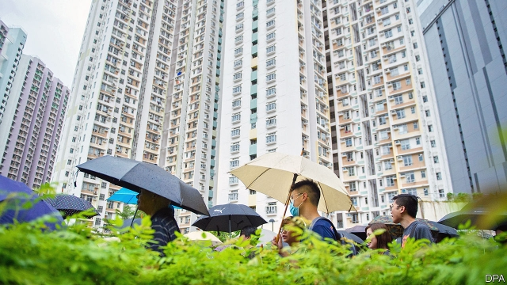
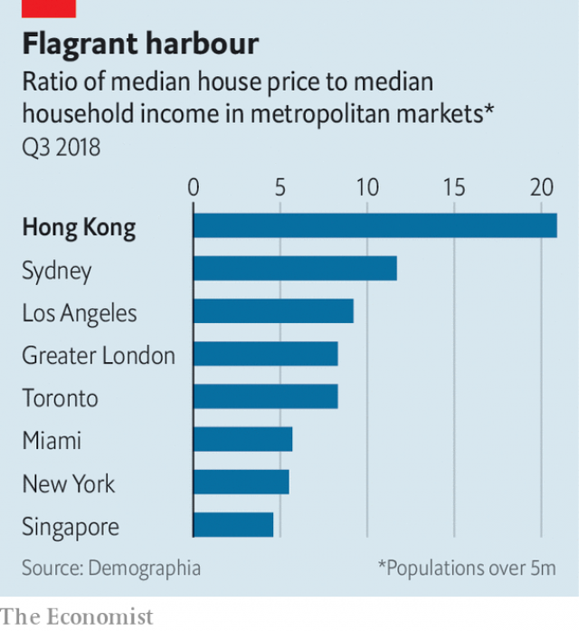

###### Property and protest

# The turmoil in Hong Kong stems in part from its unaffordable housing 

 

> print-edition iconPrint edition | China | Aug 22nd 2019 

WHEN BRITAIN returned Hong Kong to China in 1997, the Communist Party promised two things to the anxious people of a territory with political and economic systems very different from the mainland’s. The first was political autonomy: in time Hong Kongers would even be able to choose their own leaders. The second was to preserve Hong Kong’s swashbuckling capitalism and light-touch government. 

China has not lived up to the political promise. Especially since Xi Jinping came to power in 2012, China has undermined Hong Kong’s autonomy and strangled political life. For nearly three months the consequences have played out, with the world looking on, on Hong Kong’s streets in the form of anti-government protests that have sometimes tipped into violence. For the past week the territory has been relatively calm, with a rare lull in the barrages of tear-gas. The airport, following a sit-in and an unprecedented two-day shutdown, is up and running again. Yet pro-democracy feelings run no less high. Under monsoon rains on August 18th crowds in signature black T-shirts called for universal suffrage in central Hong Kong’s biggest park. The organisers claimed 1.7m people attended, over a fifth of the population. Another big march is planned for August 31st and a general strike on September 2nd. 

Yet while breaking its political promises, China has hewed closely to its economic ones. That, too, has fed popular resentment. By preserving Hong Kong’s economic system in aspic, China has helped to generate extreme inequality, due largely to the extraordinary expense of housing. A coterie of tycoons with a lock on the property market continue to enrich themselves at the expense of others. Many young protesters say they have lost hope of a prosperous future. Being able to afford a decent home appears inconceivable. The latest “nano” flats are not much bigger than a large car. 

Thanks to light regulation, independent courts and a torrent of money from China, Hong Kong has long been a global financial centre. But many of the resulting jobs are filled by outsiders on high salaries, who help push up property prices. Mainlanders seeking boltholes do too. And then there is the contorted market for housing. The government artificially limits the supply of land for development, auctioning off just a little bit each year. Most of it is bought by wealthy developers, who by now are sitting on land banks of their own. They have little incentive to flood the market with new homes, let alone build lots of affordable housing. The average Hong Kong salary is less than HK$17,000 ($2,170) a month, hardly more than the average rent. The median annual salary buys just 12 square feet, an eighth as much as in New York or Tokyo. 

The patriarchs of the main business families—for instance, Peter Woo of Wheelock, Lee Shau-kee of Henderson Land and the Kwok brothers of Sun Hung Kai—were already at the top when Britain ruled Hong Kong. In addition to property, such families dominate industries with limited competition such as ports, utilities and supermarkets. Before the handover, China assiduously cultivated the oligarchs with a view to securing their loyalty—not least by offering them juicy land deals on the mainland. They duly fell into line. 

Since the handover the tycoons have come to dominate not just the economy but also government, opposing calls for more democratic representation, a more generous welfare state and, of course, a programme to build mass, cheap housing of the kind that Singapore has long promoted (and used to keep voters quiescent). Part of the tycoons’ clout comes from their contribution to Hong Kong’s finances: 27% of government revenues come from land sales. Since the start of the crisis Hong Kong’s chief executive, Carrie Lam, has not met any democracy activists, but she has consulted with several plutocrats. 

 

In public, however, the normally voluble tycoons have fallen silent. They are presumably hoping to avoid offending both their patrons in Beijing and their customers in Hong Kong. For a Chinese government demanding that business bow down (see article), that is no longer good enough. 

Chinese media have taken to attacking Hong Kong’s oligarchs for insufficient displays of loyalty. Over the weekend several showed up at a pro-government rally. Li Ka-shing, Hong Kong’s richest man, has placed full-page advertisements in the local press, calling for restraint. But his message—some enigmatic quotes from classical literature—was ambiguous. Was it aimed at the protesters, the local government or the authorities in Beijing? 

In a recent meeting with visiting Western dignitaries, a senior Chinese official complained about Hong Kong’s tycoons. The crisis was exposing the shortcomings of Hong Kong’s capitalist system, the official said: it was not spreading wealth around as much as the central government had hoped. 

That realisation, if it is widely shared in Beijing, is a welcome development. Just as a political solution to the crisis has to involve a less rigged system of political representation, so an economic dimension has to involve a less rigged property market. Perhaps leaders in Beijing think such a reform would be a substitute for democracy. Either way, they appear to be starting to appreciate that Hong Kong’s property cartel needs to be challenged by policies that see much more land released for low-cost housing. 

The potential, says Johnny Kember of KplusK Associates, an architectural practice, is vast. Over 1,000 hectares of brownfield sites could quickly be developed, he notes. There is also the 170-hectare golf course in Fanling, whose lease comes up next year. Many of Hong Kong’s fat cats would surely resent giving up their weekends there to help the very people who are out making trouble. But given the souring mood in Beijing, that is what they may yet be forced to do. ■ 

