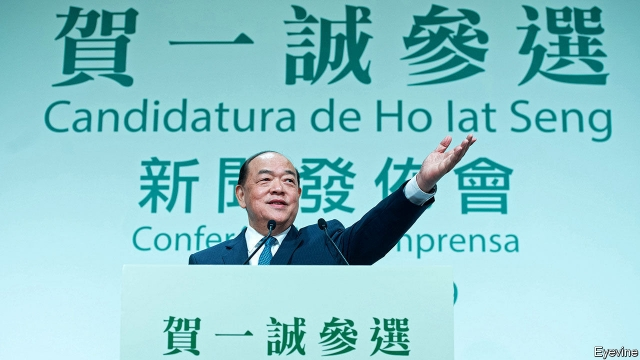

###### Betting on red

# Why Macau is impervious to the turmoil in Hong Kong 

 

> print-edition iconPrint edition | China | Aug 22nd 2019 

ON THE EVENING of August 19th at least two dozen police officers could be seen loitering at the entrances to Senado Square, a narrow, busy plaza in the heart of old Macau. They took down the names of passing youngsters, especially anyone in black or white clothing. Some were led to a nearby car park to be searched. A few were taken away for further questioning. 

The cops were there to discourage people from participating in a silent rally that had been advertised online a few days earlier, and to intercept people who had talked of confronting them. The rally organisers, who have not been named, hoped people in Macau would come out to condemn the way police in nearby Hong Kong have dealt with anti-government protests there. Local authorities, unusually, disallowed the event; police warned that attendees risked up to two years in jail. Around the same time the city began renovating a famous fountain protesters had planned to gather around. It will be hidden behind blue hoardings for a month. 

Leaders in Macau seem anxious about contagion from Hong Kong, which lies 65km to the east along China’s southern coast. The former Portuguese colony has been allowed to run its own affairs since it was handed back to the mainland in 1999. But like Hong Kong, its institutions are flawed. Only 14 out of the 33 legislative assembly seats are directly elected, the rest being doled out to interest groups. The city’s chief executive is elected every five years by a committee of 400 bigwigs. At a meeting on August 25th they will ask Ho Iat Seng (pictured), a businessman, to take up the job in December. It is the fourth time in a row that the Communist Party’s preferred candidate has run unopposed. 

Macau is very unlikely to develop an anti-government movement of the sort seen in Hong Kong. With only about 600,000 residents, its economy is heavily reliant on money and visitors from the mainland, and its small political class is loyal to the party. Although its laws guarantee rights to speech and assembly, Macau has plenty of tools for dampening dissent, including stern national-security legislation of a type that does not yet exist in Hong Kong. People associated with pro-democracy movements in Hong Kong sometimes get stopped at Macau’s borders. That is more common than being denied entry to the mainland, says one. 

Although youngsters are growing more politically aware, Macau’s people are “largely apolitical and pragmatic”, says Sonny Lo of Hong Kong University. The city’s GDP per person is among the highest in the world. Some government revenue, derived primarily from the territory’s enormous casinos, is distributed to residents as an annual cash handout. This year the giveaway is 10,000 patacas ($1,250) per adult. Macau has a more generous welfare system than Hong Kong, including better provision of social housing. Beneficiaries are loth to rock the boat. 

Elections in 2017 brought fresh faces to the legislature, most notably Sulu Sou, a pro-democracy lawmaker who, at 26, was the youngest to ever join the body. But the pro-reform bloc grabbed only about a quarter of votes, not much changed from the previous election. Mr Sou thinks that media coverage of protests in Hong Kong has hardened pre-existing views in Macau. He says that in recent weeks conservative voters who have long been suspicious of calls for fuller democracy seem to have become much more vehement. 

At a meeting with officials and journalists on August 10th Mr Ho said that his new administration would aim to make Macau’s youth more patriotic, including through the education system. That has its perils: a few years ago ham-fisted efforts to tinker with Hong Kong’s curriculum caused a backlash that presaged the more recent unrest. In the nearer term nervous authorities will have to resist overreacting to locals inspired by Hong Kong’s protests. No one wants police to keep interrupting people’s evening strolls. ■ 

