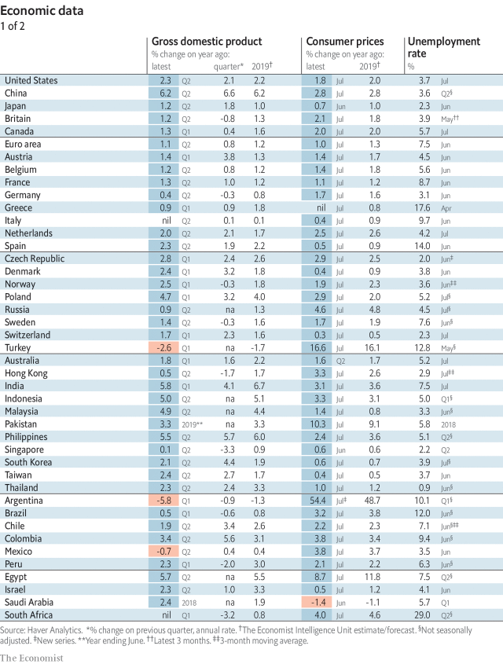
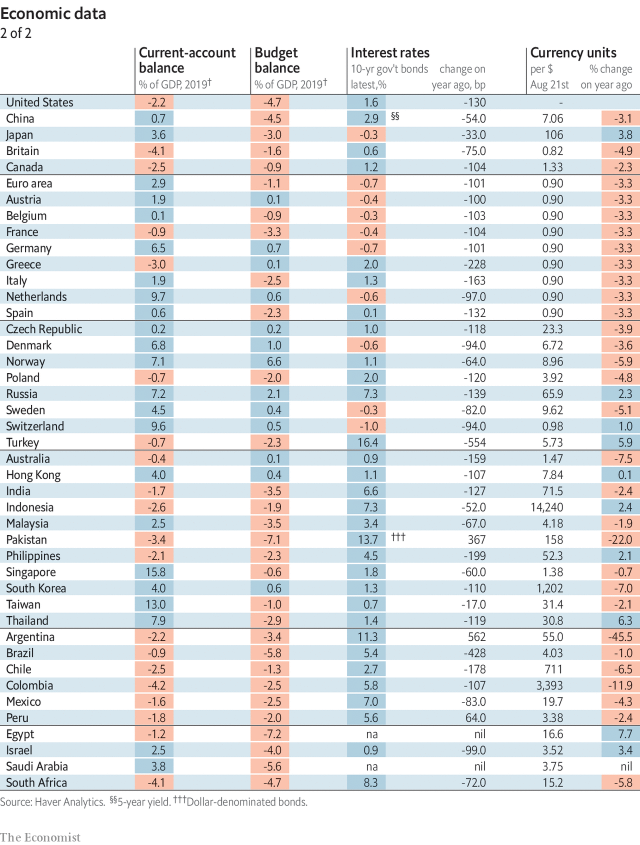
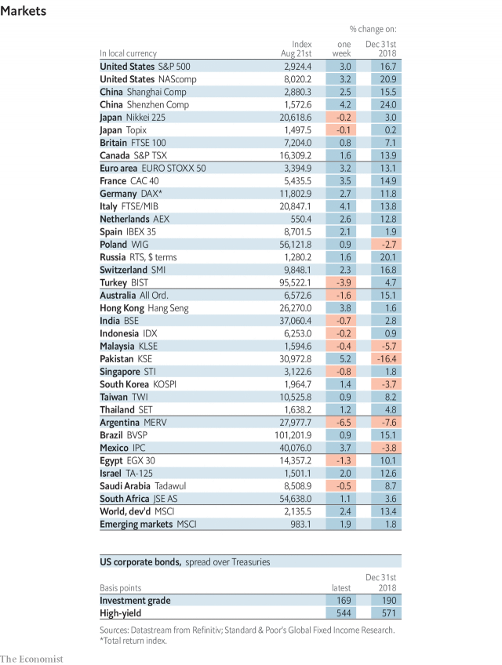
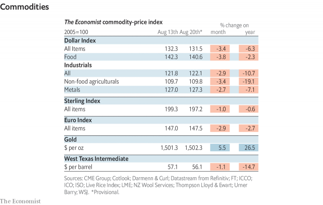

###### Forest apocalypse

# Economic data, commodities and markets 

> print-edition iconPrint edition | Economic Indicators | Aug 22nd 2019 

 

 

 

 

-- 

 单词注释:

1.apocalypse[ә'pɒkәlips]:n. 启示, 天启 

2.datum['deitәm]:n. 论据, 材料, 资料, 已知数 [医] 材料, 资料, 论据 

3.commodity[kә'mɒditi]:n. 农产品, 商品, 有用的物品 [经] 商品, 货物, 日用品 

4.indicator['indikeitә]:n. 指示器, 指示剂, 指标 [计] 指示器 

5.Aug[]:abbr. 八月（August） 

