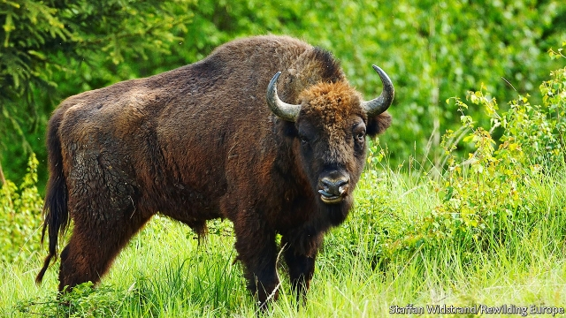

###### Butting back

# An ancient beast returns to Transylvania 

 

> print-edition iconPrint edition | Europe | Aug 22nd 2019 

CURT THE bison is not sure he wants to return to the wild. After 20 hours in a lorry from Germany to Romania, he takes a few hesitant steps down the ramp, chews at some leaves, then heads back inside. Two hours later he is still there, delaying the bolder females, stuck deeper inside the lorry. Finally the rangers shoot him with a tranquilliser dart. Eight men, two per hoof, carry him into an enclosure, where he quickly recovers. The other beasts trot dutifully after him across a small bridge. They will join two herds already about 50-strong. Transylvania just got a bit wilder. 

European bison were hunted to the brink of extinction in the early 20th century. Fewer than 60 individuals remained, all in captivity. In the United States, the American bison’s population fell below 600. Yet both species have since been nursed back to health. Herds have already been re-established in Poland and Belarus. 

Eastern Europe’s ecologically diverse wildflower meadows and old-growth forests provide near-perfect conditions for bison and other scarce species. Wild bees, dragonflies and glow-worms (and the birds which feed on them), threatened by intensive agriculture in western Europe, still thrive here. In the communist era, wildernesses benefited from a reluctance to farm agriculturally marginal land. More recently, rural areas have seen mass emigration since Romania joined the European Union. The population of Caras-Severin county, where Curt and his herd will roam, fell from 380,000 in 1990 to 280,000 today. 

“On the face of it, we’re just releasing some big animals into the forest,” says Rob Stoneman of Rewilding Europe, a group overseeing the project with the Worldwide Fund for Nature, a charity. “But this is a keystone species. They open the forest up.” Bison herds will prevent shrubs from spreading across pastures. Red deer will flourish in their wake. Deer and bison will be preyed on by grey wolves and brown bears. 

Some locals have doubts about bringing back the giant ruminants. But they seem to be coming around. Simona Boieriu, who owns a small farm on the slopes of the Tarcu mountains, now sells her tomatoes to bed-and-breakfasts that cater to eco-tourists. The bison, she says, are “attracting people from other cultures to visit us, people interested in nature conservation”. Romanians, she adds, are less so. From farther up the valley comes the thunder of a summer storm. Or perhaps it is the hooves of the mighty but tentative Curt.■ 
<<<<<<< HEAD

-- 

 单词注释:

1.butt[bʌt]:n. 粗大的一头, 烟头, 靶, 笑柄 [医] 对核 

2.transylvania[,trænsil'veiniә,- njә]:n. 特兰西瓦尼亚 

3.Aug[]:abbr. 八月（August） 

4.curt[kә:t]:a. 简略的, 简短的, 生硬的 

5.bison['baisәn]:n. 野牛 

6.Romania[rәu'meinjә]:n. 罗马尼亚 

7.hesitant['hezitәnt]:a. 迟疑的, 踌躇的, 犹豫不定的 

8.ramp[ræmp]:n. 斜坡, 坡道, 敲诈 vi. 狂跳乱撞, 乱冲, 敲诈, 蔓延 vt. 使有斜面, 敲诈 

9.ranger['reinʒә]:n. 王室守林人, 骑警, 漫游者 

10.tranquilliser[]:n. 镇静剂, 安定药, 止痛药 

11.dart[dɑ:t]:n. 飞镖, 投射 vt. 投射 vi. 疾走, 突进 

12.hoof[hu:f]:n. 蹄, (人的)脚 vt. 以蹄踢, 行走, 步行 vi. 走, 踢, 踏 

13.enclosure[in'klәuʒә]:n. 附件, 围墙, 围绕 [化] 机壳; 外壳 

14.quickly['kwikli]:adv. 很快地 

15.trot[trɒt]:n. 快步 vi. 快步走, 小跑 vt. 使小跑, 策马小跑 

16.dutifully[]:adv. 忠实地；忠贞地 

17.brink[briŋk]:n. 边缘, 陡岸 

18.extinction[ik'stiŋkʃәn]:n. 消失, 消灭, 废止 [化] 消光; 熄灭 

19.captivity[kæp'tiviti]:n. 囚禁, 被关 [法] 囚禁, 被俘, 俘虏 

20.specie['spi:ʃi]:n. 硬币 [经] 硬币 

21.Poland['pәulәnd]:n. 波兰 

22.Belarus['belərəs]:n. 白俄罗斯, 白俄罗斯共和国 

23.ecologically[]:adv. 从生态学的观点看 

24.wildflower['waild,flajә(r)]:n. 野花 

25.dragonfly['drægәnflai]:n. 蜻蜓 

26.wilderness['wildәnis]:n. 荒野, 荒地, 大量 

27.reluctance[ri'lʌktәns]:n. 不情愿, 勉强 [电] 磁阻 

28.agriculturally[]:adv. 农业地 

29.marginal['mɑ:dʒinәl]:a. 边缘的, 最低限度的, 有旁注的 [医] 缘的 

30.emigration[.emi'greiʃәn]:n. 移民, 移居外国(或外地) [医] 血细胞渗出 

31.curt[kә:t]:a. 简略的, 简短的, 生硬的 

32.roam[rәum]:v. 漫游, 闲逛, 徜徉 n. 漫步, 漫游 

33.stoneman['stәunmәn]:n. 石工, 石匠 

34.rewilding[]:[网络] 环保骏驹 

35.oversee[.әuvә'si:]:vt. 向下看, 了望, 监督, 偷看到 [法] 监察, 监督, 俯瞰 

36.keystone['ki:stәun]:n. 拱顶石, 楔石, 重点 

37.bison['baisәn]:n. 野牛 

38.shrub[ʃrʌb]:n. 矮树, 灌木, 果汁甜酒 

39.pasture['pæstʃә]:n. 牧场, 草地, 牧草 vt. 放牧 vi. 吃草 

40.prey[prei]:n. 被掠食者, 牺牲者 vi. 捕食 

41.ruminant['ru:minәnt]:a. 反刍类的, 沉思的, 默想的 n. 反刍动物 

42.simona[]:n. 西蒙娜（女子名） 

43.Romanian[ru:'meiniәn]:n. 罗马尼亚人, 罗马尼亚语 a. 罗马尼亚的 

44.les[lei]:abbr. 发射脱离系统（Launch Escape System） 

45.mighty['maiti]:n. 有势力的人 a. 有势力的, 强大的, 有力的 adv. 很, 极 
=======
>>>>>>> 50f1fbac684ef65c788c2c3b1cb359dd2a904378

