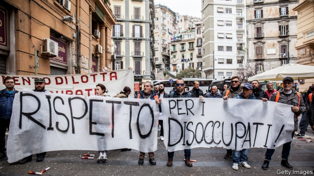
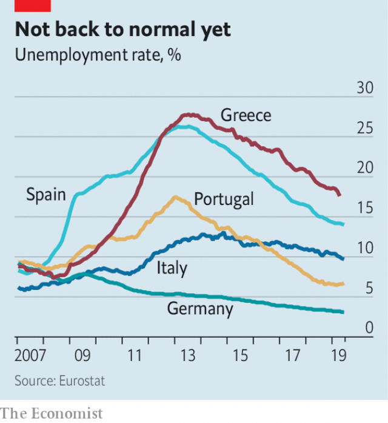
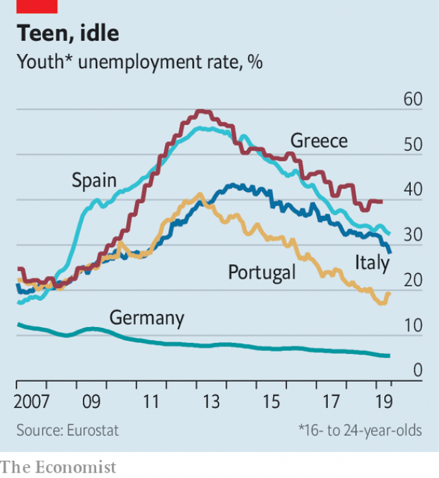

###### Work in progress

# Employment in southern Europe: better, but fragile 

 

> print-edition iconPrint edition | Europe | Aug 22nd 2019 

VITAL ALMEIDA is on the hunt for workers. The boss of Ciclo Fapril, a firm that makes metal components for foreign manufacturers, needs to hire 200 staff by the end of the year to meet new orders. But luring workers—even unskilled ones—to Agueda, a rural town in central Portugal, is proving difficult. To attract more, he is running open days, setting up internships and building relationships with local schools. 

This is a far cry from the state of affairs just over a decade ago, when the global financial crisis struck. Many of Mr Almeida’s neighbours, also metal-bashers, were forced to close down. He weathered the drought by closing the factory on Friday afternoons and freezing pay. 

As southern Europe was racked by the crisis, joblessness rose dramatically. Unemployment rates in Spain and Greece exceeded 25%; youth rates neared 60% (see chart). Populations shrank as many left home in search of better fortunes abroad. 

 

These trends have reversed since 2015, when economic recovery took hold. In the euro area nearly 8m jobs have been created, one for every 20 adults of working age. The unemployment rate has returned to pre-crisis levels, even as the pool of available workers has grown. Older people are working longer: nearly two-thirds of 55- to 64-year-olds in the euro zone are in the labour market, compared with less than half in 2007. In southern Europe, net migration has turned positive. 

Even so, the labour-market recovery in the south has further to go. Unemployment rates are above pre-crisis levels in Greece, Italy and Spain; youth rates are still 30-40%. Part of the explanation is anaemic economic growth. In Greece and Italy, output is still below pre-crisis peaks. 

But in Spain, despite an impressive economic recovery, 1m more people are still out of work than in 2008. Comparisons with the years immediately before the crisis are tricky, because Spain was enjoying a construction boom and unemployment may have been unsustainably low. But Marcel Jansen of Fedea, a think-tank in Madrid, also points the finger at underperforming job centres and schools. 

Nearly 40% of Spain’s unemployed have been jobless for over a year, and need well-designed programmes to get them back into work. But the country’s employment services are run by regional authorities with little central co-ordination. In comparison to those elsewhere in the OECD, they find work for very few of the unemployed. Young Spaniards are more likely than peers elsewhere to drop out of school. And across the south, notes Stefano Scarpetta of the OECD, employers offer less vocational training and fewer apprenticeships than in Germany or the Netherlands. 

 

High unemployment also reflects a long-standing feature of southern labour markets: a relatively large share of workers cycle in and out of temporary jobs. Cushy contracts for permanent workers, with high severance pay and lengthy appeals procedures, make it costly for bosses to sack them. Instead they hire lots of temporary staff, and respond to downturns by cutting their wages or not renewing their contracts. Collective-bargaining agreements for permanent staff can be inflexible—in Portugal, for example, they cannot include wage cuts, making it hard to cope with downturns. 

Many countries have enacted reforms since unemployment soared during the crisis, in some cases as a condition of bail-out funds.These included cutting severance pay for permanent staff in order to make temporary contracts less attractive to bosses, and allowing firms in dire straits to depart from wage bargains. Wages were sometimes cut or frozen. 

Those reforms have had mixed results. In Spain and Portugal pay cuts and freezes, though unpopular, helped restore competitiveness. But the share of temporary workers—at around a fifth of jobs—has barely budged. That is not because these people are satisfied: fully 80% would like to find a permanent job, compared with around a third in Britain and 14% in Germany. Pedro Martins, a former employment minister in Portugal who is now at Queen Mary University of London, wonders whether bosses are still too uncertain about the economy to take a punt on a permanent hire. 

Another risk is that reforms may be rolled back. France is an exception: since 2018 it has taken steps to encourage permanent hiring and vocational training. But farther south a backlash against wage austerity is encouraging governments to adopt risky measures. 

Minimum wages have been raised—sensible enough after years in the deep freeze. But some of the rises appear excessive. Spain’s has risen by 22% this year, after a 12% increase in 2017-18, despite double-digit unemployment. The Bank of Spain warns the uplift could cause 125,000 job losses, though others dispute that. 

Other reforms seem half-baked. In 2018 Italy’s government raised severance pay for permanent workers and lowered time limits on temporary contracts, despite a warning from the national social-security administration that it would lead employers to shed temp workers. Thirty-year-old Giulia lost her job when the law came into force. “The situation was absurd,” she says: although employers were happy with her work, they were forbidden to renew her temporary contract, and decided to hire and retrain someone else instead. Frustrated by her experience in Italy, she has taken up a job offer in Marseilles. 

As the global economy slows, the spectre of job losses returns. Another full-blown crisis is probably not in the cards. But, frets Mr Martins, a rollback of reforms could limit employers’ ability to spread the pain of job and wage cuts more evenly. ■ 

-- 

 单词注释:

1.Aug[]:abbr. 八月（August） 

2.Almeida[]:n. (Almeida)人名；(法、西、葡、英)阿尔梅达 

3.ciclo[]:[网络] 环；春昊 

4.lure[luә]:n. 饵, 诱惑 vt. 引诱, 诱惑 

5.unskilled[.ʌn'skild]:a. 无(特殊)技能的, 不熟练的, 拙劣的 

6.agueda[]:n. (Agueda)人名；(西、葡)阿格达 

7.Portugal['pɒ:tʃugl]:n. 葡萄牙 

8.internship['intә:nʃip]:n. 实习医师的职务 [医] 实习医师职位, 实习医师期 

9.joblessness['dʒɔblisnis]:n. 失业；无活可干（jobless的名词形式） 

10.dramatically[drә'mætikli]:adv. 戏剧地, 引人注目地, 突然地 

11.Spain[spein]:n. 西班牙 

12.euro['juәrәu]:n. 欧元（欧盟的统一货币单位） 

13.les[lei]:abbr. 发射脱离系统（Launch Escape System） 

14.migration[mai'greiʃәn]:n. 移民, 移往, 移动 [计] 迁移 

15.anaemic[ә'ni:mik]:a. 贫血的, 患贫血症的, 无活力的 

16.tricky['triki]:a. 狡猾的, 机敏的 

17.unsustainably[]:[网络] 了不可持续；无法维持的；无法维持 

18.marcel[mɑ:'sel]:n. 波浪形鬈发 vt. 把...烫成波浪形 vi. 烫发 

19.jansen[]:n. 詹森（姓氏） 

20.Madrid[mә'drid]:n. 马德里 

21.underperform[,ʌndәpә'fɔ:m]:vi.表现不佳,工作不如预期(或同行) vt.(股票等)运作差于(一般市场价格) 

22.unemployed[.ʌnim'plɒid]:a. 失业的, 未被利用的 [经] 没有被雇用的, 失业的, 没有被利用的 

23.jobless['dʒɔblis]:a. 失职的, 无职业的 [经] 失业的 

24.regional['ri:dʒәnәl]:a. 地方的, 地域性的 [医] 区的, 部位的 

25.Oecd[]:[经] 已开发国家组织 

26.Spaniard['spænjәd]:n. 西班牙人 

27.peer[piә]:n. 同等的人, 匹敌, 贵族 vi. 凝视, 窥视, 费力地看, 隐现 vt. 与...同等, 封为贵族 

28.Stefano[]:n. 斯特凡诺（意大利名） 

29.scarpetta[]:[网络] 斯卡佩塔；猎杀史卡佩塔；斯卡佩塔餐厅 

30.vocational[vәu'keiʃәnl]:a. 职业的 [法] 职业上的, 天职的 

31.apprenticeship[ә'prentisʃip]:n. 学徒身分, 见习(期) [经] 学徒制, 学徒期 

32.Netherlands['neðәlәndz]:n. 荷兰 

33.cushy['kuʃi]:a. 舒适的, 安逸的 

34.severance['sevәrәns]:n. 切断, 分离, 断绝 [经] 解雇 

35.lengthy['leŋθi]:a. 冗长的, 漫长的 

36.downturn['dauntә:n]:n. (尤指经济方面的)衰退, 下降趋势 [电] 低迷时期 

37.cannot['kænɒt]:aux. 无法, 不能 

38.enact[i'nækt]:vt. 制定法律, 扮演, 颁布 [法] 法令, 法规, 条例 

39.soar[sɒ:]:n. 高扬, 翱翔 vi. 往上飞舞, 高耸, 翱翔 

40.dire[daiә]:a. 可怕的, 悲惨的, 阴沉的, 极端的 

41.unpopular['ʌn'pɔpjulә]:a. 不得人心的, 不受欢迎的, 不流行的 

42.competitiveness[]:[经] 竞争 

43.budge[bʌdʒ]:vi. 微微移动 vt. 推动 n. 羔羊皮 

44.fully['fuli]:adv. 十分地, 完全地, 充分地 

45.pedro['pi:drәu]:n. 彼得牌戏（一种纸牌戏） 

46.Martin['mɑ:tin]:n. 马丁, 圣马丁鸟 

47.mary['meәri]:n. 玛丽（女子名） 

48.punt[pʌnt]:n. 方头平底船, 踢悬空球, 赌博者 v. 踢悬空球, 用篙撑船, 赌博 

49.backlash['bæklæʃ]:n. 后冲, 强烈反对 [电] 反撞, 逆栅流 

50.austerity[ɒ'sterәti]:n. 朴素, 苦行, 严格, 严峻 

51.risky['riski]:a. 危险的 

52.uplift[ʌp'lift]:n. 抬起, 道德的向上, 精神的高涨 vt. 提高, 抬起 vi. 上升 

53.temp[temp]:n. [口]临时雇员 

54.Giulia[]:朱莉娅（人名） 

55.retrain[ri:'trein]:vt. 重新训练, 再训练 

56.Marseille[ma:'seil]:n. 法国马赛市 

57.spectre['spektә]:n. 幽灵, 妖怪, 凶兆 

58.fret[fret]:n. 烦躁, 磨损, 焦急, 网状饰物 vi. 烦恼, 不满, 磨损 vt. 使烦恼, 腐蚀, 使磨损, 使起波纹 

59.rollback['rәulbæk]:n. 回降, 卷回, 推回去 [电] 滚返 

60.evenly['i:vәnli]:adv. 平衡地, 平坦地, 平等地 

