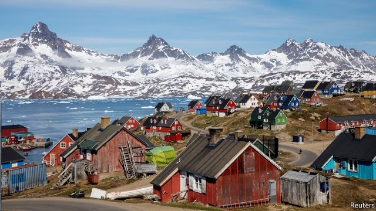

###### Arctic antics

# Greenlanders say Donald Trump should have asked them first 

 

> print-edition iconPrint edition | Europe | Aug 24th 2019 

MOST DANES thought it was a joke when President Donald Trump said America might buy Greenland, a self-governing island that forms 98% of Danish territory. Denmark’s prime minister, Mette Frederiksen, dismissed the idea as “absurd”. When Mr Trump reacted by calling her “nasty” and cancelling a visit to Copenhagen, his would-be hosts were stunned. But many Greenlanders were not. 

“I knew from the start this was to be taken seriously,” says Aleqa Hammond, a former prime minister of Greenland. It was not the first time an American president had suggested such a purchase. In 1946 Harry Truman offered $100m for Greenland ($1.3bn in today’s money). 

Today the island has only 57,000 inhabitants, yet it is of growing strategic importance, as Russian submarines reappear in the Arctic and China dreams of a “polar silk route” through newly ice-free seas. Denmark is responsible for Greenland’s external affairs and defence. NATO membership once allowed Greenlanders to sleep easy, but since Mr Trump has undermined that alliance, their security is less certain. 

Greenland’s feisty legislators, including Kim Kielsen, the current prime minister, all agree that the island’s sovereignty is not for sale. But they are flattered that outsiders are interested, and insist on their right to parley with all comers. As Ms Hammond says: “If Mr Trump wants to discuss Greenland, let him come here, not to Denmark.” 

As Mr Trump observed, Danish taxpayers send Greenland more than $600m a year in subsidies. But that dependence does not deter the island’s politicians from pursuing their own bargains. Last year Mr Kielsen found Chinese contractors for an upgrade to the island’s airports. That terrified NATO, and Denmark pressed Greenland to find Danish contractors instead. One of the parties in Mr Kielsen’s coalition marched out in protest. Greenlanders who want independence say that widening the range of economic partners could wean them off Danish aid. 

Aqqaluk Lynge, a veteran leftist, said the spat with Mr Trump might make Danes and Greenlanders appreciate one another more. It might, for example, remind Danes who moan about subsidising their Arctic cousins not to take them for granted. 

Today Greenland exports mostly seafood. When Mr Trump joked that he did not want to build a skyscraper with his name on it in Greenland, he was surely telling the truth. The real economic opportunity is that vanishing glaciers are opening up its mineral resources, including rare earths and possibly oil and gas. Minik Rosing, a Greenland-born geologist, noted the irony in a man who once called global warming a “hoax” coveting territory that owes its rising value to melting snows. Yet he also thinks a more tactful American leader might persuade Greenlanders to upgrade their links with the United States at the expense of their Danish ones. 

Perhaps. But were they ever to decide to become part of America, which for now seems highly unlikely, they would get a culture shock. Not only do Greenlanders have Nordic ideas about social welfare; they also ban private ownership of land. ■ 

-- 

 单词注释:

1.antic['æntik]:n. 滑稽动作 a. 古怪的 

2.greenlanders[]:[网络] 格林兰人 

3.Aug[]:abbr. 八月（August） 

4.Dane[dein]:n. 丹麦人 

5.Greenland['gri:nlәnd]:n. 格陵兰 

6.Danish['deiniʃ]:n. 丹麦文 a. 丹麦的, 丹麦人的, 丹麦文的 

7.mette[]:n. (Mette)人名；(中非)梅泰；(德、俄、意、芬、捷、丹)梅特 

8.frederiksen[]:[网络] 弗雷泽里克森 

9.Copenhagen[.kәupәn'heigәn]:n. 哥本哈根 

10.stun[stʌn]:vt. 使昏迷, 使震惊, 打昏 n. 昏迷, 猛击 

11.hammond['hæmәnd]:n. 哈蒙德（美国城市） 

12.harry['hæri]:vt. 掠夺, 使苦恼, 强使前行, 折磨, 骚扰 

13.truman['tru:mәn]:n. 杜鲁门（男子名） 

14.reappear[.ri:ә'piә]:vi. 再出现 

15.polar['pәulә]:a. 两极的, 极地的, 正好相反的, 极性的 n. 极线, 极面 

16.Denmark['denmɑ:k]:n. 丹麦 

17.NATO['neitәj]:北大西洋公约组织, 北约组织 [经] 北大西洋公约组织 

18.membership['membәʃip]:n. 会员的资格, 全体会员, 会员数目 [法] 会员资格, 成员资格, 会籍 

19.undermine[.ʌndә'main]:vt. 在...下面挖, 渐渐破坏, 暗地里破坏 [法] 暗中破坏, 以阴谋中伤伤害 

20.alliance[ә'laiәns]:n. 联盟, 联合 [法] 同盟, 联盟, 联姻 

21.les[lei]:abbr. 发射脱离系统（Launch Escape System） 

22.feisty['faisti]:a. 激动的, 活跃的, 好争吵的, 坐立不安的 

23.legislator['ledʒisleitә]:n. 立法者, 立法官, 立法委员 [法] 立法者, 立法机关成员, 立法委员 

24.kim[]:n. 金姆（人名） 

25.sovereignty['sɒvrәnti]:n. 主权, 独立国 [法] 主权, 主权国家, 统治权 

26.flatter['flætә]:vt. 奉承, 阿谀, 使高兴 [机] 平面锤 

27.outsider[' aut'saidә]:n. 外人, 局外人, 非会员, 外行, 门外汉, 比赛中获胜可能性不大的选手 [经] 外船公司 

28.parley['pɑ:li]:n. 会谈, 谈判 vi. 会谈, 谈判 vt. 讲 

29.comer['kʌmә]:n. 来的人, 新来者, 有成功希望的人 

30.taxpayer['tækspeiә]:n. 纳税人 [法] 纳税人, 纳税义务人 

31.dependence[di'pendәns]:n. 依赖, 依存, 信赖 [医] 依赖(如对药物的依赖,即瘾或癖), 从属, 偏利共生 

32.deter[di'tә:]:vt. 制止, 吓住, 威慑 

33.contractor['kɒntræktә]:n. 立契约的人, 承包商 [化] 承包者; 承包工厂 

34.upgrade['ʌpgreid]:n. 上坡, 升级, 上升 adv. 往上 vt. 使升级, 提升, 改良品种 vi. 升级 [计] 升级 

35.coalition[.kәuә'liʃәn]:n. 结合体, 结合, 联合 [经] 联合, 联盟 

36.wean[wi:n]:vt. 使断奶, 使丢弃, 使断念 n. 小儿 

37.lynge[]:[地名] 灵厄 ( 丹 ) 

38.leftist['leftist]:n. 左翼的人, 左派 a. 左派的 

39.subsidise[]:vt. 给...补助金, 津贴, 资助 

40.seafood['si:fu:d]:n. 海味, 海鲜, 鱼类 

41.glacier['gleiʃә]:n. 冰川 

42.minik[]:[网络] 迷你客；乡亲们啊 

43.rosing[]: [人名] 罗辛 

44.geologist[dʒi'ɔlәdʒist]:n. 地质学家, 地质学者 

45.irony['aiәrәni]:n. 反语, 讽刺, 具有讽刺意味的事 

46.hoax[hәuks]:vt. 欺骗, 哄骗, 愚弄 n. 愚弄人, 恶作剧 

47.tactful['tæktful]:a. 机智的, 老练的 

48.Nordic['nɒ:dik]:n. 北欧人, 日耳曼民族, 北欧两项滑雪 a. 北欧人的, 日耳曼民族的, 北欧两项滑雪的 

